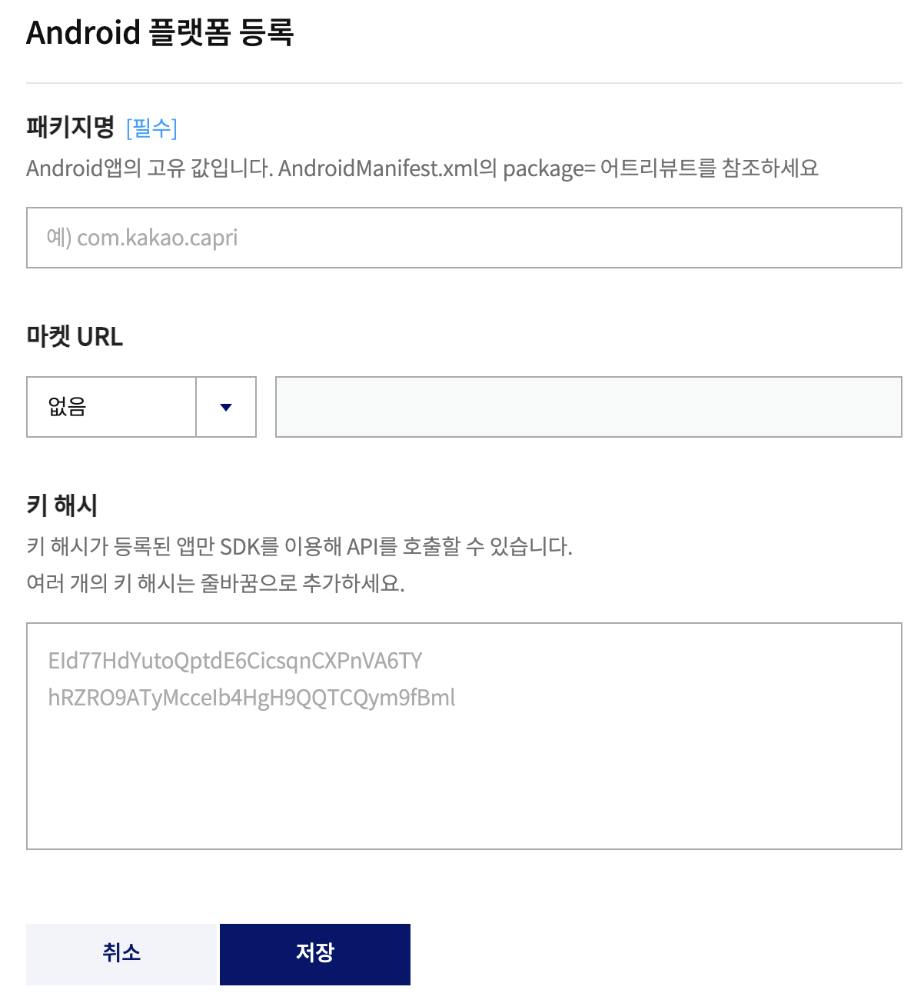
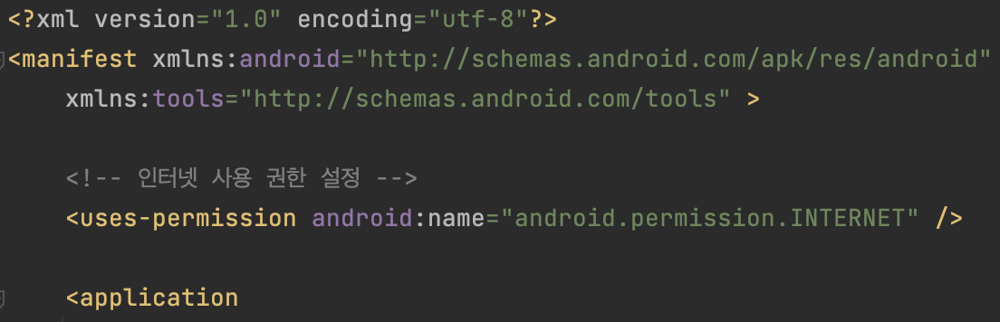
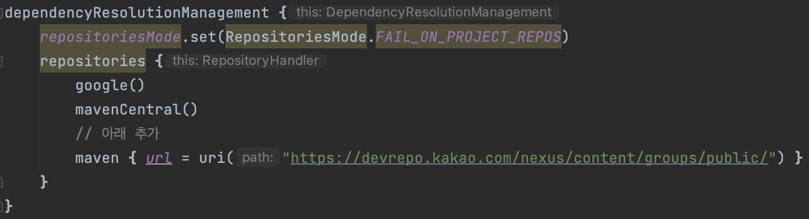
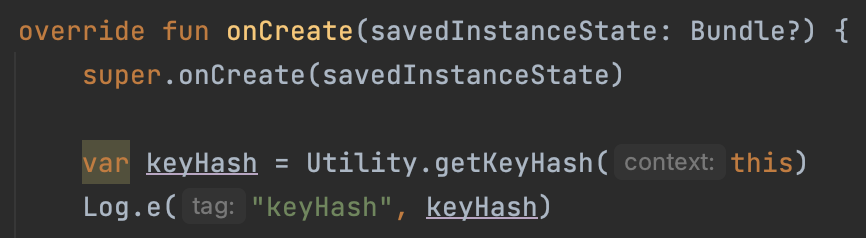
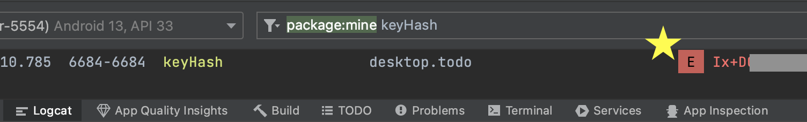
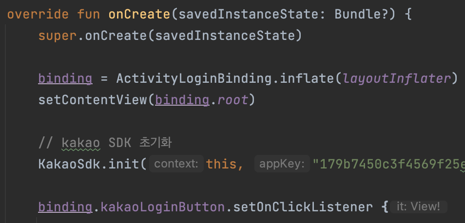

  

    
  

   
  <h2>API</h2>
  
API 관련 내용 정리

   
   

## 🔥 카카오 로그인

### 1. 카카오 등록

✅ 로그인 API를 사용할 애플리케이션 등록

https://developers.kakao.com/console/app

위 링크에 들어가서 카카오 계정으로 로그인 후 

➡️ [애플리케이션 추가하기]를 클릭

➡️ 앱이름과 사업자명 등록 후 약관에 동의 후 [저장] 클릭하면 생성 완료

*앱이름, 사업자명 이름은 아무거나

 

✅ Android 플랫폼 등록

해당 애플리케이션 좌측 [앱 설정] > [플랫폼] 클릭

👉 [패키지명]은 안드로이드 스튜디오 > Kotlin Class 파일 상단에서 확인 가능

👉 [마켓 URL]은 배포 전이여서 [없음]

👉 [키 해시]는 아래 과정을 통해서 나온 키 해시 등록

 

### 2. 앱 설정

✅ 인터넷 사용 권한

카카오 API를 통해 카카오 서버와 통신하기 위해 앱에 인터넷 사용 권한을 설정해야 한다

AndroidManifest.xml에 다음과 같이 인터넷 사용 권한을 설정

 

✅ Gradle 설정

프로젝트의 Gradle 설정을 통해 Android SDK를 간편하게 연동할 수 있다

settings.gradle(프로젝트 레벨) 파일에 Maven 레파지토리(Repository)를 설정

 

✅ 모듈 설정

build.gradle(Module) 파일에 필요한 모듈을 설정

코드는 아래 링크 > [모듈 설정] 참고

https://developers.kakao.com/docs/latest/ko/android/getting-started#apply-sdk-select-module

*카카오 로그인만 설정함

 

### 3. 키 해시 구하기

Kakao SDK로 키 해시 확인

: Android SDK의 `Utility`에서 제공하는 편의 기능 중 `getKeyHash()` 함수를 사용하여 키 해시 값을 문자열(String)로 구할 수 있다

👉 키 해시 값을 로그로 찍어본다

*MainActivity.kt > onCreate에서 진행함

 

👉 나온 키 해시 값을 등록한다

*1.카카오설정 > [Android 플랫폼 등록] 참고

 

### 4. 카카오 설정

✅ 카카오 로그인 활성화 설정

카카오 로그인을 사용하려면 [내 애플리케이션] > [제품 설정] > [카카오 로그인]에서 [활성화 설정]의 상태를 ON으로 설정

 

✅ Redirect URI 설정

카카오 로그인 기능을 구현하기 위해서는 리다이렉션(Redirection)을 통해 인가 코드를 받아야 한다

이를 위해 AndroidManifest.xml에 액티비티(Activity) 설정 필요

코드는 아래 링크 참고!!

https://developers.kakao.com/docs/latest/ko/kakaologin/android#set-redirect-uri

*NATIVE_APP_KEY는 [내 애플리케이션] > [앱 설정] > [앱 키]에서 확인

 

✅ 초기화

설치 및 설정 후 Android SDK를 사용하기 위해서는 가장 먼저 네이티브 앱 키로 초기화를 해야 한다

https://developers.kakao.com/docs/latest/ko/android/getting-started#init

*로그인 버튼 전에 초기화함

*NATIVE_APP_KEY는 [내 애플리케이션] > [앱 설정] > [앱 키]에서 확인

 

### 5. 카카오 로그인 구현

카카오 로그인 구현 예제

https://developers.kakao.com/docs/latest/ko/kakaologin/android#kakaologin-sample

