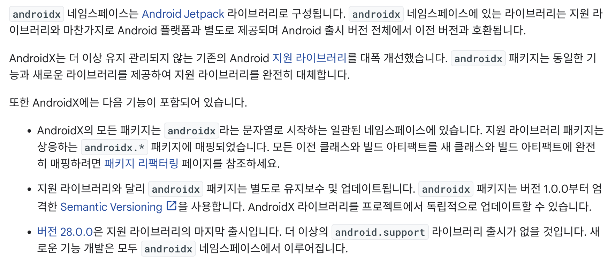

  

    
  

   
  <h2>Android</h2>
  
안드로이드 관련 내용 정리

   
   

## 🔥 Jetpack

### Jetpack 정의

> 개발자가 중요한 코드에 집중할 수 있도록 권장사항 준수, 상용구 코드 감소,
>
> 여러 Android 버전과 기기에서 일관되게 작동하는 코드 작성을 돕는 라이브러리 묶음

👉 안드로이드 개발자에게 편리하고 생산적인 개발을 위해 제공하는 라이브러리 모음

 

### Android Jetpack을 사용해야 하는 이유

 

### AndroidX 개요

👉 Jetpack은 AndroidX 라이브러리로 패키지화 되어 있다

👉 AndroidX로 패키지화 되어 있기 때문에

​	➡️ 안드로이드 플랫폼 API와 분리되어 안드로이드 버전에 관계없이 호환된다

👉 API와 분리되어 있으면

​	➡️ 플랫폼 버전에 제한을 받지 않고, 항상 최신 버전의 androidx 패키지에 접근할 수 있다

👉 따라서, 의존성을 추가할 때 implementation("jetpack.~") 처럼 사용하지 않고 

​	➡️ Jetpack 관련 라이브러리는 implementation("androidx.~") 이런 식으로 추가

 

### Jatpack의 구성요소

- Architecture
  - Data Binding : 앱의 xml 파일(UI)에 데이터를 연결하여 xml 파일에서 데이터에 접근하는 방식
  - Lifecycles : Activity나 Fragment의 생명주기 상태를 기반으로 작업을 실행하는 구성요소
  - LiveData : Activity나 Fragment의 생명주기 내에서 데이터의 변경을 관찰할 수 있는 Data Holder 클래스
  - Navigation : 화면 전환(Fragment To Fragment)과 화면 간 데이터 전달을 관리하는 구성요소
  - Paging : RecyclerView 내 대량의 데이터를 효율적으로 로딩(Loading)하기 위한 구성요소
  - Room : SQLite를 활용해 로컬 데이터베이스에 접근하는 라이브러리
  - ViewModel : MVVM 디자인 패턴에서 파생된 UI와 데이터를 처리하는 로직을 분리하기 위한 구성요소
  - WorkManager : 백그라운드 작업을 도와주는 최신 라이브러리

- Foundation

  - AppCompat : 이전 버전의 안드로이드에서 상위 버전의 API에 접근할 수 있도록 해주는 라이브러리

  - Android KTX : 안드로이드 코틀린 개발을 위한 확장 프로그램 세트

  - Mutidex : 프로젝트 규모가 커짐에 따라 dex 파일을 관리하는 구성요소

  - Test : 안드로이드 스튜디오의 테스트 작업을 단순화할 수 있도록 설계된 구성요소
- Behavior

  - Download Manager : HTTP 다운로드를 관리하는 서비스 클래스
  - Media & Playback : 미디어 유형의 재생을 지원하는 클래스
  - Permissions : 앱이 기기의 접근 권한을 관리하는 클래스
  - Notifications : 안드로이드의 알림을 관리하는 클래스
  - Sharing : 다른 앱에 데이터를 공유할 수 있도록 도와주는 클래스
  - Slices : 앱 외부에 앱의 콘텐츠를 표시할 수 있도록 도와주는 클래스
- UI
  - 앱의 다양한 애니메이션, 이모지, 주변기기, UI 등 상호작용과 관련된 역할을 수행하는 구성요소
