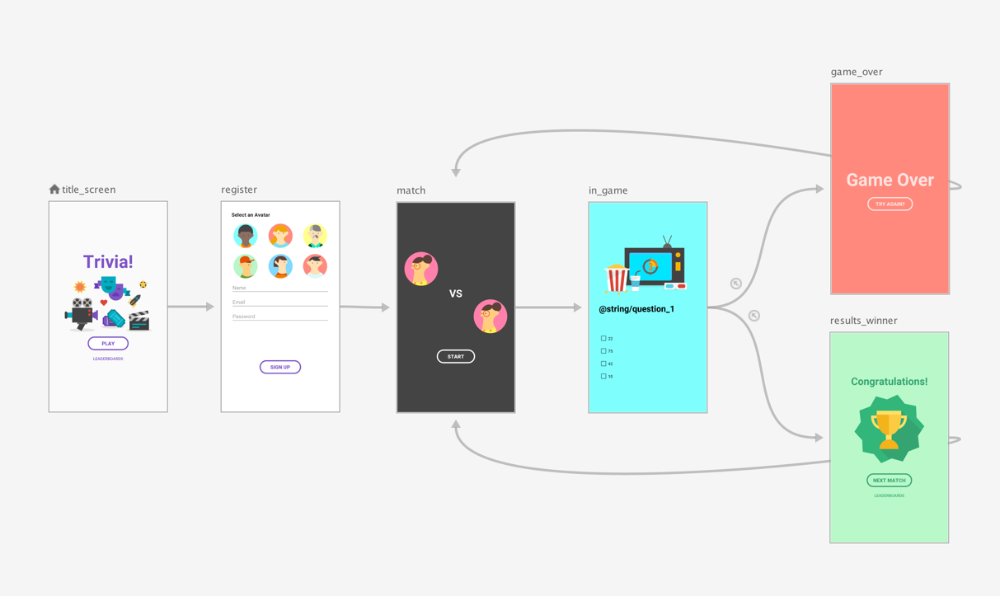

<div align="center">
  <p>
    
  </p>
  <br>
  <h2>Android</h2>
  <p>안드로이드 관련 내용 정리</p>
  <br>
  <br>
</div>


## 🔥 Navigation

### Navigation

> 화면 이동을 쉽고 안정적이게 도와주는 Jetpack 라이브러리 중 하나



<br>

### Navigation 구성요소

- Navigation Graph
  - 모든 탐색 관련 정보가 하나의 중심 위치에 모여 있는 XML 리소스입니다. 
  - 여기에는 *대상*이라고 부르는 앱 내의 모든 개별적 콘텐츠 영역과 사용자가 앱에서 갈 수 있는 모든 이용 가능한 경로가 포함됩니다.
- NavHost
  - 탐색 그래프에서 대상을 표시하는 빈 컨테이너입니다. 
  - 대상 구성요소에는 프래그먼트 대상을 표시하는 기본 `NavHost` 구현인 [`NavHostFragment`](https://developer.android.com/reference/androidx/navigation/fragment/NavHostFragment?hl=ko)가 포함됩니다
- NavController
  - `NavHost`에서 앱 탐색을 관리하는 객체입니다. 
  - `NavController`는 사용자가 앱 내에서 이동할 때 `NavHost`에서 대상 콘텐츠의 전환을 오케스트레이션합니다

<br>

### Navigation 장점

- 프래그먼트 트랜잭션 처리

- 기본적으로 '위로'와 '뒤로' 작업을 올바르게 처리

- 애니메이션과 전환에 표준화된 리소스 제공

- 딥 링크 구현 및 처리

- 최소한의 추가 작업으로 탐색 UI 패턴(예: 탐색 창, 하단 탐색) 포함

- Safe Args

  : 대상 사이에서 데이터를 탐색하고 전달할 때 유형 안정성을 제공하는 그래프 플러그인

- ViewModel 지원

  : 탐색 그래프에 대한 ViewModel을 확인해 그래프 대상 사이에 UI 관련 데이터를 공유합니다

<br>

### Navigation 사용

app 레벨의 build.gradle에 의존성 추가

```kotlin
implementation("androidx.navigation:navigation-fragment-ktx:2.5.3")
implementation("androidx.navigation:navigation-ui-ktx:2.5.3")
```
