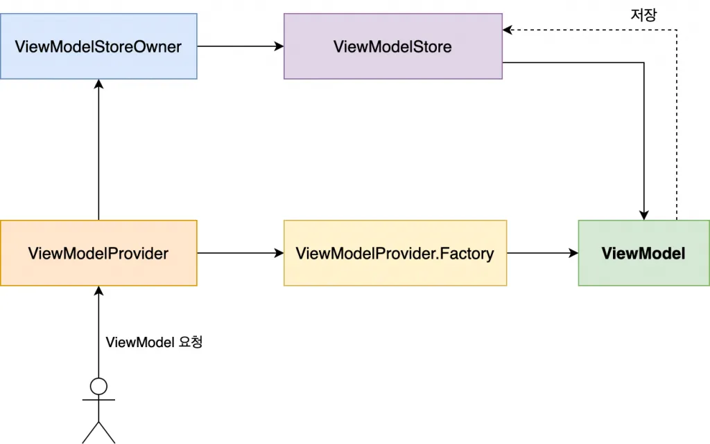

<div align="center">
  <p>
    
  </p>
  <br>
  <h2>Android</h2>
  <p>안드로이드 관련 내용 정리</p>
  <br>
  <br>
</div>


## 🔥 ViewModel

### ViewModel 정의

> Android Jepack의 구성요소 중 하나로, MVVM (Model - View - ViewModel) 디자인 패턴으로부터 파생되었다
>
> View로부터 독립적이며, View가 필요로 하는 데이터만을 소유한다

<br>

### ViewModel 필요성

- 안드로이드 앱 개발시에 MVVM 디자인 패턴을 적용하면 Activity나 Fragment 같은 UI컨트롤러의 과도한 책임을 분담하여 

  클래스가 거대해지는 것을 방지하고, 유지보수, 재사용성 그리고 테스트 등을 용이하게 만든다

- 구글에서도 앱 개발자들에게 MVVM패턴 사용을 권장하고 있다

<br>

### ViewModel 요청 프로세스



- ViewModelProvider를 통해 ViewModel 인스턴스를 요청한다

- ViewModelProvider 내부에서는 ViewModelStoreOwner를 참조하여 ViewModelStore를 가져온다

- ViewModelStore에게 이미 생성된(저장된) ViewModel 인스턴스를 요청한다

- 만약 ViewModelStore가 적합한 ViewModel 인스턴스를 가지고 있지 않다면, 

  Factory를 통해 ViewModel인스턴스를 생성한다

- 생성한 ViewModel 인스턴스를 ViewModeStore에 저장하고 만들어진 ViewModel 인스턴스를 클라이언트에게 반환한다

- 똑같은 ViewModel 인스턴스 요청이 들어온다면, 1~3번의 과정을 반복하게 된다

<br>

### ViewModel 구현

ViewModel 클래스를 상속하는 서브 클래스 정의

```kotlin
class MainViewModel : ViewModel() {
    ...
}
```

ViewModel을 생성하기 위해서는 ViewModel Provider 객체가 필요

```kotlin
class MainActivity : AppCompatActivity() {    
		private lateinit var viewModel: MainViewModel
  
		override fun onCreate(savedInstanceState: Bundle?) {
    		super.onCreate(savedInstanceState)
      
        // ViewModel 인스턴스 생성
        viewModel = ViewModelProvider(this).get(MainViewModel::class.java)
    }}
```

👉 하지만 by viewModels()를 사용하면 ViewModel Provider를 사용하지 않고, ViewModel을 지연 생성할 수 있다

(아래 참고)

<br>

### by viewModels()

> by viewModels()는 Android Jetpack의 viewmodel 라이브러리에서 제공하는 kotlin 확장함수로,
>
> 이 함수를 통해 간단하게 viewmodel 인스턴스를 생성할 수 있다

app 레벨의 build.gradle에 아래와 같이 의존성 추가

```kotlin
implementation("androidx.activity:activity-ktx:1.6.1")  // activity
implementation("androidx.fragment:fragment-ktx:1.6.1")  // fragment
```

viewModel을 쉽게 만들어 사용할 수 있다

```kotlin
private val viewModel: MainViewModel by viewModels()
```

👉 MainViewModel은 해당하는 (가져올) ViewModel 클래스이며, 

viewModels() 함수는 `Lazy<VM>` 타입의 프로퍼티 위임을 반환한다 

(*위임 : 어떠한 기능을 자신이 수행하지 않고 다른 객체가 수행하도록 함)

👉 따라서 해당 프로퍼티에 접근할 때 viewModel 인스턴스가 생성된다

viewModel에 접근할 때까지 초기화를 지연시켜서 필요한 시점에만 ViewModel이 생성되고 초기화된다
