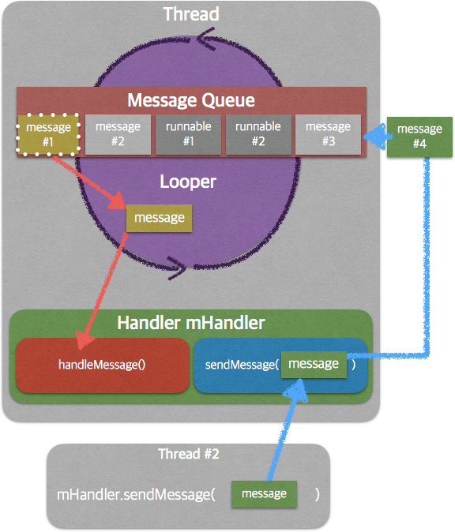

  

    
  

   
  <h2>Android</h2>
  
안드로이드 관련 내용 정리

   
   

## 🔥 스레드 (Thread)

### 스레드 정의

- CPU가 작업을 수행할 수 있는 실행 단위
- 앱 실행 시, 안드로이드 시스템은 메인 스레드(Main Thread)를 생성하여 UI 작업을 처리

 

### 스레드 종류

- 메인 스레드 (UI 스레드)
  - 앱 실행 시, 안드로이드 시스템이 자동 생성

  - UI 작업, 사용자 입력 처리 담당

  - 앱당 1개만 존재

- 작업자 스레드 (Worker Thread)
  - 메인 스레드 외의 스레드
  - 네트워크, DB, 파일 I/O 등 오래 걸리는 작업 수행

 

### 메인 스레드 규칙

#### 1. UI 스레드를 차단하면 안됨

- UI 스레드에서 오래 걸리는 작업을 수행하면, 앱이 멈춘 것처럼 보이거나 ANR(Application Not Responding) 발생
- ANR 기준 : 약 5초 이상 차단 시

#### 2. UI 조작은 UI 스레드에서만 가능

- 작업자 스레드에서 UI를 직접 변경하면 앱이 크래시 가능
- UI 업데이트는 반드시 메인 스레드에서 수행

 

### 작업자 스레드에서 UI 작업 방법

실제로 작업을 하다보면 작업자 스레드에서도 UI 조작을 해야하는 경우가 있다

해결 방법 예시

- `Activity.runOnUiThread(Runnable)`
- `View.post(Runnable)` / `View.postDelayed(Runnable, long)`
- `Handler`
- Compose 환경 : `LaunchedEffect { ... }`

 

### 스레드 동작 구조 (Handler, Looper)

- 메인 스레드

  - Looper + MessageQueue 포함

  - UI 작업 처리 및 다른 스레드 요청 처리

- 작업자 스레드

  - 직접 UI 접근 불가

  - Handler를 통해 Runnable/Message를 메인 스레드에 전달

- 흐름
  1. 작업자 스레드 → Handler → MessageQueue 삽입
  2. Looper → MessageQueue 확인
  3. Runnable/Message 순서대로 처리 → UI 업데이트

 

### 그림 설명

- Thread / 메인 스레드
  - 상단 보라색 영역
  - 내부에 Looper + MessageQueue 존재 

- 작업자 스레드

  - 하단 파란색 영역 (Thread #2)

  - Handler를 통해 MessageQueue에 메시지 전달 

- Handler

  - 하단 녹색 영역

  - sendMessage → 메시지 큐에 추가
  - handleMessage → 메시지 처리

- MessageQueue / Looper 흐름
  - 메시지와 Runnable이 순서대로 큐에 들어가고, Looper가 순차적으로 처리

