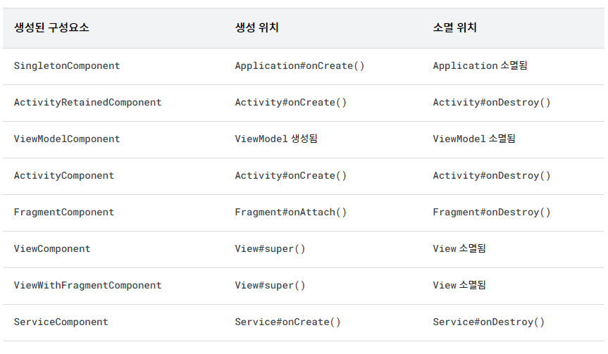
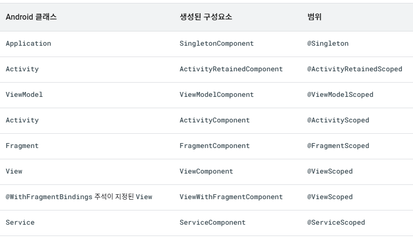

<div align="center">
  <p>
    
  </p>
  <br>
  <h2>Android</h2>
  <p>안드로이드 관련 내용 정리</p>
  <br>
  <br>
</div>


## 🔥 Dependency Injection (DI, 의존성 주입)

### 의존성

객체 지향 프로그래밍에서 클래스 간에 `의존성`이 있다는 것은 클래스 간에 `의존 관계`가 있다는 것을 뜻한다

즉, 한 클래스가 바뀔 때 다른 클래스가 영향을 받는다는 것을 뜻한다

(A클래스가 객체를 만들기 위해 B를 필요로 하는 것)

<br>

### 의존성 주입

> 클래스간 의존성을 클래스 외부에서 주입하는 것

의존성 주입을 받으면, 클래스 간에 결합도가 약해진다

클래스 간에 결합도가 약해진다는 것은 한 클래스가 변경될 경우, 다른 클래스가 변경될 필요성이 적어진다는 뜻

<br>

### 의존성 주입 장점

- 리팩토링 편의성
- 테스트 편의성
- 코드 재사용 가능

<br>

### 안드로이드 의존성 주입 라이브러리

: Dagger / Hilt / Koin / Kodein / Anvil

👉 안드로이드에서의 의존성 주입은 Hilt를 사용한다

<br>

### Hilt

> Google의 Dagger 기반의 Dependency Injection(DI) 라이브러리

<br>

### Hilt 특징

- Android class에 의존성 주입을 지원하고 생명 주기를 자동으로 관리

- Dagger2 기반의 라이브러리
- 프로젝트 설정의 간소화
- 쉬운 모듈 탐색과 통합
- 개선된 테스트 환경
- Koin에 비해서 Android Component별 Scope가 명확

- 보일러플레이트 코드 감소

  *보일러플레이트 : 여러곳에서 재사용되며, 반복적으로 비슷한 형태를 띄는 코드

<br>

### Hilt 상세내용

✅ Hilt는 Annotation을 통해 적용할 수 있다

- Application

  ```kotlin
  @HiltAndroidApp
  class ExampleApplication : Application() { ... }
  ```

  ➡️ `AndroidManifest.xml`에서 아래 내용 추가

  ```xml
  <!-- 이 application 안에서 hilt를 사용하겠다는 의미 -->
  <application
  	android:name=".ExampleApplication"
  </application>
  ```

- Activity

  ```kotlin
  @AndroidEntryPoint
  class ExampleActivity : AppCompatActivity() { ... }
  ```

- Inject

  ```kotlin
  class AnalyticsAdapter @Inject constructor(
    private val service: AnalyticsService
  ) { ... }
  ```

<br>

✅ Android Class에 종속성 주입 범위

*나머지는 `@AndroidEntryPoint` 사용

👉 Hilt가 해당 클래스에 Dependency를 제공해 줄 수 있는 Component를 생성해준다

- Application (`@HiltAndroidApp` 사용하여)
- ViewModel (`@HiltViewModel` 사용하여)
- Activity
- Fragment
- View
- Service
- BroadcastReceiver

<br>

✅ @InstallIn

필드 삽입을 실행할 수 있는 각 Android Class마다 `@InstallIn` Annotation을 설정해야 한다

이 어노테이션에는 구성요소 기간을 설정해서 모듈이 어느 범위까지 사용되는지를 지정해야 한다



👉 ex) SingletonComponent는 Application 전체 기간동안 존재하고 사용할 수 있다

<br>

✅ Component Scopes (구성요소 스코프)

기본적으로 Hilt의 모든 결합은 범위가 지정되지 않는다

앱이 결합을 요청할 때마다 Hilt는 필요한 유형의 새 인스턴스를 생성한다

<br>

그러나 Hilt는 결합을 특정 구성요소로 범위 지정할 수도 있다

Hilt는 결합의 범위가 지정된 구성요소의 인스턴스마다 한 번만 범위가 지정된 결합을 생성하며,

이 결합에 관한 모든 요청은 동일한 인스턴스를 공유한다



<br>

✅ Hilt 모듈

Module을 이용해서 Hilt에게 원하는 Dependency를 생성하는 방법을 알려줄 수 있다

아래와 같이 생성자 삽입을 할 수 없는 상황에도 쓰인다

- 인터페이스
- 외부 라이브러리의 클래스

이럴 때는 Hilt 모듈을 사용하여 Hilt에 결합 정보를 제공할 수 있다

👉 Module 클래스를 생성할 때 가장 먼저 `@Module` Annotation을 붙여준다

그래야 Hilt는 여기가 Module이 있는 곳임을 알 수 있다

👉 다음으로 `@InstallIn` Annotation을 붙여준다

ex) `@InstallIn(ActivityComponent::class)`는 해당 모듈이 acitivity에서 사용가능하다고 선언하다는 의미

(해당 Component의 이름을 넣어주면 된다)

```kotlin
@Module
@InstallIn(ViewModelComponent::class)
object RepositoryModule {
  
  @ViewModelScoped
  @Provides
  fun providesContentRepository(contentDao: ContentDao): ContentRepository =
  	ContentRepositoryImpl(contentDao)  // ContentDao 주입
}
```

```kotlin
// Hilt를 썼으니까 Inject 실행
class ContentRepositoryImpl @Inject constructor(private val contentDao: ContentDao) : 
	ContentRepository {
    ...
}
```

<br>

✅ 각 Annotation 내용

- @Module

  : Hilt 모듈인지 여부를 판단

- @InstallIn

  : Component 범위를 지정 

- @Binds

  : 인터페이스 타입의 객체를 어떻게 만드는지 Hilt에게 알려주기 위한 용도로 사용

  (인터페이스 삽입)

- @Provides

  : 외부 라이브러리인 클래스(Retrofit, OkHttpClient, Room 등) 또는 빌더 패턴으로 인스턴스를 생성해야 하는 경우에 사용

  (인스턴스 삽입)

  ```kotlin
  @Module
  @InstallIn(SingletonComponent::class)
  object AnalyticsModule {
  
    @Singleton
    @Provides
    fun provideAnalyticsService(): AnalyticsService {
      return Retrofit.Builder()
      		.baseUrl("https://example.com")
      		.build()
      		.create(AnalyticsService::class.java)
    }
  }
  ```

- @Qualifier

  : 동일한 유형에 대해 여러 결합 제공

- @ApplicationContext

  : Application의 context를 제공하는 한정자

<br>

### 의존성 주입 방식별 구분

- 생성자 주입 방식
  - 필요한 모든 의존객체를 객체를 생성하는 시점에 준비 가능
  - 생성 시점에 의존객체가 정상인지 아닌지 판정 가능
- 메서드 주입 방식
  - 의존객체가 나중에 생성되는 경우에 사용 가능
  - 메서드의 이름을 통해 어떤 의존객체를 주입하는지 더 알기 쉬움
- 인터페이스를 통한 주입 방식
  - 메서드와 특징 동일

<br>

### 의존성 주입 방식별 예시

```kotlin
class DieselEngine {
  val fuel = "diesel"
}

class Car {
  val engine = DieselEngine()
}
```

- 생성자 주입 방식

  ```kotlin
  class DieselEngine {
    val fuel = "diesel"
  }
  
  class Car(val engine: DieselEngine) {
  }
  
  fun main() {
    val dieselEngine = DieselEngine()  // DieselEngine 객체
    val car = Car(dieselEngine)  // 클래스를 초기화하는 시점에서 외부에서 작성한 DieselEngine 객체를 생성자로 주입
  }
  ```

- 메서드 주입 방식

  ```kotlin
  class DieselEngine {
    val fuel = "diesel"
  }
  
  class Car {
    val engine = null
    
    private fun setEngine(engine: Engine) {
      this.engine = engine
    }
  }
  
  fun main() {
    val dieselEngine = DieselEngine()
    val car = Car()
    // 클래스 초기화가 끝난 후 어떤 시점에서 setEngine을 실행시켜서 객체를 주입
    car.setEngine(dieselEngine)
  ```

- 인터페이스를 통한 주입 방식

  ```kotlin
  interface DieselEngineInjector {
    fun inject(dieselEngine: DieselEngine)
  }
  
  class DieselEngine {
    val fuel = "diesel"
  }
  
  class Car implements DieselEngineInjector {
    val engine = null
    
    override fun inject(dieselEngine: DieselEngine) {
      this.engine = engine
    }
  }
  
  fun main() {
    val dieselEngine = DieselEngine()
    val car = Car()
    car.inject(dieselEngine)
  }
  ```


 

