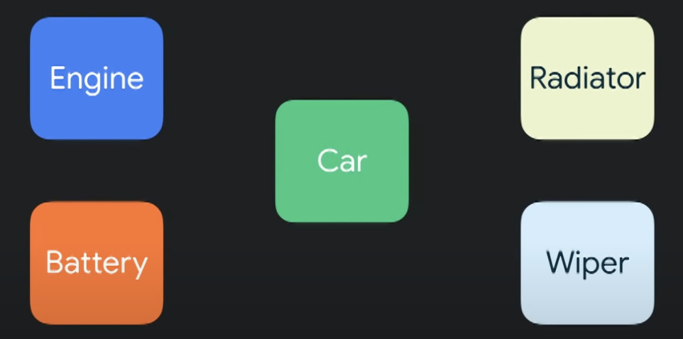
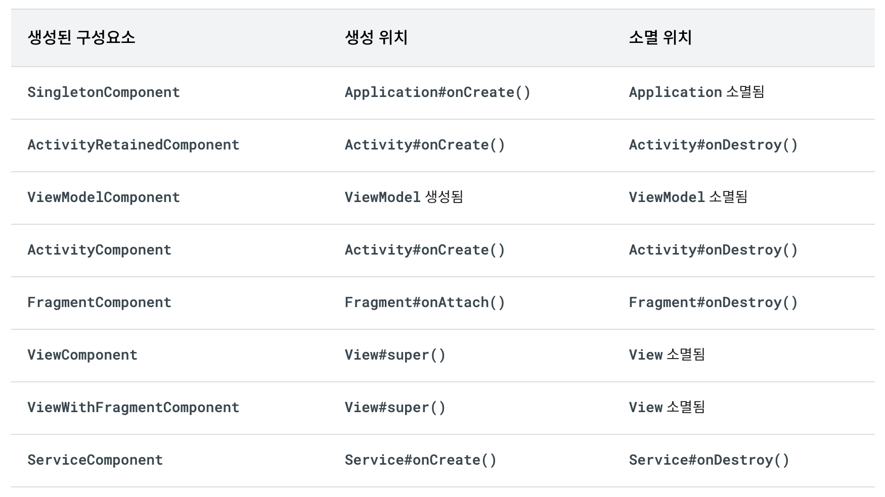
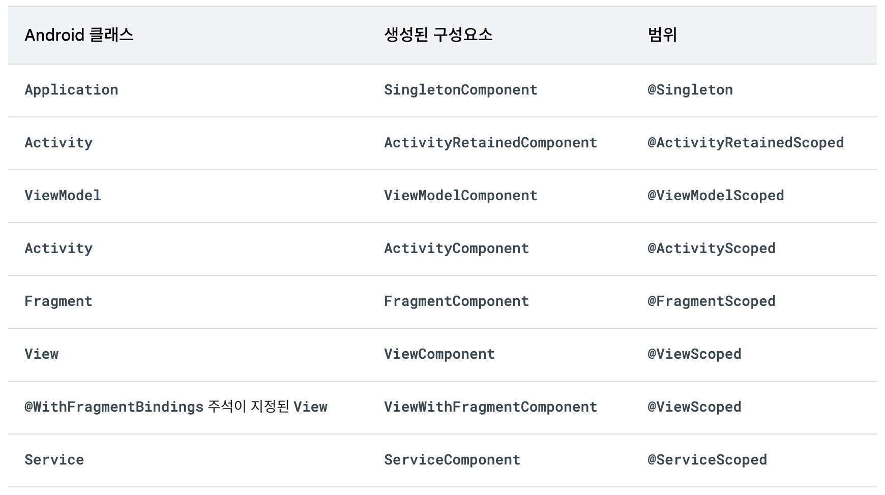

<div align="center">
  <p>
    
  </p>
  <br>
  <h2>Android</h2>
  <p>안드로이드 관련 내용 정리</p>
  <br>
  <br>
</div>


## 🔥 Dependency Injection (DI, 의존성 주입)

### 의존성 주입의 필요성

클래스는 작업을 완료하기 위해 다른 클래스를 참조해야 할 때가 있다

이렇게 참조하는 것을 `의존성` 이라고 한다

<br>

자동차는 엔진이 없으면 동작하지 않는다

즉, 엔진을 자동차의 의존성이라고 표현하거나 / 차가 엔진에 의존한다고 말할 수 있다

다음 예는 `Car` 클래스가 자체 `Engine`을 구성하고 있다

👉 `Car` 클래스가 실행되기 위해서는 `Engine` 클래스의 인스턴스가 있어야 한다


‼️ 하지만, 자동차는 스스로 엔진 인스턴스를 만들어야 하는 책임을 지고 있다

이를 어떻게 구성하는지도 알고 있어야 한다

‼️ 이는 클래스가 하기에 양이 많다

```kotlin
// Without DI

class Car {
  private val engine: Engine = Engine()
}
```

<br>

### 의존성 주입

> 클래스가 스스로 의존성을 생성하는 대신 클래스에 의존성을 부여하는 것


자동차가 엔진 인스턴스를 직접 생성하는 것이 아니라

자동차를 만들 때 엔진을 차에 달아주는 것이다

<br>

의존성 주입으로 클래스가 지닌 책임을 가져가고

매개변수를 의존성으로 바꾼다

👉 자동차를 소규모로 유지하면서 다른 부분은 생각하지 않고 자동차 상태 관리에만 집중하게 한다

```kotlin
// With DI

class Car(private val engine: Engine) {
}
```

<br>

### 의존성 주입 장점

- 코드 재사용하고 의존성을 분리
- 코드의 리팩토링 편의성

- 테스트 편의성

```kotlin
// Reuse Car

fun main(args: Array<String>) {
  val electricCar = Car(ElectricEngine())
  val combustionCar = Car(CombustionEngine())
  ...
}
```



커대한 클래스를 가지는 대신 여러 부품으로 나눠서 자동차를 작게 만든다

✅ 자동차를 관리하기 더 쉬워진다

✅ 코드가 줄어든다

✅ 여러 사람이 동시에 충돌 없이 앱을 작업할 수 있다

<br>

### Hilt

> Google의 Dagger 기반의 의존성 주입(DI) 라이브러리

👉 안드로이드에서의 의존성 주입은 Hilt를 사용한다

<br>

### Hilt 특징

- Android class에 의존성 주입을 지원하고 생명 주기를 자동으로 관리

- Dagger2 기반의 라이브러리
- 프로젝트 설정의 간소화
- 쉬운 모듈 탐색과 통합
- 개선된 테스트 환경
- Android Component별 Scope가 명확

- 보일러플레이트 코드 감소

  *Boilerplate code : 여러곳에서 재사용되며, 반복적으로 비슷한 형태를 띄는 코드

<br>

### Hilt 의존성 추가

프로젝트 수준의 `build.gradle` 파일에 추가

```python
plugins {
  id("com.google.dagger.hilt.android") version "2.44" apply false
}
```

➡️ app 수준의 `build.gradle` 파일에 추가

```python
plugins {
  kotlin("kapt")
  id("com.google.dagger.hilt.android")
}

android {
  ...
}

dependencies {
  implementation("com.google.dagger:hilt-android:2.44")
  kapt("com.google.dagger:hilt-android-compiler:2.44")
}
```

<br>

### Hilt 상세내용

Hilt는 Annotation을 통해 적용할 수 있다

- Hilt 애플리케이션 클래스

  Hilt를 사용하는 모든 앱은 `@HiltAndroidApp`을 달아야한다

  `@HiltAndroidApp`은 애플리케이션 수준 의존성 컨테이너 역할을 하는 애플리케이션의 기본 클래스를 비롯하여 Hilt의 코드 생성을 트리거합니다.

  ```kotlin
  @HiltAndroidApp
  class ExampleApplication : Application() { ... }
  ```

  ➡️ `AndroidManifest.xml`에서 아래 내용 추가

  ```xml
  <application
      android:name=".ExampleApplication"
  </application>
  ```
  
  <br>
  
- Android 클래스에 의존성 주입

  `Application` 클래스에 Hilt를 설정하고 애플리케이션 수준 구성요소를 사용할 수 있게 되면 

  Hilt는 `@AndroidEntryPoint` 어노테이션이 있는 다른 Android 클래스에 의존성을 제공할 수 있습니다

  ```kotlin
  @AndroidEntryPoint
  class ExampleActivity : AppCompatActivity() { ... }
  ```

  Hilt가 해당 클래스에 Dependency를 제공해 줄 수 있는 Component를 생성해준다

  - Application (`@HiltAndroidApp` 사용하여)
  - ViewModel (`@HiltViewModel` 사용하여)
  - Activity
  - Fragment
  - View
  - Service
  - BroadcastReceiver

  👉 나머지는 `@AndroidEntryPoint` 사용

<br>

- Hilt 결합 정의

  생성자 주입 방식으로 Hilt에 결합 정보를 제공

  다음과 같이 클래스의 생성자에서 `@Inject` 어노테이션을 사용하여 클래스의 인스턴스를 제공하는 방법을 Hilt에 알려준다

  ```kotlin
  class AnalyticsAdapter @Inject constructor(
    private val service: AnalyticsService
  ) { ... }
  ```

  👉 어노테이션이 지정된 클래스 생성자의 매개변수는 그 클래스의 의존성이다

  `AnalyticsAdapter`에는 `AnalyticsService`가 의존성으로 있다

<br>

- Hilt 모듈

  Module을 이용해서 Hilt에게 원하는 의존성을 생성하는 방법을 알려줄 수 있다

  아래와 같이 생성자 주입할 수 없는 상황에도 쓰인다

  - 인터페이스
  - 외부 라이브러리의 클래스

  👉 이럴 때는 Hilt 모듈을 사용하여 Hilt에 결합 정보를 제공할 수 있다

  <br>

  ➡️ Module 클래스를 생성할 때 가장 먼저 `@Module` Annotation을 붙여준다

  그래야 Hilt는 여기가 모듈이 있는 곳임을 알 수 있다

  이 모듈은 특정 유형의 인스턴스를 제공하는 방법을 Hilt에 알려준다

  ➡️ 다음으로 `@InstallIn` 어노테이션을 붙여준다

  ex) `@InstallIn(ActivityComponent::class)`는 해당 모듈이 acitivity에서 사용가능하다고 선언하다는 의미

  (해당 Component의 이름을 넣어주면 된다)

  *Hilt 모듈에 `@InstallIn` 어노테이션을 지정하여 각 모듈을 사용하거나 설치할 Android 클래스를 Hilt에 알려야 한다

  <br>

  ✅ `@Binds`를 사용하여 인터페이스 인스턴스 주입

  `AnalyticsService`가 인터페이스라면 이 인터페이스를 생성자 주입할 수 없다

  대신 Hilt 모듈 내에 `@Binds`로 어노테이션이 지정된 abstract 함수를 생성하여 Hilt에 결합 정보를 제공한다

  `@Binds` 어노테이션은 인터페이스의 인스턴스를 제공해야 할 때 사용할 구현을 Hilt에 알려준다

  <br>

  어노테이션이 지정된 함수는 Hilt에 다음 정보를 제공한다

  - 함수 반환 유형은 함수가 어떤 인터페이스의 인스턴스를 제공하는지 Hilt에 알려준다
  - 함수 매개변수는 제공할 구현을 Hilt에 알려준다

  <br>

  ```kotlin
  interface AnalyticsService {
    fun analyticsMethods()
  }
  
  // Constructor-injected, because Hilt needs to know how to
  // provide instances of AnalyticsServiceImpl, too.
  class AnalyticsServiceImpl @Inject constructor(
    ...
  ) : AnalyticsService { ... }
  
  @Module
  @InstallIn(ActivityComponent::class)
  abstract class AnalyticsModule {
  
    @Binds
    abstract fun bindAnalyticsService(
      analyticsServiceImpl: AnalyticsServiceImpl
    ): AnalyticsService
  }
  ```

  👉 Hilt가 AnalyticsModule의 의존성을 `ExampleActivity`에 주입하기를 원하기 때문에 

  Hilt 모듈 `AnalyticsModule`에 `@InstallIn(ActivityComponent.class)` 어노테이션을 지정한다

  이 어노테이션은 `AnalyticsModule`의 모든 의존성을 앱의 모든 activity에서 사용할 수 있음을 의미한다

  <br>

  ✅ `@Provides`를 사용하여 인스턴스 주입

  생성자 주입할 수 없는 것은 인터페이스만이 아니다

  클래스가 외부 라이브러리에서 제공되므로 

  클래스를 소유하지 않은 경우(Retrofit, OkHttpClient 또는 Room 데이터베이스와 같은 클래스)

  또는 빌더 패턴으로 인스턴스를 생성해야 하는 경우에도 생성자 주입이 불가능하다

  <br>

  이전 예에서, `AnalyticsService` 클래스를 직접 소유하지 않으면 

  Hilt 모듈 내에 함수를 생성하고 이 함수에 `@Provides` 어노테이션을 지정하여 이 유형의 인스턴스를 제공하는 방법을 Hilt에 알릴 수 있다

  어노테이션이 달린 함수는 Hilt에 다음 정보를 제공한다

  - 함수 반환 유형은 함수가 어떤 유형의 인스턴스를 제공하는지 Hilt에 알려준다

  - 함수 매개변수는 해당 유형의 의존성을 Hilt에 알려준다

  - 함수 본문은 해당 유형의 인스턴스를 제공하는 방법을 Hilt에 알려준다

    Hilt는 해당 유형의 인스턴스를 제공해야 할 때마다 함수 본문을 실행한다

  ```kotlin
  @Module
  @InstallIn(ActivityComponent::class)
  object AnalyticsModule {
  
    @Provides
    fun provideAnalyticsService(
      // Potential dependencies of this type
    ): AnalyticsService {
        return Retrofit.Builder()
                 .baseUrl("https://example.com")
                 .build()
                 .create(AnalyticsService::class.java)
    }
  }
  ```

  <br>

### Android 클래스용으로 생성된 구성요소

- 구성요소 전체기간 (@InstallIn)

주입할 수 있는 각 Android Class마다 `@InstallIn` 어노테이션을 설정해야 한다

이 어노테이션에는 구성요소 기간을 설정해서 모듈이 어느 범위까지 사용되는지를 지정해야 한다

👉 Hilt는 해당 Android 클래스의 수명 주기에 따라 생성된 구성요소 클래스의 인스턴스를 자동으로 만들고 제거한다



ex) SingletonComponent는 Application 전체 기간동안 존재하고 사용할 수 있다

<br>

- 구성요소 범위 (Component Scopes)

기본적으로 Hilt의 모든 결합은 범위가 지정되지 않는다

앱이 결합을 요청할 때마다 Hilt는 필요한 유형의 새 인스턴스를 생성한다

<br>

Hilt는 결합을 특정 구성요소로 범위 지정할 수도 있다

Hilt는 결합의 범위가 지정된 구성요소의 인스턴스마다 한 번만 범위가 지정된 결합을 생성하며,

이 결합에 관한 모든 요청은 동일한 인스턴스를 공유한다



<br>

### 각 Annotation 내용

- @Module

  : Hilt 모듈인지 여부를 판단

- @InstallIn

  : Component 범위를 지정 

- @Binds

  : 인터페이스 타입의 객체를 어떻게 만드는지 Hilt에게 알려주기 위한 용도로 사용

  (인터페이스 주입)

- @Provides

  : 외부 라이브러리인 클래스(Retrofit, OkHttpClient, Room 등) 또는 빌더 패턴으로 인스턴스를 생성해야 하는 경우에 사용

  (인스턴스 주입)

- @Qualifier

  : 동일한 유형에 대해 여러 결합 제공

- @ApplicationContext

  : Application의 context를 제공하는 한정자

<br>

### [참고] 의존성 주입 방식별 구분

- 생성자 주입 방식
  - 필요한 모든 의존객체를 객체를 생성하는 시점에 준비 가능
  - 생성 시점에 의존객체가 정상인지 아닌지 판정 가능
- 메서드 주입 방식
  - 의존객체가 나중에 생성되는 경우에 사용 가능
  - 메서드의 이름을 통해 어떤 의존객체를 주입하는지 더 알기 쉬움
- 인터페이스를 통한 주입 방식
  - 메서드와 특징 동일

<br>

### [참고] 의존성 주입 방식별 예시

```kotlin
class DieselEngine {
  val fuel = "diesel"
}

class Car {
  val engine = DieselEngine()
}
```

- 생성자 주입 방식

  ```kotlin
  class DieselEngine {
    val fuel = "diesel"
  }
  
  class Car(val engine: DieselEngine) {
  }
  
  fun main() {
    val dieselEngine = DieselEngine()  // DieselEngine 객체
    val car = Car(dieselEngine)  // 클래스를 초기화하는 시점에서 외부에서 작성한 DieselEngine 객체를 생성자로 주입
  }
  ```

- 메서드 주입 방식

  ```kotlin
  class DieselEngine {
    val fuel = "diesel"
  }
  
  class Car {
    val engine = null
    
    private fun setEngine(engine: Engine) {
      this.engine = engine
    }
  }
  
  fun main() {
    val dieselEngine = DieselEngine()
    val car = Car()
    // 클래스 초기화가 끝난 후 어떤 시점에서 setEngine을 실행시켜서 객체를 주입
    car.setEngine(dieselEngine)
  ```

- 인터페이스를 통한 주입 방식

  ```kotlin
  interface DieselEngineInjector {
    fun inject(dieselEngine: DieselEngine)
  }
  
  class DieselEngine {
    val fuel = "diesel"
  }
  
  class Car implements DieselEngineInjector {
    val engine = null
    
    override fun inject(dieselEngine: DieselEngine) {
      this.engine = engine
    }
  }
  
  fun main() {
    val dieselEngine = DieselEngine()
    val car = Car()
    car.inject(dieselEngine)
  }
  ```
