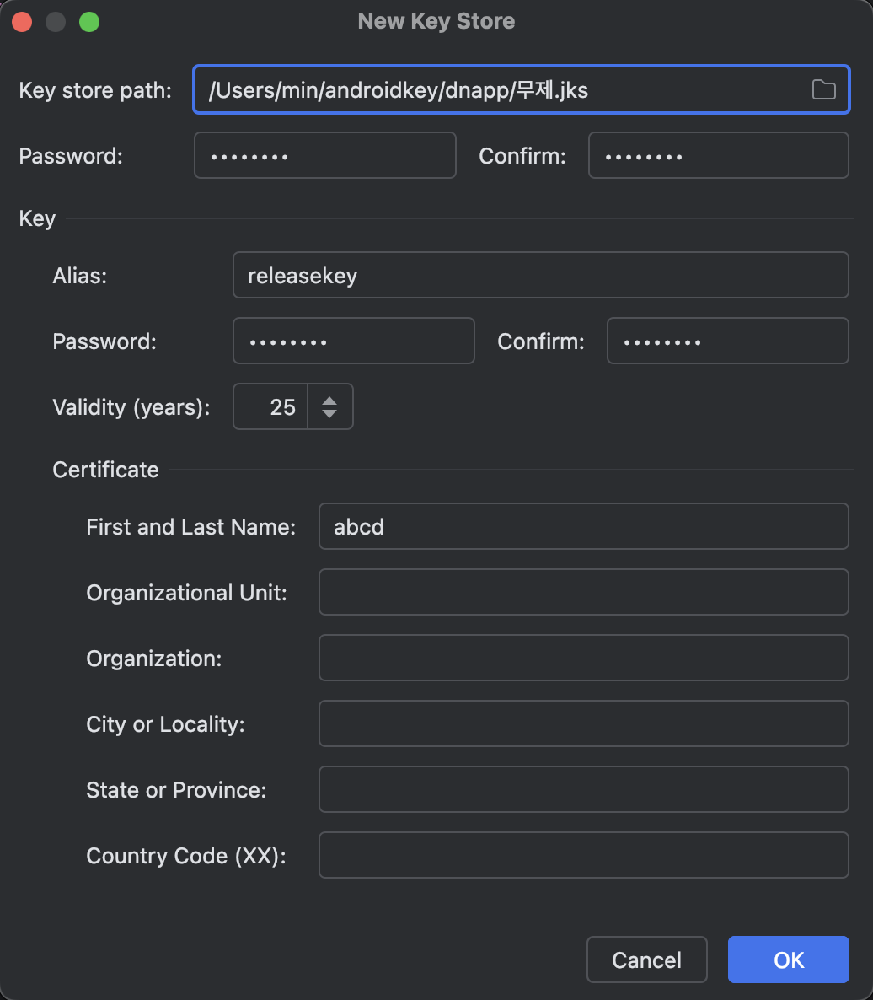
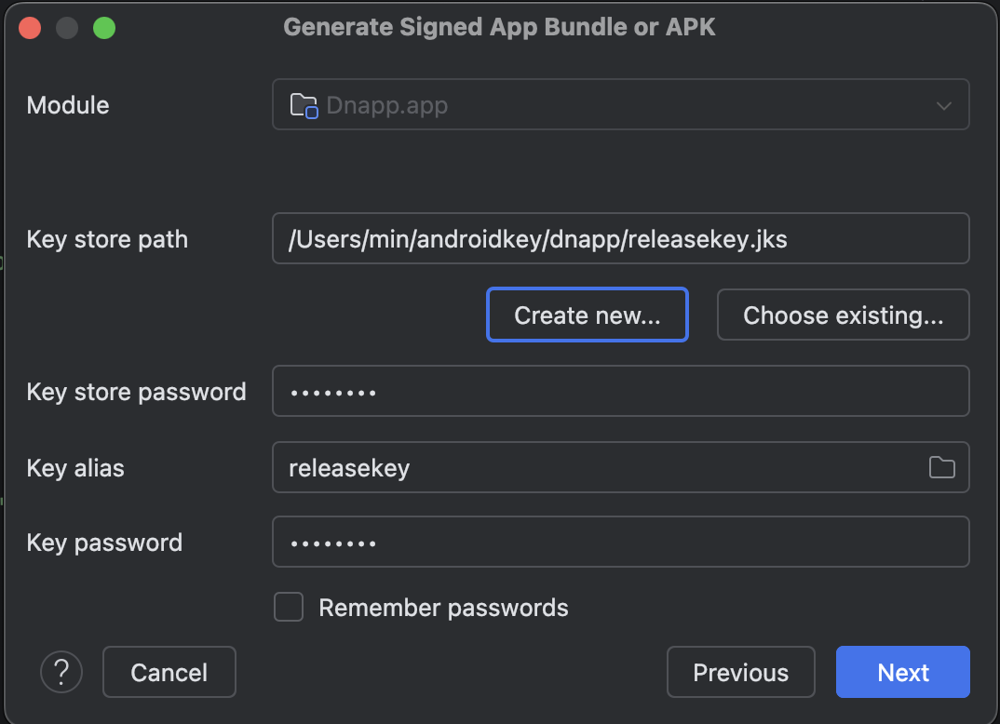
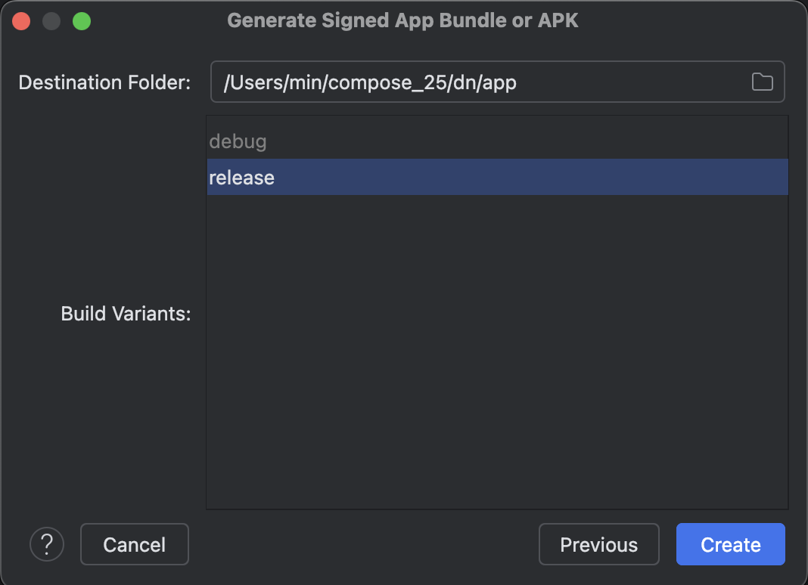
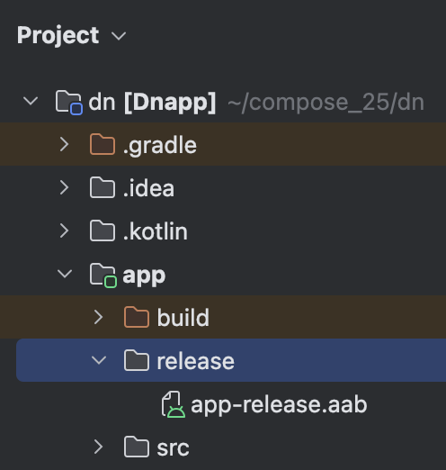

  

    
  

   
  <h2>Android Studio</h2>
  
안드로이드 스튜디오 관련 내용 정리

   
   

## 🔥 App Bundle 생성 방법

안드로이드 스튜디오에서 App Bundle(AAB)을 생성하려면 아래 단계를 진행한다

 

### 1. 서명 키 생성

앱을 Google Play Store에 배포하려면 앱에 서명해야 한다

먼저 서명 키를 생성해야 하는데, 이미 서명 키가 있다면 이 단계는 건너뛴다 

#### 1-1)

안드로이드 스튜디오 상단 메뉴에서 Build → Generate Signed App Bundle or APK 선택

#### 1-2)

Generate Signed 창에서 Android App Bundle 선택된 상태로 Next 클릭

#### 1-3)

Key store path 옆에 있는 [Create new] 버튼 클릭

#### 1-4)

New Key Store 창이 뜨면 다음 정보를 입력한다

- Key store path : 키 저장소 파일(*.jks)을 저장할 경로와 파일 이름을 지정한다
- Password : 키 저장소의 비밀번호 입력하고 확인한다
- Alias : 키 별칭을 지정한다
- Password : 키의 비밀번호를 입력하고 확인한다
- Validity (years) : 키의 유효기간 설정, 최소 25년 이상 권장

👉 두 비밀번호 같게 설정하는 것 추천

#### 1-5)

모든 정보 입력 후 [OK] 클릭하면 키 저장소 파일이 생성된다

 

### 2. App Bundle 생성

서명 키가 준비되었다면 이제 앱 번들을 생성할 수 있다

#### 2-1)

Generate Signed 창에서 Android App Bundle 선택된 상태로 Next 클릭

#### 2-2)

Key store path에 1단계에서 생성한 키 저장소 파일의 경로를 지정하거나,

기존에 사용하던 키 파일을 선택한다

#### 2-3)

Key store password, Key alias, Key password를 입력한다

*비밀번호를 기억하기 어렵다면 Remember passwords를 체크하면 편리함

#### 2-4)

[Next] 클릭 후 release 선택된 상태로 생성

👉 App Bundle은 배포용이므로 release 빌드를 사용해야 한다

 

### 3. AAB 파일 확인

- 빌드가 완료되면 안드로이드 스튜디오 우측 하단에 팝업 알림이 뜬다

- app → release 폴더에서 생성된 AAB 파일 확인 가능

  (`app-release.aab`)

👉 이 AAB 파일을 Google Play Console에 업로드하여 앱을 배포할 수 있다

 

### 참고

- App Bundle(`*.aab`)은 Google Play Store에 업로드하기 위한 형식이다

- APK(`*.apk`)는 Android 기기에 직접 설치할 수 있는 파일 형식이다

- AAB 파일을 Google Play Console에 업로드하면, Google Play에서 사용자의 기기에 최적화된 APK를 생성하여 배포해 준다

- AAB는 APK보다 용량이 작고, 필요한 리소스만 다운로드하므로 사용자에게 더 좋은 경험을 제공한다
