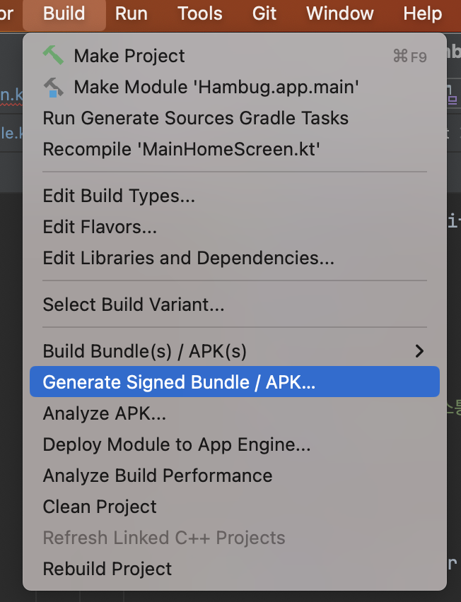

  

    
  

   
  <h2>Android Studio</h2>
  
안드로이드 스튜디오 관련 내용 정리

   
   

## 🔥 APK 파일 설치

### APK 추출

안드로이드 스튜디오 상단 main menu에서

Build ➡️ Generate Signed Bundle / APK ➡️ APK 선택 ➡️ 키스토어 정보 입력

 

APK 생성 완료되면

해당 프로젝트 폴더 ➡️ app ➡️ release 폴더에서 만들어진 APK 확인 가능

 

### APK 설치

https://developer.android.com/tools/releases/platform-tools?hl=ko

위 링크에서 노트북 OS에 맞게 설치하기

ex) Windows용 SDK 플랫폼 도구 다운로드

 

➡️➡️ 선택 후 약관동의 체크하고 다운로드 진행

➡️ adb 폴더 만든 후 다운받은 파일 풀어주기

➡️ adb 폴더 안에 apk 폴더 만들기 (설치된 apk파일 옮기기 위해서)

 

###  USB 디버깅 활성화

휴대폰에서 USB 개발권한을 부여하기 위해 아래처럼 디버그 모드를 사용한다

- 개발자 모드

휴대폰 설정 ➡️ 휴대전화 정보 ➡️ 소프트웨어 정보 ➡️ 빌드번호를 연타하면

개발자 모드로 들어갈 수 있다

- USB 디버깅 활성화

이후 설정 ➡️ 개발자 옵션 ➡️ USB 디버깅을 활성화 시킨 후

휴대폰과 PC를 연결해준다

 

### CMD를 활용한 APK 설치

