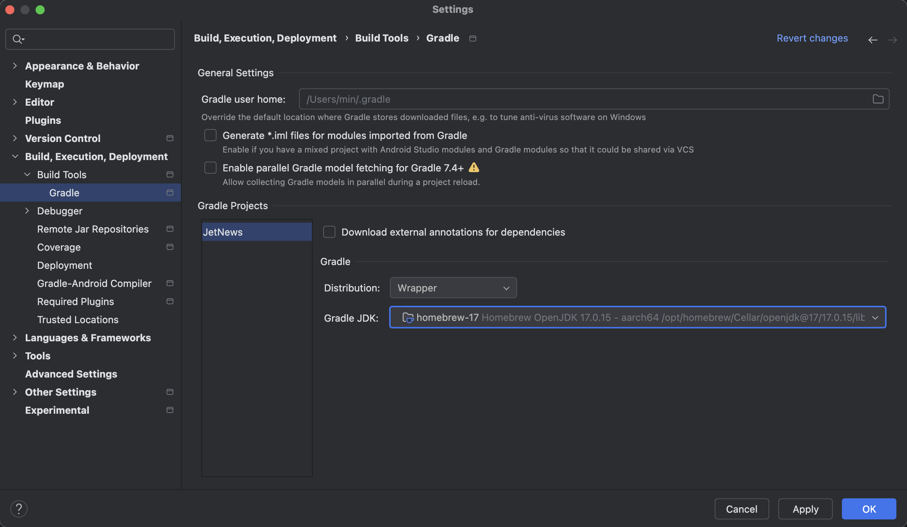

<div align="center">
  <p>
    
  </p>
  <br>
  <h2>Android Studio</h2>
  <p>안드로이드 스튜디오 관련 내용 정리</p>
  <br>
  <br>
</div>


## 🔥 macOS에서 Homebrew를 이용한 JDK 17 설치 및 설정

### 배경

- Android Studio에서 `AGP 8.7.3`과 `Gradle 8.10.2` 를 사용하는 프로젝트에서 `JDK 17` 이 요구되었으나,

  기본 설정이  `JDK 21` 로 되어 있어 빌드 오류 발생

- 해결을 위해 Homebrew를 사용해 `JDK 17` 을 설치하고  `JAVA_HOME` 환경 변수를 재설정함 

<br>

### 개념 정리

Homebrew

- macOS에서 명령어 기반으로 개발 도구, 라이브러리 등을 설치/관리할 수 있게 해주는 패키지 관리자

JAVA_HOME

- 자바 개발 도구(JDK)의 경로를 명시적으로 지정하는 환경 변수
- java, javac 명령이 어떤 JDK를 참조할지 결정됨
- JAVA_HOME을 명시적으로 설정하지 않으면, 시스템이 기본 경로에서 임의의 JDK를 참조할 수 있음
- 여러 버전의 JDK가 설치된 경우, 명시적으로 설정해야 정확한 버전 선택이 가능함

<br>

### 설치 순서

1. Homebrew 설치

   ```bash
   /bin/bash -c "$(curl -fsSL https://raw.githubusercontent.com/Homebrew/install/HEAD/install.sh)"
   ```

   <br>

   설치 확인

   ```bash
   brew --version
   # Homebrew 4.5.1
   ```

   <br>

   ❗️경고 메세지가 나타나는 경우, 아래 방법으로 진행

   (Warning: /opt/homebrew/bin is not in your PATH ...)

   👉 이 경고 메시지는 Homebrew가 설치된 경로 (`/opt/homebrew/bin`)가 시스템의 `PATH`에 아직 추가되지 않았다는 의미,

   `PATH`는 터미널에서 명령어를 찾을 수 있는 경로 목록인데, 이 경로에 Homebrew가 추가되어 있지 않으면 Homebrew 명령어를 사용할 수 없게 된다

   ```bash
   echo 'eval "$(/opt/homebrew/bin/brew shellenv)"' >> /Users/min/.zprofile
   eval "$(/opt/homebrew/bin/brew shellenv)"
   ```

   👉 명령어들은 경고 메시지에서 알려줬던 내용 (==> Next steps)

   👉 각 명령어를 한 줄씩 입력하면, Homebrew 경로가 `PATH`에 추가되고, 터미널에서 Homebrew를 사용할 수 있게 된다

2. JDK 17 설치 (OpenJDK 17)

   ```bash
   brew install openjdk@17
   ```


3. JDK 17을 기본으로 설정 (환경 변수 설정)

   ```bash
   echo 'export JAVA_HOME="/opt/homebrew/opt/openjdk@17"' >> ~/.zshrc
   echo 'export PATH="$JAVA_HOME/bin:$PATH"' >> ~/.zshrc
   source ~/.zshrc
   ```

   👉 각 명령어를 한 줄씩 실행

   <br>

4. 설치 및 설정 확인 잘 되었는지 확인

   ```bash
   java -version
   # openjdk version "17.0.x" (x는 설치된 버전 번호)
   
   echo $JAVA_HOME
   # /opt/homebrew/opt/openjdk@17
   ```


​	👉 출력이 위와 같으면 설정 성공한 것

<br>

### Android Studio 설정

- 설치한 버전은 아래 위치에서 확인 가능

  상단 Android Studio ➡️ Settings ➡️ Build, Execution, Deployment ➡️ Build Tools ➡️ Gradle ➡️ Gradle JDK 에서 

- 설치한 버전 선택 후 적용(OK)하기




