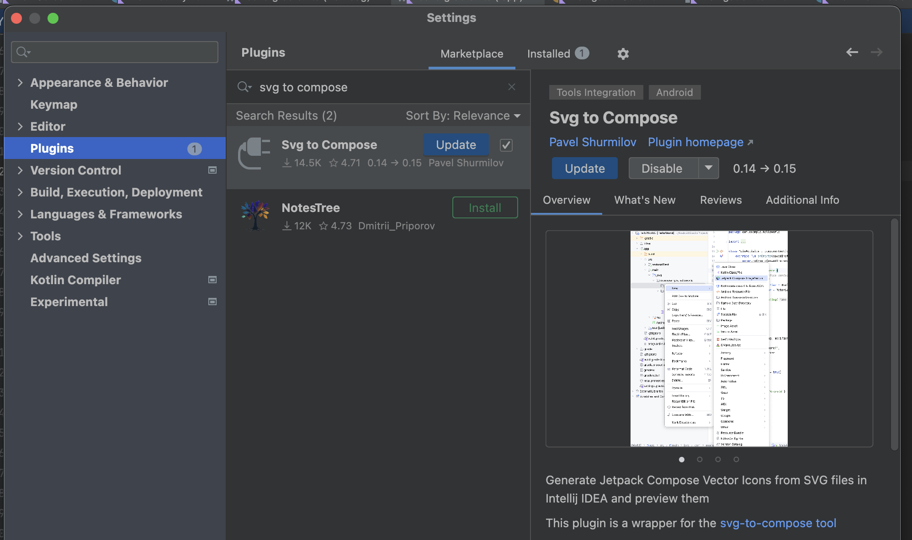
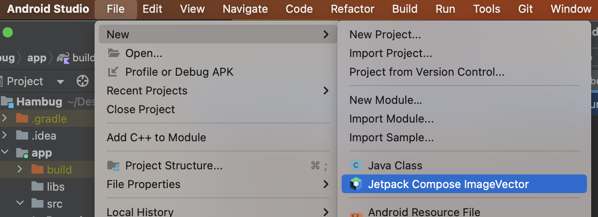

  

    
  

   
  <h2>Android Studio</h2>
  
안드로이드 스튜디오 관련 내용 정리

   
   

## 🔥 SVG 파일을 Compose용 ImageVector로 변환

### 설치

Android Studio 에서

Settings ➡️ Plugins ➡️ [ svg to compose ] 검색해서 설치

 

File ➡️ New ➡️ [ Jectpack Compose ImageVector ] 클릭

