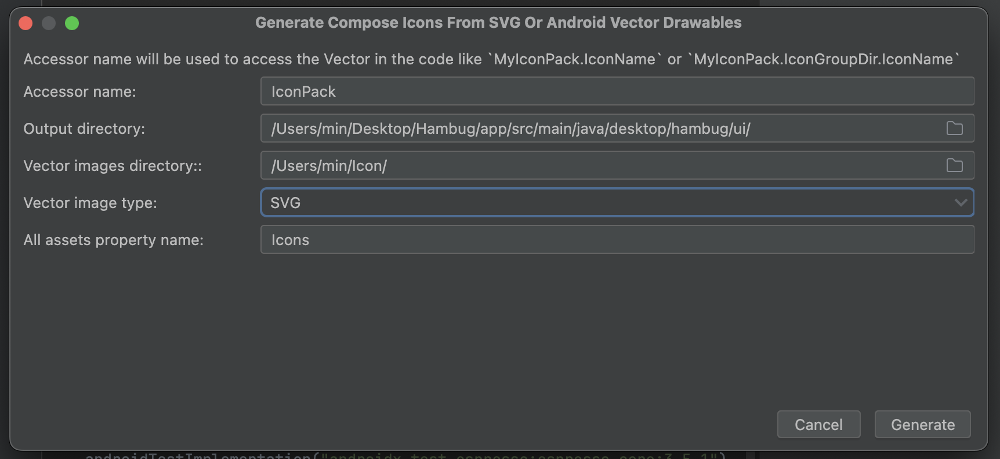

  

    
  

   
  <h2>Android Studio</h2>
  
안드로이드 스튜디오 관련 내용 정리

   
   

## 🔥 SVG 파일을 Compose용 ImageVector로 변환

### 설치

Android Studio 에서

Settings ➡️ Plugins ➡️ [ svg to compose ] 검색해서 설치

 

File ➡️ New ➡️ [ Jectpack Compose ImageVector ] 클릭

 

내용들을 입력한다

👉 Accessor name : ImageVector에 접근하기 위한 이름

👉 Output directory : 변환된 ImageVector 들이 출력될 디렉토리 경로

👉 Vector images directory : SVG 파일들이 포함된 디렉토리 경로

👉 Vector image type : SVG 선택

👉 All assets property name : 변환된 아이콘 목록의 변수명
