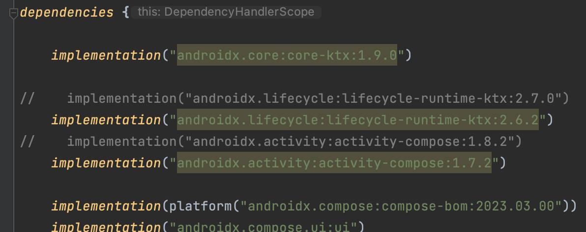

<div align="center">
  <p>
    
  </p>
  <br>
  <h2>Android Studio</h2>
  <p>안드로이드 스튜디오 관련 내용 정리</p>
  <br>
  <br>
</div>


## 🔥 sdk 설정에 따른 프로젝트 세팅

### 설정 내용

- minSdk = 28

- targetSdk = 33
- Jetpack Compose

<br>

### 프로젝트 세팅

app(module) 수준의 build.gradle에 의존성 수정



👉 sdk 33의 최신 버전으로 세팅

- 기존 버전은 최소 android sdk 34 버전부터 지원한다
- 현재 개발 중인 모듈은 33 버전을 타겟팅하고 있으므로 호환이 불가하다
- 라이브러리를 33 지원되는 버전으로 낮춰 호환되는 버전으로 세팅해주면 문제가 해결된다

```kotlin
implementation("androidx.lifecycle:lifecycle-runtime-ktx:2.6.2")
implementation("androidx.activity:activity-compose:1.7.2")
```
