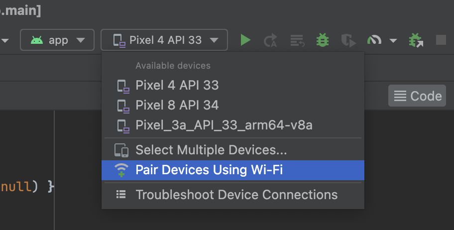
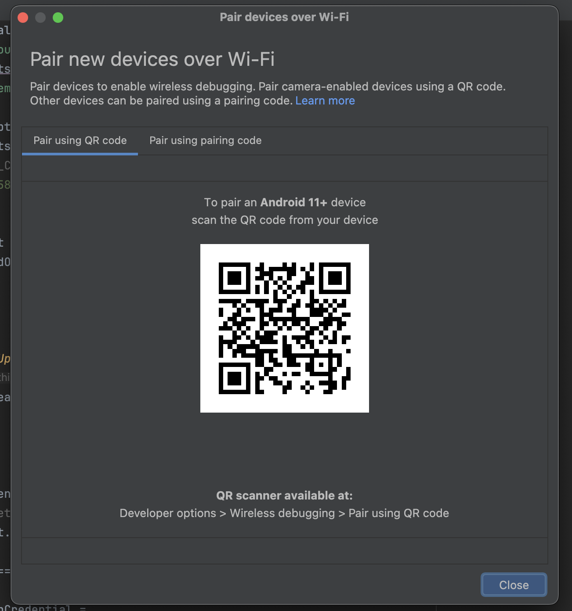

  

    
  

   
  <h2>Android Studio</h2>
  
안드로이드 스튜디오 관련 내용 정리

   
   

## 🔥 안드로이드 스튜디오 핸드폰 연결 안되는 경우

### 기기 인식 안될때 연결하는 다른방법

Pair Devices Using Wi-Fi를 이용해 USB 없이 와이파이로 연결 가능

👉 안드로이드 스튜디오에서 [Pair Devices Using Wi-Fi] 클릭

 

👉 실기기로 QR 코드 스캔

*설정 ➡️ 개발자 옵션 ➡️ 무선 디버깅 ON ➡️ 무선 디버깅 꾹 눌러서 QR 코드로 기기 페어링 클릭 ➡️ QR 코드 스캔 
