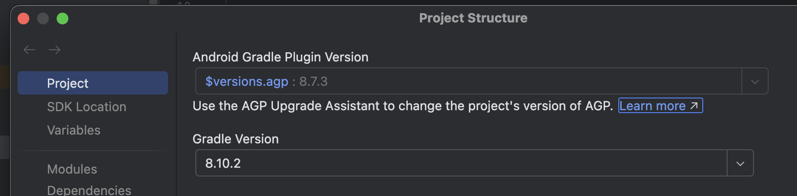
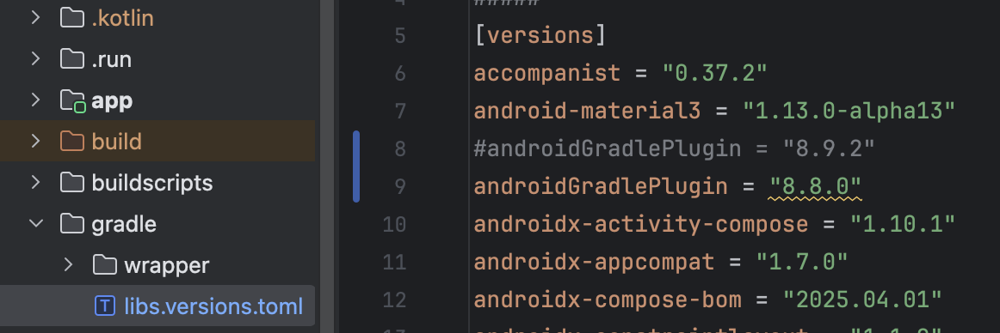
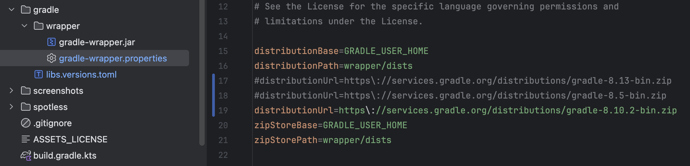

  

    
  

   
  <h2>Android Studio</h2>
  
안드로이드 스튜디오 관련 내용 정리

   
   

## 🔥 Android 프로젝트의 빌드 도구 버전 호환성

### 개요

- Android 프로젝트에서 JDK, Android Gradle Plugin (AGP), Gradle,

  Android Studio, compileSdk/targetSdk는 서로 의존한다

- 이들의 버전 호환성을 정확히 설정하지 않으면 빌드 오류, 기능 미지원, 런타임 충돌 등이 발생할 수 있다
- 각 요소 간의 호환성을 정리하고, 안정적인 개발 환경 구성을 위해 작성

 

### 개념 정리

AGP (Android Gradle Plugin)

- Android 앱의 빌드, 테스트, 배포 과정을 관리하는 플러그인

- AGP 버전은 Android Studio, Gradle, JDK, Kotlin Plugin 및 Compose Compiler 버전과 호환되어야 한다

Gradle

- Kotlin, Android 등 다양한 언어와 플랫폼을 지원하는 빌드 자동화 도구
- Android Studio는 Gradle을 기본 빌드 시스템으로 사용하며, Kotlin DSL(`build.gradle.kts`)과 함께 구성된다
- 프로젝트 전체의 빌드 흐름 및 의존성 관리를 담당한다

JDK (Java Development Kit)

- Kotlin/Java 코드를 컴파일하고 실행하기 위한 개발 도구 모음 (컴파일러, 런타임 포함)
- Kotlin도 JVM 바이트코드를 생성하므로 Android 빌드에는 JDK가 필수
- AGP 8.0 이상부터는 JDK 17 이상이 필요하다

 

### Android API 레벨과 JDK 호환성

- Android 12 (API 32) 및 Android 13 (API 33) : JDK 11까지 호환됨
- Android 14 (API 34) 및 Android 15 (API 35) : JDK 17까지 호환됨

| Android 버전 | API 레벨 | 권장 JDK 버전 |
| ------------ | -------- | ------------- |
| Android 12   | 32       | 11            |
| Android 13   | 33       | 11            |
| Android 14   | 34       | 17            |
| Android 15   | 35       | 17            |

 

### AGP, Gradle, JDK 호환성

- AGP 8.0 이상 : JDK 17 필요
- AGP 8.5.1 이상 : Android 15 (API 35) 지원을 위해 권장됨

| AGP 버전 | 출시 시기 | 최소 Gradle 버전 | 최소 JDK 버전 | 지원 API 레벨 |
| -------- | --------- | ---------------- | ------------- | ------------- |
| 8.0      | 23년 4월  | 8.0              | 17            | 33            |
| 8.5      | 24년 6월  | 8.7              | 17            | 34            |
| 8.6      | 24년 8월  | 8.7              | 17            | 35            |
| 8.7      | 24년 10월 | 8.9              | 17            | 35            |
| 8.8      | 25년 1월  | 8.10.2           | 17            | 35            |
| 8.9      | 25년 3월  | 8.11.1           | 17            | 35            |

 

### Android Studio와의 호환성

| Android Studio 버전 | 코드네임 | 필요한 AGP 버전 범위 | 요구 JDK 버전 |
| ------------------- | -------- | -------------------- | ------------- |
| Koala               | 2024.1.1 | 3.2~8.5              | 17            |
| Koala 기능 출시     | 2024.1.2 | 3.2~8.6              | 17            |
| Ladybug             | 2024.2.1 | 3.2~8.7              | 17            |
| Ladybug 기능 출시   | 2024.2.2 | 3.2~8.8              | 17            |
| Meerkat             | 2024.3.1 | 3.2~8.9              | 17            |
| Meerkat 기능 출시   | 2024.3.2 | 3.2~8.10             | 17            |

 

### compileSdk, targetSdk와 API 레벨

| compileSdk/targetSdk | API 레벨 | 필요한 AGP 버전 | 권장 JDK 버전 |
| -------------------- | -------- | --------------- | ------------- |
| 33                   | 33       | 7.2 이상        | 11            |
| 34                   | 34       | 8.1.1 이상      | 17            |
| 35                   | 35       | 8.6.0 이상      | 17            |
| 36                   | 36       | 8.9.1 이상      | 17            |

 

### 프로젝트의 AGP, Gradle 버전 확인

상단 File ➡️ Settings ➡️ Project Structure 에서 확인 가능

 

### 프로젝트의 AGP, Gradle 버전 수정

- AGP 버전 수정

  프로젝트 ➡️ gradle 폴더 ➡️ libs.versions.toml 에서 ➡️ androidGradlePlugin 수정

  

- Gradle 버전 수정

  프로젝트 ➡️ gradle 폴더 ➡️ wrapper 폴더 ➡️ gradle-wrapper.properties 에서 ➡️ distributionUrl 수정

  

 

### 출처

https://developer.android.com/studio/releases

https://developer.android.com/build/jdks

https://developer.android.com/build/releases/gradle-plugin

https://developer.android.com/build/releases/past-releases/agp-8-9-0-release-notes?_gl=1*1rn7rld*_up*MQ..*_ga*ODg2MTY1MjIxLjE3NDY2Nzg5MzI.*_ga_6HH9YJMN9M*czE3NDY2ODY1ODgkbzIkZzAkdDE3NDY2ODY1ODgkajAkbDAkaDE4NDI1MDkzNjg.
