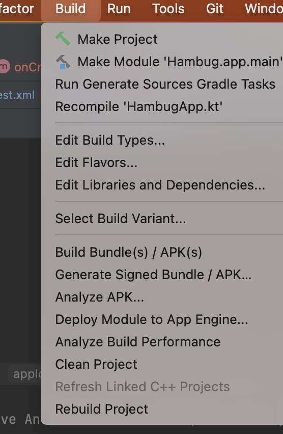

  

    
  

   
  <h2>Android Studio</h2>
  
안드로이드 스튜디오 관련 내용 정리

   
   

## 🔥 빌드 관련 에러

### 에러 해결 방법

안드로이드 스튜디오에서 빌드(Run app)시 갑자기 에러가 발생하는 경우

👉 문제될게 없는데 에러가 발생했을때 아래 방법으로 해결 가능

 

안드로이드 스튜디오 캐시 삭제

상단 File 탭 ➡️ Invalidate Caches ➡️ Invalidate and Restart 버튼 클릭

 

그래도 안되면

상단 Build 탭 ➡️ Clean Project 후 Rebuild Project 진행

 

위의 방법들을 통해 빌드 성공 가능
