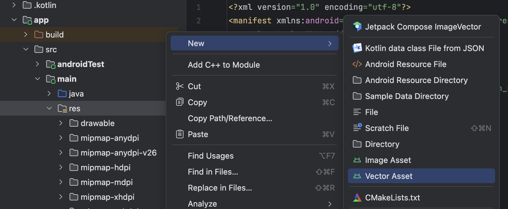
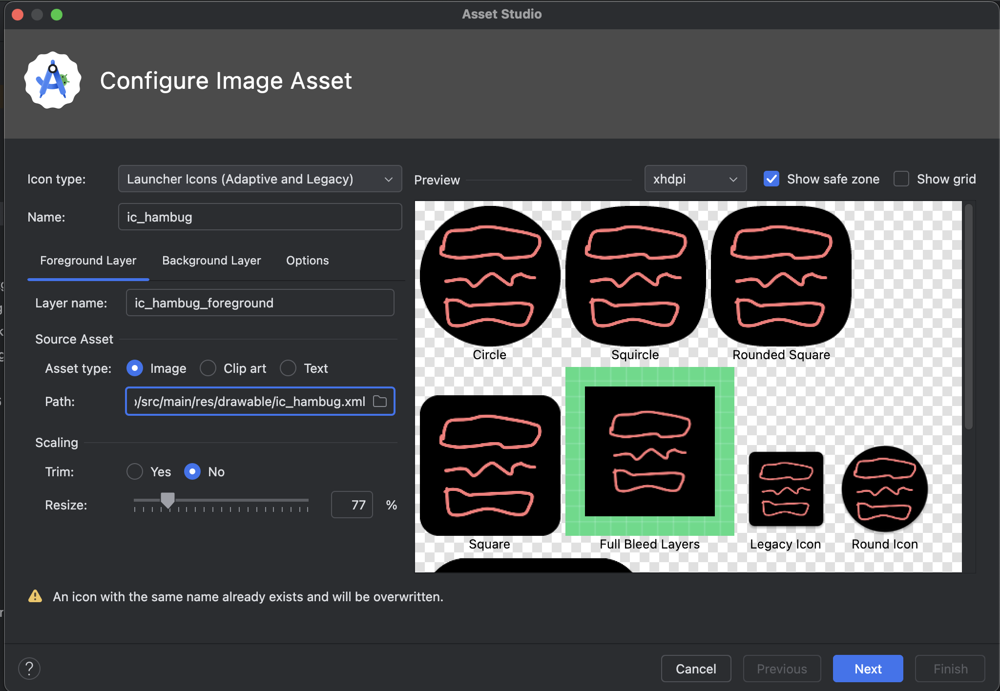

<div align="center">
  <p>
    
  </p>
  <br>
  <h2>Android Studio</h2>
  <p>안드로이드 스튜디오 관련 내용 정리</p>
  <br>
  <br>
</div>


## 🔥 안드로이드 앱 아이콘 변경

### 1. SVG 파일 준비 및 VectorDrawable 변환

- SVG 파일 준비

  앱 아이콘으로 사용할 SVG 파일 준비

- Vector Asset Studio 열기

  프로젝트 창에서 `res` 폴더 우클릭 → New → Vector Asset 선택

- SVG 파일 선택

  - Asset Type : `Local file (SVG, PSD)`로 설정
  - Path 옆 폴더 아이콘 클릭하여 준비한 SVG 파일 선택
  - Name : `ic_hambug`와 같은 이름으로 지정
  - Size는 기본으로 표시되는 값으로 두기

- 변환 완료

  - Next 클릭하고, 확인 후 Finish 클릭

  - `res/drawable` 폴더 안에 SVG 데이터가 포함된 XML 파일 생성됨

    (`your_icon_name.xml`)



<br>

### 2. Image Asset Studio를 통한 런처 아이콘 생성

- Image Asset Studio 열기

  프로젝트 창에서 `res` 폴더 우클릭 → New → Image Asset 선택

- 아이콘 유형 설정

  Icon Type : `Launcher Icons (Adaptive and Legacy)`로 설정

- Foreground 레이어 설정

  - Asset Type을 `Image`로 선택

  - Path 옆 폴더 아이콘 클릭하여 1단계에서 생성한 VectorDrawable 파일 선택

    (`res/drawable` 폴더 > `your_icon_name.xml`)

  - Resize 슬라이더를 조절하여 로고가 안전 영역(Safe Zone) 안에 들어가도록 크기를 조정한다

  *`An icon with the same name already exists and will be overwritten` 경고 메세지는

  기존 아이콘을 새로운 아이콘으로 덮어쓰는 정상적인 과정이므로 무시해도 된다

- Background 레이어 설정

  - `Background Layer` 탭에서 기본 설정을 그대로 두면 된다

    (커스텀 이미지를 배경으로 사용하거나 특정 색상을 지정할 필요가 없다면)

- 변환 완료

  - Next 클릭하고, 확인 후 Finish 클릭

  - `mipmap-anydpi-v26` 폴더에 XML 파일이 생성되고,

    구형 안드로이드 버전을 위한 다양한 해상도의 WEBP 파일들이 `mipmap` 폴더에 업데이트된다



<br>

### 3. AndroidManifest.xml 파일 확인

- 앱 아이콘을 `AndroidManifest.xml` 파일에 지정해야 한다

- `<application>` 태그 내의 `android:icon`, `android:roundIcon` 속성 값을

  `@mipmap`을 통해 새로 만든 아이콘으로 지정한다

```xml
<application
    android:allowBackup="true"
    android:dataExtractionRules="@xml/data_extraction_rules"
    android:fullBackupContent="@xml/backup_rules"
    android:icon="@mipmap/ic_hambug"
    android:label="@string/app_name"
    android:roundIcon="@mipmap/ic_hambug_round"
    android:supportsRtl="true"
    android:theme="@style/Theme.Test0803">
</application>
```

<br>

### 4. 앱 빌드 및 실행

모든 설정을 마쳤으면, 앱을 빌드하고 에뮬레이터나 실기기에서 실행하여 변경된 아이콘을 확인한다
