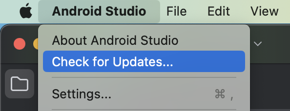
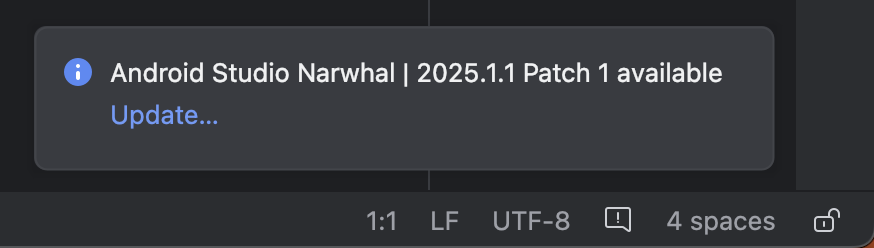
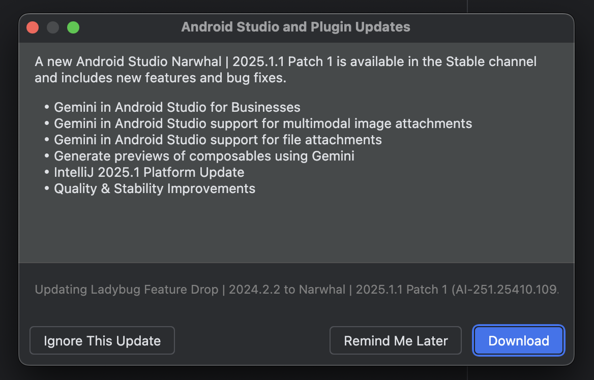
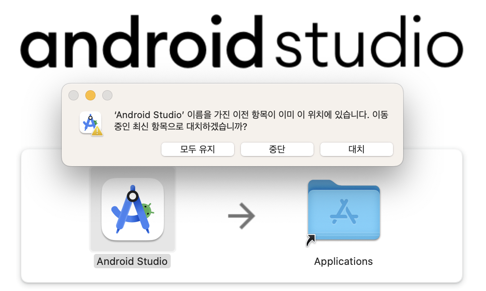

  

    
  

   
  <h2>Android Studio</h2>
  
안드로이드 스튜디오 관련 내용 정리

   
   

## 🔥 안드로이드 스튜디오 업데이트 방법

안드로이드 스튜디오를 최신 버전으로 업데이트하는 가장 권장되는 방법은

안드로이드 스튜디오 자체 기능을 이용하는 것이다

 

### 1. 안드로이드 스튜디오 실행

### 2. 업데이트 확인

메뉴바에서 Android studio > Check for Updates 클릭

(macOS)

### 3. 업데이트 설치

- 새로운 업데이트가 감지되면, 업데이트 알림이 표시된다

  

  *업데이트가 감지되지 않는다면, 이미 최신 버전을 사용 중이거나 업데이트 채널 설정이 다를 수 있다

- 알림에서 [Update]를 클릭하면 업데이트 내용을 확인할 수 있다

  

- [Download] 버튼을 클릭하면 기존 스튜디오 내에서 바로 업데이트 하거나,

  웹사이트로 이동하는 경우도 있다 (메이저 버전 업그레이드 시)

  - 사이트 이동 후, Download Android Studio 클릭

    

  - [대치]를 선택하면 최신 버전이 이전 버전을 대체하며 설치된다

    
