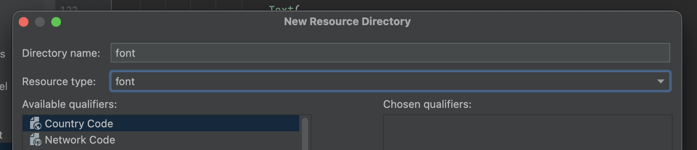

<div align="center">
  <p>
    
  </p>
  <br>
  <h2>Design System</h2>
  <p>디자인 시스템 관련 내용 정리</p>
  <br>
  <br>
</div>


## 🔥 Typography (타이포그래피)

### 타이포그래피 가이드라인

한글은 영문과 다른 시각적 특성을 가지므로, Material Design 기본 권장값을 조정함

#### Line Height (행간)

- 권장 비율 : fontSize * 1.5 ~ 1.6
- Material 기본 가이드 : fontSize * 1.2 ~ 1.4
- 한글은 행간이 좁으면 답답해 보임

#### Letter Spaceing (자간)

- 권장 값 : -1% ~ -3% (-0.01em ~ -0.03em)
- 제목 : -1% ~ -2%
- 본문/읽기용 : -2% ~ -3%
- 한글은 기본 자간이 넓어 마이너스 자간이 더 자연스러움

<br>

## 타이포그래피 구조

### 데이터 클래스 정의

```kotlin
@Immutable
data class AppTypography(
    val heading01: TextStyle,
    val heading02: TextStyle,
    val title01: TextStyle,
    ...
)
```

<br>

### CompositionLocal 제공

```kotlin
val LocalAppTypography = staticCompositionLocalOf<AppTypography> {
    error("AppTypography not provided")
}

object HambugTheme {
    val typography: AppTypography
        @Composable
        @ReadOnlyComposable
        get() = LocalAppTypography.current
}
```

<br>

## Pretendard 폰트 적용

### 폰트 다운로드

- 출처 : https://github.com/orioncactus/pretendard
- 다운로드 : https://cactus.tistory.com/306

<br>

### 필요한 파일 선택

압축 해제 후 `public/static/` 경로에서 아래 파일들 사용

- Pretendard-Medium.otf
- Pretendard-SemiBold.otf
- Pretendard-Bold.otf


<br>

### Android Studio에 추가

1. 리소스 디렉토리 생성

   res 폴더 우클릭 → New → Android Resource Directory


<br>

2. 설정

   - Directory name : font

   - Resource type : font



<br>

3. 파일명 변경 후 이동
   - 파일명 규칙 : 소문자 + 언더스코어만 사용
   - Pretendard-Bold.otf → pretendard_bold.otf


<br>

4. 코드에 적용

   - FontFamily 정의

     ```kotlin
     private val pretendardMedium = FontFamily(
         Font(R.font.pretendard_medium, FontWeight.Medium)
     )
     private val pretendardSemiBold = FontFamily(
         Font(R.font.pretendard_semibold, FontWeight.SemiBold)
     )
     private val pretendardBold = FontFamily(
         Font(R.font.pretendard_bold, FontWeight.Bold)
     )
     ```


   - AppTypography 생성

     ```kotlin
     fun getAppTypography(): AppTypography {
         return AppTypography(
             heading01 = TextStyle(
                 fontFamily = pretendardBold,
                 fontSize = 28.sp,
                 lineHeight = (28 * 1.25).sp,
                 letterSpacing = (-0.014).em
             ),
             ...
         )
     }
     ```
