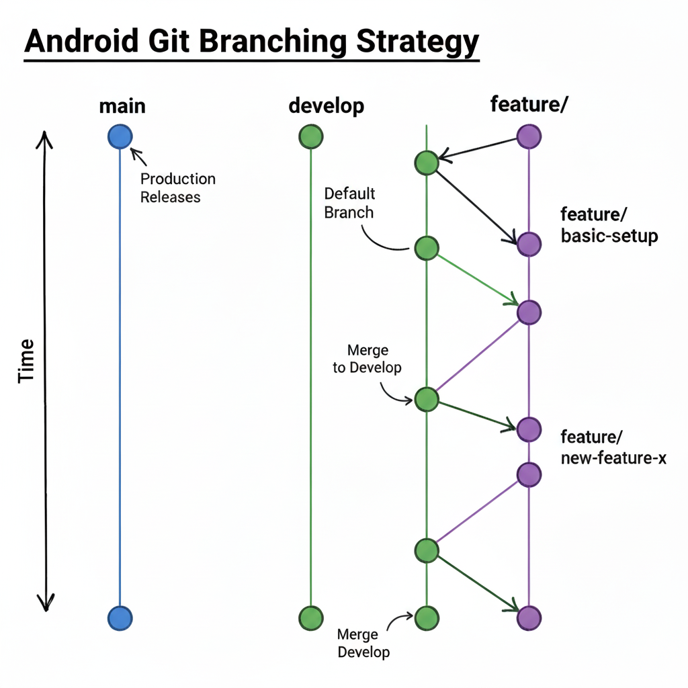

<div align="center">
  <p>
    
  </p>
  <br>
  <h2>Git</h2>
  <p>Git 관련 내용 정리</p>
  <br>
  <br>
</div>


## 🔥 Git Branch 전략

### 개요

> 여러 개발자가 하나의 저장소에서 협업할 때, 브랜치 규칙과 workflow를 정의하여
>
> 효율적으로 개발과 배포를 관리하는 방법

<br>

### 브랜치 구조

```kotlin
main        // 배포용 브랜치 (항상 배포 가능한 상태)
develop     // 기본 개발 브랜치 (default)
feature/*   // 기능별 브랜치 (작업 완료 후 develop로 병합)
```

- `main` 브랜치는 항상 안정된 배포 가능 상태 유지

- `develop` 브랜치에서 기능 개발을 위한 `feature/*` 브랜치를 생성

- 작업 완료 후 PR(Pull Request)을 통해 `develop`에 병합

- `develop` 브랜치의 안정화가 완료되면 `main`으로 병합 후 배포

<br>

### 개발 과정 예시

1. 브랜치 생성

   ```bash
   git checkout develop
   git checkout -b feature/login
   ```

2. 개발 및 커밋

   ```bash
   git add .
   git commit -m "Add login feature"
   git push origin feature/login
   ```

3. 병합

   - 리뷰 완료 후 `develop` 브랜치에 병합
   - develop 브랜치 안정화 후 `main` 브랜치에 병합
   - 병합 후 배포 가능

<br>

### WorkFlow 그림



