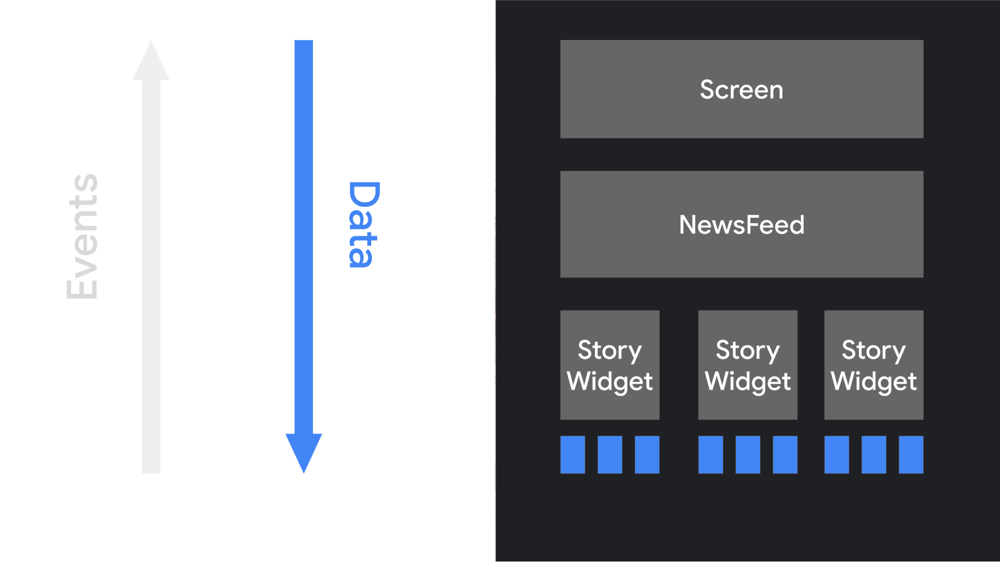

<div align="center">
  <p>
    
  </p>
  <br>
  <h2>Jetpack Compose</h2>
  <p>Jetpack Compose 관련 내용 정리</p>
  <br>
  <br>
</div>


## 🔥 Compose 기초

- Compose
- Composable
- Composition
- Recomposition
- State

<br>

### Jetpack Compose (Compose)

> 안드로이드 앱의 UI를 쉽게 디자인하고 빌드하기 위한 라이브러리

Android를 위한 현대적인 선언형 UI 도구 키트

Compose는 선언형 UI 프레임워크

<br>

### 선언형 UI

- 선언형 UI는 어떻게(HOW) UI를 구성하는지가 아니라 무엇(WHAT)을 UI에 구성하는지 나타내는 방식이다

- 선언형 UI는 UI 전체를 다시 생성하여 UI의 변경을 처리한다

  화면 전체를 다시 만들기 때문에 변수나 이벤트를 UI 객체와 연결할 필요가 없다

<br>



👉 함수는 데이터를 사용하여 다른 컴포저블을 호출함으로써 UI를 형성하고

적절한 데이터를 해당 컴포저블 및 계층 구조 아래로 전달한다

<br>


👉 사용자가 UI 요소와 상호작용하며 이에 따라 이벤트가 트리거된다. 앱 로직이 이벤트에 응답한다.

그러면 컴포저블 함수가 필요한 경우 새 매개변수를 사용하여 자동으로 다시 호출된다

<br>

### Composable (컴포저블)

Composable은 컴포즈로 화면을 만들기 위한 함수로, `@Composable`로 지정할 수 있다

하나의 화면을 만들기 위해 여러개의 컴포저블 함수를 만들어 사용할 수 있고, 

컴포저블 함수 내에서 필요한 구성 요소들(텍스트, 버튼, 이미지 등)을 원하는 형태로 배치 및 구성할 수 있다

```kotlin
@Composable
fun Greeting(name: String) {
    Text("Hello $name")
}
```

<br>

### Composition (컴포지션)

컴포저블 함수를 실행하면 생성되는 것으로, UI를 그리는 역할을 한다

@Composable 어노테이션을 활용하여 작성한 함수가 실제 UI로 구성되는 과정을 의미한다

<br>

즉, 맨 처음 UI로 초기화 될 때는 composition, 

클릭이나 다른 이벤트가 일어나 UI의 상태가 바뀌어 재구성 될 때는 recomposition이라고 부른다

<br>

### Recomposition (리컴포지션)

데이터가 변경될 때 컴포지션을 업데이트 하기 위해 컴포저블을 다시 실행하는 것

데이터의 변화를 관찰하여 Composition이 다시 일어나는 과정을 Recomposition이라 부른다

👉 뷰가 새로 그려짐

<br>

상태(State)가 변경되는 시점을 관찰하기 위해서 아래와 같은 클래스와 메서드를 활용할 수 있다

- MutableStateOf
- remember
- LiveData

<br>

### Scaffold

> Material Component들을 편하게 사용할 수 있도록 하기 위해 미리 디자인된 레이아웃이다

- Snackbar도 Material Component이므로

  Compose에서 Snackbar를 기존 Snackbar의 동작대로 이용하기 위해서는 Scaffold State로 감싸야 한다

  만약 Scaffold로 감싸지 않으면 보통의 Composable과 똑같이 동작한다

- Scaffold는 앱을 위한 최상위 수준의 컴포저블이다
- topBar, bottomBar, floatingActionButton 같은 일반적인 최상위 머테리얼 컴포넌트에 대한 Slot을 제공한다
- Scaffold를 사용하면 이러한 컴포넌트들을 배치하고 올바르게 동작하도록 한다

- UI의 여러 부분을 결합하여 앱에 일관된 디자인과 분위기를 준다

```kotlin
@Composable
fun ScaffoldExample() {
    var presses by remember { mutableIntStateOf(0) }

    Scaffold(
        topBar = {
          ...
        },
        bottomBar = {
          ...
        },
        floatingActionButton = {
          ...
        }
    ) { 
      ...
    }
}
```

Snackbar composable이 존재한다

하지만 이를 띄우고, 애니메이션 효과를 주고 하는 등의 작업이 개발자의 몫이 된다

또한, snackbar는 suspend 하게 동작한다

그렇기 때문에 이렇게 하지 않고 `snackbarHostState`를 사용하여 구현한다

```kotlin
@Composable
fun SnackbarEx() {
    val snackbarHostState = remember { SnackbarHostState() }
  
    Scaffold(
        snackbarHost = { SnackbarHost(snackbarHostState) },
        ...
    ) {
        ...
    }
}
```

<br>
