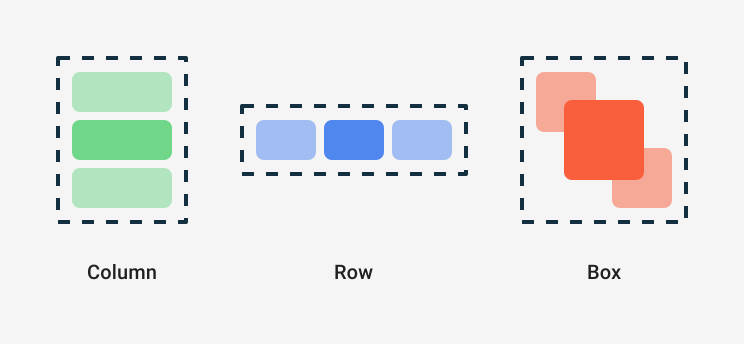

  

    
  

   
  <h2>Jetpack Compose</h2>
  
Jetpack Compose 관련 내용 정리

   
   

## 🔥 레이아웃 (Layout)

### Compose 레이아웃 기초

- Column
  - 자식 컴포저블을 세로 방향으로 순서대로 배치하는 레이아웃
  - 속성
    - verticalArrangement : 자식 간 세로 간격 조절
    - horizontalAlignment : 자식의 수평 정렬 설정

- Row
  - 자식 컴포저블을 가로 방향으로 순서대로 배치하는 레이아웃
  - 속성
    - horizontalArrangement : 자식 간 가로 간격 조절
    - verticalAlignment : 자식의 세로 정렬 설정

- Box
  - 자식들을 겹치거나 특정 위치에 정렬할 때 사용

 

 

### Surface / Box

- Surface

  - Material Design 시스템에 기반한 Compose의 컨테이너

  - light/dark 테마에 따라 적용 가능

- Box

  - 단순한 컨테이너로, Compose의 레이아웃을 구성하는데 사용
  - Box는 자식 요소를 수직 또는 수평으로 정렬하고, 간격, 패딩 등의 스타일을 적용하는데 유용하다

 

### Modifier

Modifier를 통해 다음과 같은 종류의 작업을 실행할 수 있다

- 컴포저블의 크기, 레이아웃, 동작 및 모양 변경
- 접근성 라벨과 같은 정보 추가
- 사용자 입력 처리
- 요소를 클릭 가능, 스크롤 가능, 드래그 가능 또는 확대/축소 가능하게 만드는 높은 수준의 상호작용 추가
