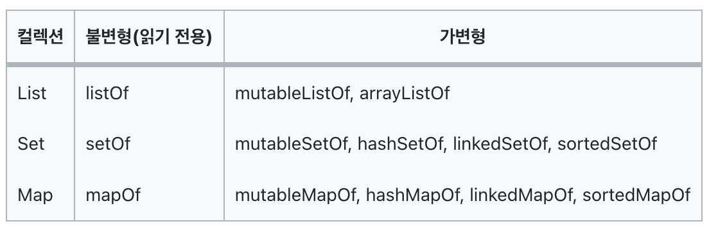

<div align="center">
  <p>
    
  </p>
  <br>
  <h2>Kotlin</h2>
  <p>코틀린 관련 내용 정리</p>
  <br>
  <br>
</div>

## 🔥 Abstract class / Interface

### 차이점

- 추상클래스 : 상속과 필수구현을 위해
- 인터페이스 : 필수구현을 위해

<br>

### Abstract class (추상 클래스)

> 대략적인 설계의 명세와 공통의 기능을 구현한 클래스 (구체적이지 않은 것)
>
> 추상 클래스를 상속하는 하위 클래스는 추상 클래스의 내용을 더 구체화 해야한다

<br>

### 추상 클래스 예제

```kotlin
// 

```

<br>

### Interface (인터페이스)

> 대략적인 설계 명세를 구현하고 인터페이스를 상속하는 하위 클래스에서 이를 구체화하는 것은 추상 클래스와 동일하지만, 
>
> 프로퍼티의 상태 정보를 저장할 수 없다

### 인터페이스 예제

- 프로퍼티의 초기화 불가능

```kotlin
interface Vehicle {
  val name : String
  val color : String
  val weight : Double
}

interface pet {
  val name : String = "puppy"  // 불가능
}
```

<br>


- immutable (불변형)

  : 데이터를 한 번 할당하면 읽기 전용이 된다 (변경 X)

  👉 기본적으로 제공하는 것이 immutable



- List

✅ 컬렉션을 잘 사용하려면 안에 있는 함수들을 잘 학습해야 한다!!
