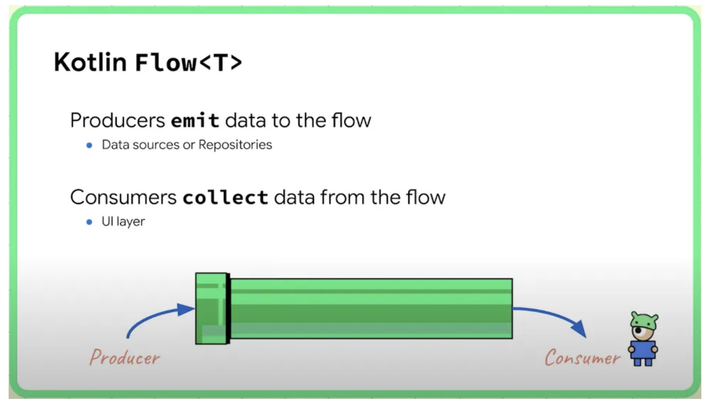
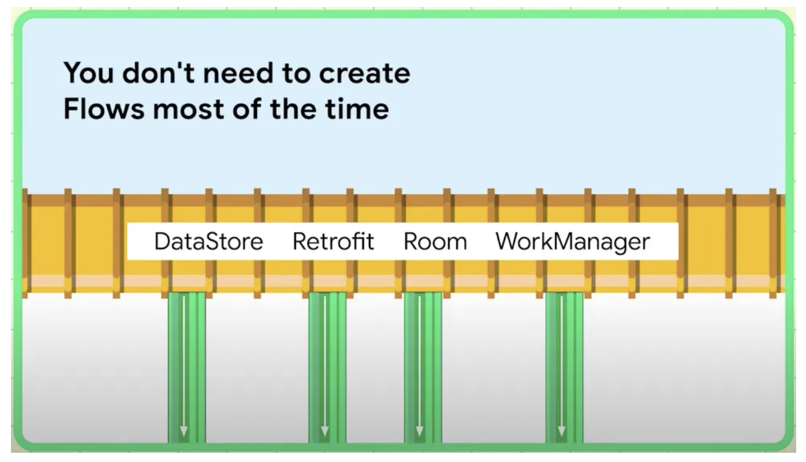

<div align="center">
  <p>
    
  </p>
  <br>
  <h2>Kotlin</h2>
  <p>코틀린 관련 내용 정리</p>
  <br>
  <br>
</div>

## 🔥 Flow

### Flow 정의

> 단일 값만 반환하는 suspend 함수와 달리 여러 값을 순차적으로 내보낼 수 있는 데이터 스트림

- 코루틴 상에서 리액티브 프로그래밍을 지원하기 위한 구성요소

- 코루틴을 기반으로 빌드 되고 여러 값을 제공할 수 있다
- 내보낸 값은 동일 타입이여야 한다

<br>

### 리액티브 프로그래밍 (Reactive Programming)

> 데이터가 변경될 때 이벤트를 발생시켜서 데이터를 계속해서 전달하도록 하는 프로그래밍 방식

✅ 명령형 프로그래밍에서 데이터 소비자는 데이터를 요청한 후 받은 결과 값을 일회성으로 수신한다

이러한 방식은 데이터가 필요할 때마다 결과값을 매번 요청해야 한다

👉 매우 비효율적

✅ 리액티브 프로그래밍에서 데이터를 발행하는 발행자가 있고, 데이터의 소비자는 데이터의 발행자에게 구독 요청을 한다

데이터의 발행자는 새로운 데이터가 들어오면 데이터의 소비자에게 지속적으로 발행

즉, 리액티브 프로그래밍에는 하나의 데이터를 발행하는 발행자가 있고,

해당 발행자는 데이터의 소비자에게 지속적으로 데이터를 전달하는 역할을 한다

👉 이것이 데이터 스트림

<br>

### 데이터 스트림의 3가지 항목

- 생산자

  : 스트림에 추가되는 데이터를 생산

- 중개자

  : 스트림에 내보내는 각각의 값이나 스트림 자체를 수정

  (소비자는 다른 타입의 데이터를 받게 된다)

- 소비자

  : 스트림의 값을 사용


<br>

### 코틀린 Flow



Flow에서 생산자는 데이터를 Flow에 입력하고, 소비자는 Flow에서 데이터를 수집하는 역할을 가지고 있다

Android에서 데이터 소스나 레포지토리가 전형적인 생산자이고, 최종적으로 화면에 데이터를 표시하는 UI가 소비자 역할을 한다

<br>

### Flow 생성



대부분의 경우 Flow를 직접 만들 필요는 없으며, 데이터 소스 라이브러리는 보통 Flow와 통합되어 있다

DataStore, Retrofit, Room, WorkManager 등이 존재한다

이들은 댐 역할을 수행하며 Flow를 사용하여 데이터를 제공하고, 개발자는 구현 방법을 몰라도 파이프에 연결만 하면 데이터를 사용할 수 있다

<br>

### Flow 예시

```kotlin
// Room DAO

@Dao
interface CodelabsDao {
  
  @Query("SELECT * FORM codelabs")
  fun getAllCodelabs() : Flow<List<Codelab>>
}
```

👉 예시에서 List< Codelab> 타입의 Flow를 노출하여 데이터베이스 변경 사항을 알리고 있다 (insert, delete, update 시에)

Room 라이브러리가 생산자 역할을 맡아 업데이트가 있을 때마다 쿼리 내용을 전달한다
