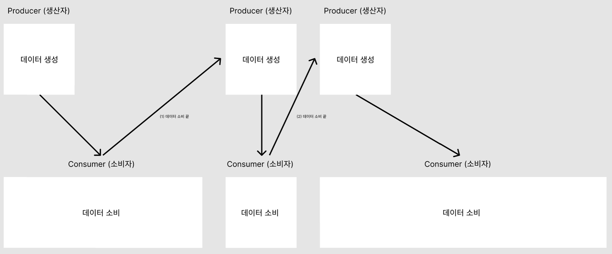
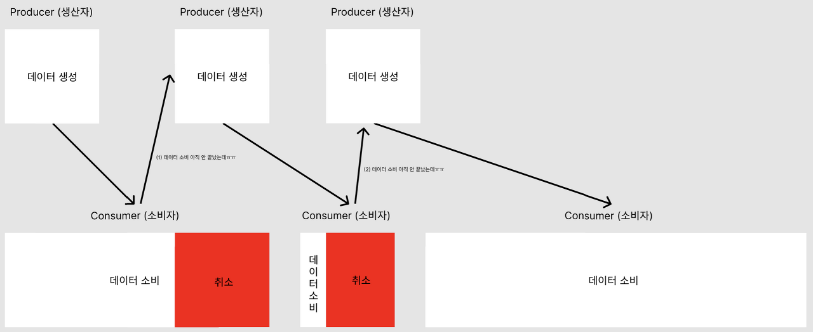
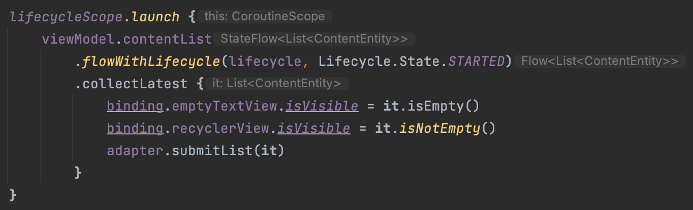

<div align="center">
  <p>
    
  </p>
  <br>
  <h2>Kotlin</h2>
  <p>코틀린 관련 내용 정리</p>
  <br>
  <br>
</div>


## 🔥 collect / collectLatest

### collect를 사용한 데이터 소비의 한계

Flow는 데이터를 발행하는 역할을 하며, Flow에서 발행하는 데이터는 collect의 action 파라미터에 의해 소비된다

```kotlin
public suspend inline fun <T> Flow<T>.collect(crossinline action: suspend (value: T) -> Unit): Unit =
    collect(object : FlowCollector<T> {
        override suspend fun emit(value: T) = action(value)
    })
```

👉 collect의 인자로 들아가는 action 블록은 flow에서 발행된 데이터를 순차적으로 받아 suspend fun을 수행한다

하지만, 이 collect를 잘못 사용하면 새로운 데이터가 발행되더라도 데이터 데이터 처리가 제대로 되지 않을 수 있다

<br>

### collect

collect는 새로운 데이터가 발행되더라도 이전 데이터의 처리가 끝날 때까지 대기한다

특정 데이터의 처리 시간이 무제한 소요된다면 이후에 새롭게 발행된 데이터는 처리할 수 없다



<br>

### collectLatest

collectLatest는 새로운 데이터가 발행되면 이전 데이터의 처리를 취소하고 새로운 데이터의 처리를 시작한다

데이터의 발행 속도가 소비의 속도보다 빠르다면 대부분의 데이터는 모두 취소되고 마지막 데이터만 정상 소비된다

(항상 최신 데이터를 소비)





<br>

### Flow의 collect와 collectLatest 차이

차이는 새로운 데이터가 들어왔을 때의 처리 방식에 있다

- collect

  : 새로운 데이터가 들어왔을 때 이전 데이터의 처리가 끝난 후에 새로운 데이터를 처리

- collectLatest

  : 새로운 데이터가 들어오면 이전 데이터의 처리를 강제 종료시키고 새로운 데이터를 처리

✅ 문제상황에 맞게 선택적으로 사용하기
