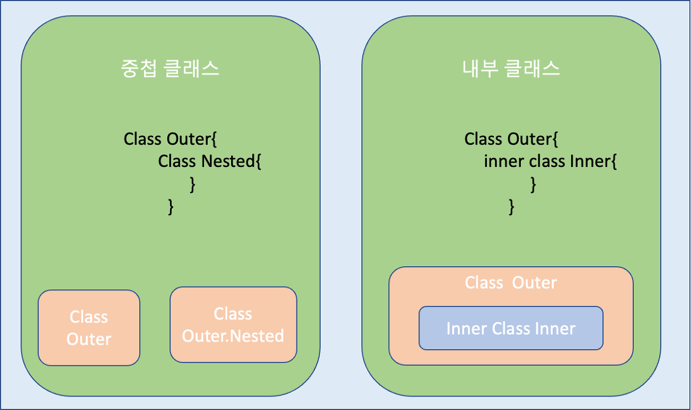

<div align="center">
  <p>
    
  </p>
  <br>
  <h2>Kotlin</h2>
  <p>코틀린 관련 내용 정리</p>
  <br>
  <br>
</div>

## 🔥 Inner class / Nested class

### Nested class (중첩 클래스)

> 클래스 안에 클래스를 하나 더 넣을 수 있다

👉 코틀린에서 기본적으로 지원

<br>

### Inner class (내부 클래스)

> 외부 클래스 객체 안에서 사용되는 클래스

👉 외부클래스 객체의 속성이나 함수를 사용할 수 있다

👉 inner 라는 키워드를 붙인 내부 class는 혼자서 객체를 만들 수 없고, 외부 클래스의 객체가 있어야만 생성과 사용이 가능하다



### 차이점

- Nested class (중첩 클래스)는 형태만 내부에 존재할 뿐 실질적으로는 내용을 서로 공유할 수 없는 별개의 클래스 이지만,

- Inner class (내부 클래스)는 외부 클래스 객체 안에서 사용되는 클래스 이므로 외부클래스 객체의 속성이나 함수를 사용할 수 있다

```kotlin
// 비교 예시
class Outer {
  private val outer = "Outer"
  
  class InnerClass {
    init {
      print(outer)  // outer 변수에 접근 X
    }
  }
}
```

👉 코틀린은 기본적으로 nested class로 정의되어서 outer 변수에 접근하지 못한다 ❌

<br>

```kotlin
// 해결방법 1
class Outer {
  private val outer = "Outer"
  
  inner class InnerClass {
    init {
      print(outer)  // 접근 가능
    }
  }
}
```

👉 inner class를 만들어서 Outer를 참조할 수 있도록 한다 ⭕️

<br>

```kotlin
// 해결방법 2
class Outer {
  private val outer = "Outer"
  
  class InnerClass(
    private val out: Outer
  ){
    init {
      print(out.outer)  // 접근 가능
    }
  }
}
```

👉 생성자에 outer를 전달해주면 해결 가능 (자바 처럼)
