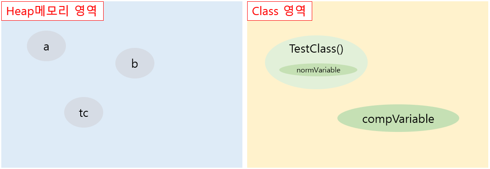
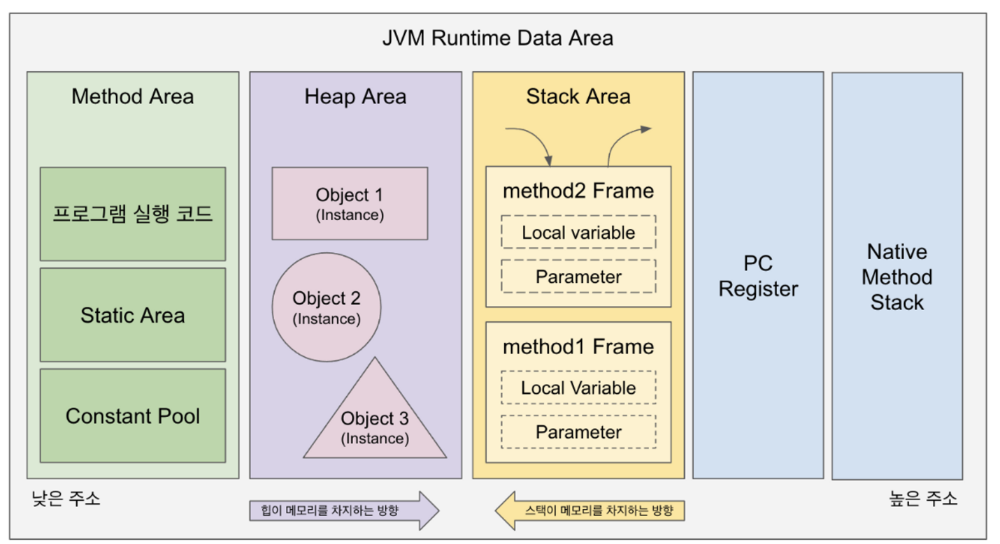

<div align="center">
  <p>
    
  </p>
  <br>
  <h2>Kotlin</h2>
  <p>코틀린 관련 내용 정리</p>
  <br>
  <br>
</div>

## 🔥 Object / Companion Object

### 싱글톤 패턴 (Singleton pattern)

> 클래스의 인스턴스가 오직 하나만 생성됨

> 클래스 인스턴스를 단 하나만 만들어야 할 경우 사용

👉 코틀린은 object를 사용

object를 사용하면 인스턴스를 생성할 때 파라미터를 전달할 수 없다는 한계가 있다

👉 파라미터를 전달하기 위해서 자바의 static을 companion object로 구현

<br>

### Object 정의

> 클래스를 정의함과 동시에 객체를 생성

<br>

### Object 특징

- 싱글톤을 만들 수 있는 키워드
- 생성자 사용 불가
- 프로퍼티, 메서드, 초기화 블록 사용 가능
- 다른 클래스, 인터페이스 상속 받을 수 있다

<br>

### Companion object (동반 객체)

> 클래스가 메모리에 올라갈 때, 동시에 companion object가 인스터스로서 힙에 올라간다 하여 '동반 객체'라고 한다

<br>

### Companion object 특징

- Java의 static과 동일한 역할
- 클래스 내에 하나만 생성할 수 있다 👉 companion object에 이름을 붙여도 되고 안 붙여도 된다
- object 키워드와 같은 역할

<br>

### Companion object 예제

```kotlin
class TestClass() {
  companion object {
    val compVariable: Int = 3
  }
  
  val normVariable: Int = 5
}

fun main() {
  var a = 0
  var b = 0
  
  a = compVariable  // companion object를 통해 선언된 변수는 객체 인스턴스화를 하지 않고도 전역변수처럼 사용 가능
  
  val tc = TestClass()
  b = tc.normVariable  // 해당 클래스를 인스턴스화한 객체를 통해서만 사용 가능
}
```



차이 발생하는 이유

👉 companion object로 선언한 변수는 클래스 영역에 위치하고, 

👉 그냥 선언된 변수는 클래스 내부에 위치하기 때문에

<br>

### Object와의 차이점

- 클래스 내부에 있는 object를 굳힌 형태인 것
- companion object 내부에 있는 변수, 메소드에 대한 접근을 더 자연스럽게 보이도록 한다

```kotlin
// 예제 1
class DataSourceClass {
  object Datasource {
    var baseUrl: String = "google.com"

    fun printBaseUrl() {
      println("baseUrl is : $baseUrl")
    }
  }
}

// 접근 1
DataSourceClass.Datasource.baseUrl
```

👉 클래스 내부에 object를 선언할 수 있다. 따라서 접근1 처럼 DataSource 객체의 변수에 접근

<br>

```kotlin
// 예제 2
class DataSourceClass {
  companion object {
    var baseUrl: String = "google.com"

    fun printBaseUrl() {
      println("baseUrl is : $baseUrl")
    }
  }
}

// 접근 2
DataSourceClass.baseUrl
```

👉 companion object로 바꿀 수 있다. 이로 인해 클래스 내부 객체에 접근할 때 해당 객체의 이름을 반복적으로 타이핑할 필요가 없다

<br>

### Static (참고)

자바와 코틀린은 모두 JVM(Java Virtual Machine)에서 실행된다



### - Method area

> 클래스에 대한 정보와 함께 클래스 변수(static variable)가 저장되는 곳

런타임 상수 풀, 멤버 변수, 클래스 변수, 생성자 및 메소드를 저장한다
👉 이 곳에 저장되는 정보가 `static`한 정보

### - Heap area

> 동적으로 할당되는 정보가 있는 곳

붕어빵으로 찍어낸 붕어빵들이 생성되기도 하고, 가비지 컬렉팅되어 없어지기도 한다
