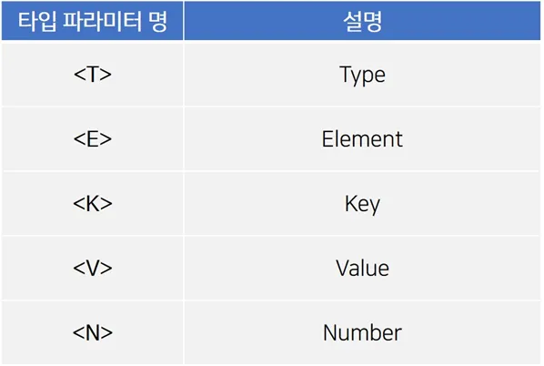
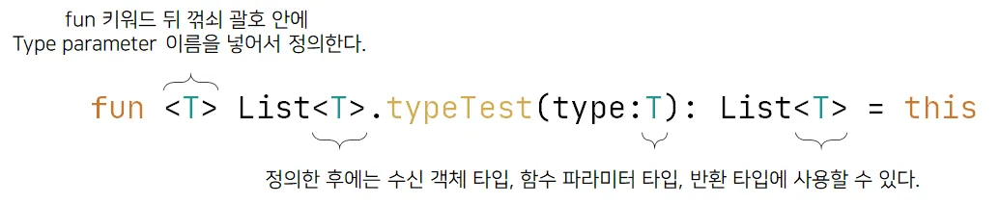

<div align="center">
  <p>
    
  </p>
  <br>
  <h2>Kotlin</h2>
  <p>코틀린 관련 내용 정리</p>
  <br>
  <br>
</div>

## 🔥 제네릭 (Generic)

### Generic 이란?

Generic의 사전적인 의미는 ‘일반적인, 포괄적인’ 이다

프로그래밍에서 제네릭은 데이터 타입을 일반화(generalize)하는 것을 의미한다

```kotlin
fun main() {
    // 꺾쇠 괄호(<>) 안에 타입을 표기하여 list1은 Int, list2는 String을 담는 ArrayList임을 알 수 있다
    val list1 = ArrayList<Int>()
    val list2 = ArrayList<String>()
}
```

👉 Kotlin의 내장 ArrayList의 선언을 보여주고 있다

선언을 보면 ArrayList가 어떤 데이터 타입을 갖는지 알 수 있다

<br>

✅ Type parameter & Type argument

클래스나 메서드, 프로퍼티를 정의할 때 데이터 타입을 변수로 지정하고, 사용할 때 그 타입을 정해줄 수 있는 것이다

여기서 변수로 지정한 데이터 타입을 타입 파라미터(type parmeter)라고 한다

또 사용할 때 구체적으로 타입을 명시해주는데, 이 때 명시해주는 타입은 타입 아규먼트(type argument)라고 한다

<br>

클래스나 메서드, 프로퍼티에서 타입 프로퍼티를 정의하면, 타입 아규먼트는 그 클래스, 메서드, 프로퍼티 외부에서 정해주어야 한다

```kotlin
// 여기서 type parameter를 T라는 이름으로 정의했다
class Box<T>

class Apple
class Banana

fun main() {
    // 여기서 Apple 클래스와 Banana 클래스가 type argument로 사용되었다
    val appleBox = Box<Apple>()
    val bananaBox = Box<Banana>()
}
```

<br>

✅ Type parameter 이름

type parameter로 사용하는 변수들은 보통 아래와 같이 많이 사용한다



<br>

### Generic 타입 필요성

동일한 동작을 하는 클래스에 입력 파라미터 타입이 다르다면, 타입별로 클래스를 만들어야 한다

```kotlin
IntegerPrinter(123).runPrint()
StringPrinter("abc").runPrint()

class IntegerPrinter(private val printValue: Int) {
    fun runPrint() {
        println(printValue)
    }
}

class StringPrinter(private val printValue: String) {
    fun runPrint() {
        println(printValue)
    }
}
```

👉 중복 코드가 생성되는 것을 줄이기 위해 < T >를 사용한다

<br>

```kotlin
EveryPrinter<Int>(123).runPrint()
EveryPrinter<String>("abc").runPrint()

class EveryPrinter<T>(private val printValue: T) {
    fun runPrint() {
        println(printValue)
    }
}
```

👉 제네릭 타입으로 클래스를 만들면, 입력 파라미터 타입이 다른더라도 하나의 클래스로 사용이 가능하다

<br>

### Generic 클래스 정의하기

클래스 이름 뒤에 타입 파라미터를 넣은 꺽쇠 괄호(<>)를 붙이면 클래스를 Generic하게 만들 수 있다


```kotlin
open class Box<T> {
    // 클래스 내부에서 타입 파라미터를 사용할 수 있다
    fun typeTest(type: T) {
        println(type)
    }
}

// SmallBox의 타입 파라미터 K를 부모 클래스의 타입 아규먼트로 넘길 수 있다
class SmallBox<K>: Box<K>()

// 구체적인 타입 아규먼트를 사용하여 상속받을 수도 있다
class FruitBox: Box<Fruit>()

// enum class 를 뺀 interface, abstract class, sealed class, data class도 제네릭하게 사용할 수 있다
interface Test1<T>
abstract class Test2<T>
sealed class Test3<T>
data class Test4<T>(val a: Int)
//enum class Test5<T>

class Ring
interface Fruit

fun main() {
    val ringBox = Box<Ring>()
    val fruitBox = FruitBox()
}
```

👉 타입 파라미터를 정의한 클래스 내부에서 해당 타입 파라미터를 수신 객체 타입, 메서드 파라미터 타입, 반환 타입에 사용할 수 있다

👉 제네릭 클래스를 상속 받을 때 하위 클래스의 타입 파라미터를 상위 클래스의 타입 파라미터로 넘길 수 있다

👉 구체적인 타입 아규먼트를 사용하여 상속받을 수 있다

👉 enum class를 제외한 interface, abstract class, sealed class, data class도 제네릭하게 만들 수 있다

<br>

### Generic 함수 정의하기

함수도 Generic하게 작성할 수 있다

함수를 정의할 때 나타내는 fun 키워드 뒤에 타입 파라미터를 넣은 꺾쇠 기호(<>)를 붙이면 함수를 Generic하게 만들 수 있다

정의한 타입 파라미터는 수신 객체 타입, 함수의 파라미터 타입, 함수의 반환 타입에 사용할 수 있다



```kotlin
// fun 키워드 뒤에 타입 파라미터를 선언하고,
// 수신 객체, 함수의 파라미터 타입, 함수의 반환 타입에 타입 파라미터를 사용할 수 있다

fun <T> List<T>.typeTest(type:T):List<T> = this

fun main() {
    val arrayList = arrayListOf<Int>(1,2,3)
    println(arrayList.typeTest(arrayList))
}
```

<br>

### reified 이란?

reified의 단어 뜻은 '구체화 된' 이다

일반 Generic Type과 다르게 더 구체화를 한다고 보면 된다

<br>

코틀린 제네릭 타입의 타입 파라미터 정보는 runtime에 지워진다

따라서 제네릭 클래스의 인스턴스가 있어도 그 인스턴스를 생성할 때 사용한 타입 파라미터 정보를 알아낼 수 없다

제네릭 함수의 타입 파라미터 또한 마찬가지다


하지만 코틀린에는 이런 제약을 피할 수 있는 경우가 하나 있다

inline 함수의 타입 파라미터는 runtime 시점에도 알 수 있다

어떤 함수에 inline 키워드를 붙이면 컴파일러는 그 함수를 호출한 식을 모두 함수 본문으로 바꾼다

해당 함수의 바이트 코드를 직접 갖다 붙인다는 뜻이다

<br>

inline 함수의 특성을 이용하여 컴파일러는 타입 파라미터로 쓰인 구체적인 클래스를 참조하는 바이트코드를 생성해 삽입할 수 있다

이로 인해 inline 함수에서 reified를 사용한 타입 파라미터를 실체화할 수 있는 것이다

```kotlin
inline fun <reified T> isA(value: Any) = value is T
```

👉 refied 키워드를 사용했기 때문에 T::class 처럼 클래스의 타입 정보를 얻을 수 있다

그래서 타입 정보를 인자로 넘기지 않아도 runtime에 타입 정보를 알 수 있다
