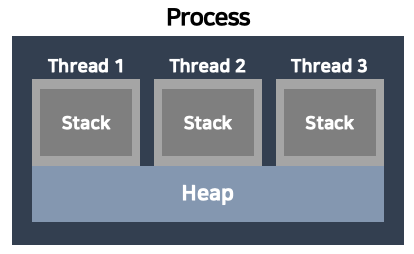
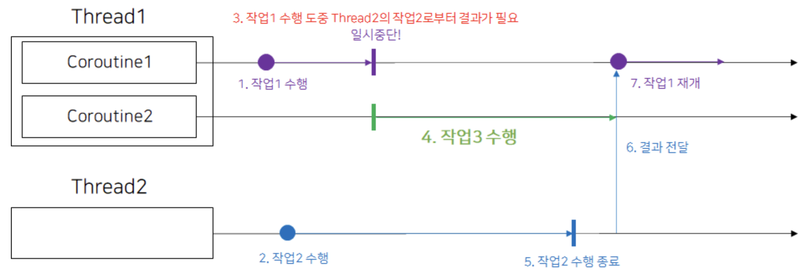
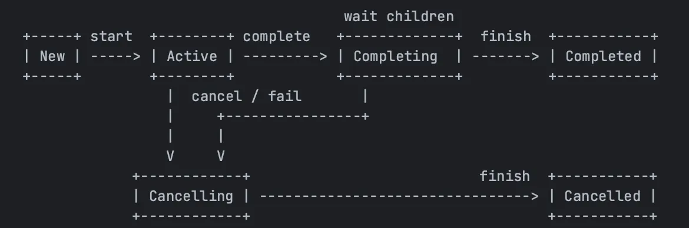

<div align="center">
  <p>
    
  </p>
  <br>
  <h2>Kotlin</h2>
  <p>코틀린 관련 내용 정리</p>
  <br>
  <br>
</div>

## 🔥 Coroutine (코루틴)

### 동기와 비동기 차이

동기와 비동기는 어떤 작업이 수행되는 방식을 나타낸다

- 동기 (Synchronous)

  - 요청과 결과가 동시에 일어나는 작업

  - 동기적으로 작성된 프로그램은 수행하는 작업이 완료될 때까지 다른 작업을 하지 않고 기다린다

- 비동기 (Asynchronous)

  - 동기와 반대로, 동시에 일어나지 않는 것을 의미한다

  - 그러므로 비동기적으로 작성된 프로그램은 수행하는 작업의 완료와 상관없이 계속해서 다른 작업도 수행할 수 있다

  - Android는 UI thread 라고 불리는 메인 스레드가 UI 작업을 관리하고 처리한다

  - UI thread는 사용자의 앱 사용성에 직결된 요소이기 때문에 항상 막힘없이 처리되어야 한다

  - 만약 이 메인 스레드에서 네트워크나 DB로부터 자료를 받아오는 작업을 수행한다면

    앱은 ANR (Application Not Responding) 상태가 될 것이다

  - 따라서 여러 작업들을 각각의 스레드에 나눠서 block 없이 수행할 수 있도록 설계해야 한다

<br>

### 코루틴 정의

> 비동기적으로 실행되는 코드를 간소화하기 위해 사용할 수 있는 동시 실행 설계 패턴

<br>

### 코루틴 특징

일반적으로 루틴은 단 하나의 입구점과 출구점을 가질 수 있는 반면, `코루틴`은 여러 개의 입구점과 출구점을 가질 수 있다

`코루틴`은 이전에 실행이 중단된 지점에서 다시 실행을 재개할 수 있다

이를 통해 비동기 작업에 적용할 수 있다

👉 구글에서 안드로이드 개발 시 `코루틴` 적용을 권장하고 있다

`코루틴`을 적용하면 메인 스레드(Main Thread) 블로킹 현상을 줄일 수 있고,

비동기 작업 중 예외 발생에 따른 메모리 누수를 방지할 수 있다

<br>

### 코루틴과 스레드

*Process : 보조기억장치의 '프로그램'이 메모리 상으로 적재되어 실행되면 '프로세스'가 된다

*Thread : 같은 process 내에서 실행되는 여러 작업 (흐름)의 단위

*비동기 작업을 수행한다는 점에서 비슷한 일을 하지만 아래와 같은 차이점들이 있다

- 메모리 구조의 차이

  - 공유 (코루틴) 
  - 할당 (스레드)

- 코루틴의 장점 (메모리 구조의 차이에서 오는)

  - 사용되는 메모리가 적어진다

    : 분리된 메모리를 사용하는 것이 아닌, Process가 가진 Heap 메모리 안에서 코루틴들이 돌아간다

    👉 코루틴들이 메모리를 공유할 수 있다

- 수행방식의 차이

  - 비선점형 (코루틴)

    : 동시에 돌아가는 코루틴 2개가 있을 때, 동일한 시간에 2개의 코루틴이 같이 실행되지 않는다

    👉 코루틴이 전환되면서 수행되는 속도가 매우 빠르기 때문에, 외부에서 볼때는 코루틴 2개가 동시에 수행되는 것처럼 보인다 

    (동시성 ⭕️, 병행성 ❌)

  - 선점형 (스레드)

    : 동시에 돌아가는 스레드가 2개가 있을 때, 동일한 시간에 동시에 2가지 작업을 할 수 있다 (병행성 ⭕️)



👉 Process는 독립된 메모리 영역인 힙을 할당 받는다

👉 Thread는 process 하위에 종속되는 보다 작은 단위다

👉 Thread는 독립된 메모리 영역인 스택 (Stack)을 갖는다

👉 Thread를 하나 생성하면, 하나의 스택 메모리가 생기는 것이다

👉 각 Thread는 다른 Thread에게 스택 메모리를 공유할 수 없다

<br>

### 코루틴의 스레드 작업 최적화

코루틴은 Thread 하나를 일시중단 가능한 다중 경량 Thread 처럼 활용한다



👉 코루틴은 Thread 안에서 실행되는 일시 중단 가능한 작업의 단위

하나의 Thread에 여러 코루틴이 존재할 수 있다

<br>

### 코루틴 구조

- Coroutine Scope
- Coroutine Context
- Coroutine Builder

<br>

### 각 구조 상세내용

- Coroutine Scope

  - 코루틴이 동작하는 범위를 규정

  - launch 또는 async를 사용하여 생성한 모든 코루틴을 추적한다


  lifecycleScope, viewModelScope 사용하기!

  [lifecycleScope, viewModelScope 상세 내용](https://github.com/min486/Android/tree/master/Kotlin/%EC%BD%94%EB%A3%A8%ED%8B%B4/lifecycleScope%2CviewModelScope)

- Coroutine Context

  - Dispatchers

    > 코루틴이 실행되는 스레드를 지정, 용도마다 사용되는게 다르다

    - Default

      : CPU 연산 작업이 많으면 사용

    - IO

      : 파일이나 네트워크 I/O 작업이 많으면 사용

    - Main

      : UI 스레드 (main 스레드)에서 UI 관련된 변경을 해야할 때 사용

    - Unconfined

      : 일반적인 용도에서는 사용 ❌

  - Job & Deferred

    > 코틀린에서는 코루틴이라는 추상적인 흐름 (한 덩어리)을 Job이라고 하는 Object로 만들어서 사용
    >
    > 👉 object에 대해서 취소 or 예외처리를 함으로써 코루틴 흐름 제어를 쉽게 할 수 있다

    *Deferred : 결과 값을 가지는 Job

    - States

      

    - methods

      : cancel, join, start

- Coroutine Builder

  > 일반적으로 launch로 코루틴 시작

  - launch

    : Job 객체 반환, 코루틴 작업을 하고 끝 

  - async

    : Deferred 객체 반환, 코루틴 작업 + 마지막에 나온 값 (Deferred 형태의 object) 반환 

  - runBlocking

    : 사용 ❌ (main 스레드를 block 하기 때문에)

  - withContext

    : Dispatcher를 전환하는 기능

<br>

### 코루틴 정리

> 코틀린에서 코루틴을 사용하기 위해서
>
> Coroutine Scope ➡️ Coroutine Context ➡️ Coroutine Builder를 사용해서 코루틴 객체를 만든다

✅ Scope

: lifecycleScope / viewModelScope 사용

✅ Context

: Default (CPU 작업) / IO (IO 작업) 사용

✅ Builder

: launch (코루틴 처리만) / async (코루틴 처리 + 값 반환)

<br>

### 코루틴 의존성 추가

app 수준의 `build.gradle` 파일에 추가

```kotlin
dependencies {
    implementation("org.jetbrains.kotlinx:kotlinx-coroutines-android:1.6.4")
}
```
