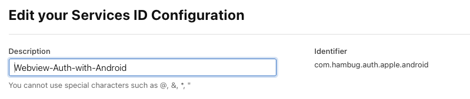
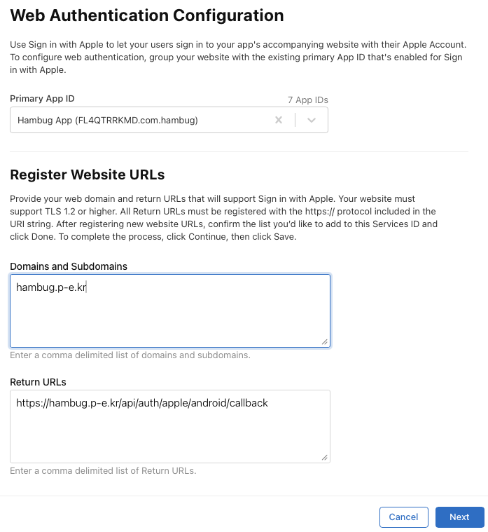
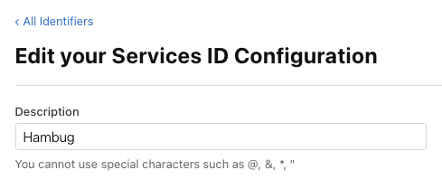
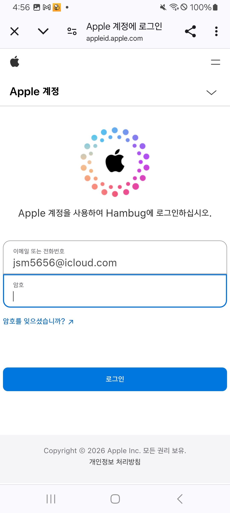

<div align="center">
  <p>
    
  </p>
  <br>
  <h2>OAuth</h2>
  <p>OAuth 관련 내용 정리</p>
  <br>
  <br>
</div>


## 🔥 애플 로그인

### 1. 목적

Android 앱에서 Browser 라이브러리 기반 애플로그인을 구현하며 iOS, 백엔드와 협업한 경험 및 이슈 해결 과정을 기록

<br>

## 2. iOS 협업

### 2-1. 애플 콘솔 설정

#### Service ID

- Client ID (Identifier) : `com.hambug.auth.apple.android`
- Service ID에 Primary App ID 연결

#### Return URLs

- 커스텀 스킴 사용 불가 (`myapp://`)
- https만 허용
- 서버 HTTPS 주소 등록

<details>
  <summary>스크린샷</summary>
  <br/>
  
</details>

<br>

### 2-2. 이슈 & 해결

#### 원인

- app ID에 service ID가 등록되지 않은 상태

- 아래처럼 양방향 연결이 필요함

  ```markdown
  service ID → app ID (설정 완료)
  app ID → service ID (누락 ❌)
  ```


#### 해결

- app ID 설정에서 service ID(`com.hambug.auth.apple.android`) 추가

<br>

### 2-3. 참고사항

service ID의 Description이 애플로그인 화면에서 앱 이름으로 표시됨

<details>
  <summary>스크린샷</summary>
  <br/>
  
</details>

<br>

### 2-4. 보안 요구사항

- 애플로그인 최소 보안 요구사항
  - TLS 1.2 이상
- 햄버그 서버
  - TLS 1.3 사용 중 → 문제 없음

#### SSL 테스트 (브라우저에서 확인)

https://www.ssllabs.com/ssltest/analyze.html?d=hambug.p-e.kr

<br>

## 3. 백엔드 협업

### 3-1. HTTP 403 오류

- 원인
  - 애플로그인 후 리다이렉트되는 백엔드 콜백 엔드포인트 미구현
- 해결
  - GET 엔드포인트 추가 (HTML 페이지 반환)
  - `GET /api/auth/apple/android/callback`

<br>

### 3-2. HTTPS URL 실행 문제

#### 원인

- 애플로그인 리다이렉트 URL은 `https://` 만 허용
- 흐름은 정상적으로 브라우저까지 도달했으나,
  - 브라우저에서만 처리되고
  - Android 앱으로 제어가 넘어오지 않음

```markdown
Apple 서버
  ↓
https://hambug.p-e.kr/.../callback#id_token=abc123
  ↓
브라우저에만 머무름 (앱 실행 안 됨) ❌
```

#### 해결

- 서버에서 반환하는 HTML에 코드 추가

- 브라우저에서 받은 `id_token`을 커스텀 스킴으로 앱에 전달

```html
<script>
    const fragment = window.location.hash;  // "#id_token=abc123"
    window.location.href = 'hambug://apple-callback' + fragment;
</script>
```

#### 해결 후 동작 흐름

```markdown
Apple 서버
  ↓
https://hambug.p-e.kr/.../callback#id_token=abc123
  ↓
브라우저가 HTML 로드
  ↓
HTML의 JavaScript 실행
  - window.location.hash에서 id_token 추출
  - hambug://apple-callback#id_token=abc123 로 리다이렉트
  ↓
커스텀 스킴은 앱만 처리 가능
  ↓
Android 앱 실행 및 토큰 처리 ✅
```

<br>

## 4. 프로덕션 이슈

### 4-1. 문제

- debug 환경에서는 애플로그인이 정상 동작
- 배포된 release 앱에서는 동작하지 않음

### 4-2. 원인

프로덕션에서 아래 2가지 문제가 확인됨

- 애플로그인 콜백 API가 HTML이 아닌 text/plain을 반환

  → 브라우저에서 JavaScript 실행 불가

- Android App Links 검증 파일 미설정 (assetlinks.json)

  → https URL을 앱이 처리하지 못함

### 4-3. 해결

아래 2가지를 백엔드에 요청해서 프로덕션 문제가 해결됨

#### 1) 애플로그인 콜백 API 수정

- 기존 상태

  - `/api/auth/apple/android/callback`

  - `text/plain` 응답으로 단순 문자열 반환

    (”로그인 처리 중입니다”)

- 해결

  - Content-Type을 `text/html`로 변경
  - 브라우저에서 JavaScript를 실행하여 커스텀 스킴(`hambug://`)으로 앱에 제어 전달

- 수정 예시

  ```java
  @GetMapping(
      value = "/api/auth/apple/android/callback",
      produces = "text/html"
  )
  public String appleCallback() {
      return """
          <!DOCTYPE html>
          <html>
          <head>
              <meta charset="UTF-8">
          </head>
          <body>
              <script>
                  const fragment = window.location.hash;
                  window.location.href = 'hambug://apple-callback' + fragment;
              </script>
          </body>
          </html>
          """;
  }
  ```

<br>

#### 2) Android App Links 검증 파일 추가

- 목적

  - release 앱에서 `hambug://` URL을 Android 앱이 직접 처리할 수 있도록 하기 위함

- 파일 경로

  ```markdown
  src/main/resources/static/.well-known/assetlinks.json
  ```

- 해결

  - 위 경로에 `assetlinks.json` 파일 생성
  - 아래 JSON 내용 작성
  - Spring Boot가 자동으로 `/.well-known/assetlinks.json` URL로 서빙
  - Content-Type도 자동으로 `application/json`으로 설정됨

- 파일 내용

  ```json
  [{
    "relation": ["delegate_permission/common.handle_all_urls"],
    "target": {
      "namespace": "android_app",
      "package_name": "desktop.hambug",
      "sha256_cert_fingerprints": [
        "65:60:9C:63:64:0C:4E:56:1F:D8:3B:25:C0:06:F4:FC:9B:73:80:5B:DA:C2:FC:97:DC:E0:76:96:C9:45:0F:B6"
      ]
    }
  }]
  ```

- 파일 설명

  - Android App Links 검증을 위한 필수 파일
  - 해당 파일이 없을 경우
    - debug 환경에서는 동작할 수 있으나
    - release 앱에서는 https URL을 앱이 수신하지 못함
