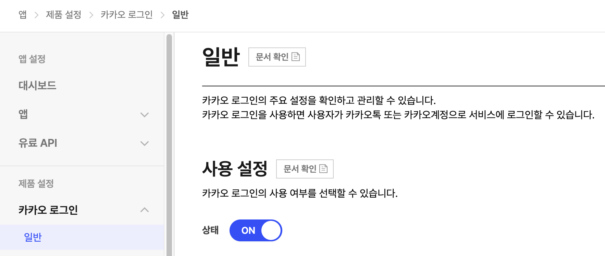

<div align="center">
  <p>
    
  </p>
  <br>
  <h2>OAuth</h2>
  <p>OAuth 관련 내용 정리</p>
  <br>
  <br>
</div>


## 🔥 카카오 로그인

### 1. 앱 생성

https://developers.kakao.com/console/app

카카오 개발자 센터에 진입 후, 우측 상단 [앱 생성] 클릭


👉 앱 이름, 회사명, 카테고리 작성(선택) 후 저장한다

<br>

### 2. 카카오 로그인 설정

생성된 앱에서 [제품 설정] > [카카오 로그인] > [일반] 진입

이후 사용 설정 영역에서 상태를 ON으로 변경한다



<br>

### 3. Android 플랫폼 등록

[앱 설정] > [앱] > [일반] 진입

이후 [플랫폼] 영역에서 [Android 플랫폼 등록] 클릭


👉 패키지명과 키 해시를 입력 후 저장한다

<br>

### *키 해시 생성 방법

안드로이드 스튜디온 내장 터미널을 사용해 디버그(debug) 키 해시를 구할 수 있다

(널리 사용되고 정확한 방법)

#### Mac 기준

터미널에 아래 명령어를 붙여넣고 엔터 키를 누른다

```bash
keytool -exportcert -alias androiddebugkey -keystore ~/.android/debug.keystore -storepass android -keypass android | openssl sha1 -binary | openssl base64
```


👉 출력된 키 해시 값을 카카오 개발자 센터에 등록한다

<br>

### 4. 개인정보 설정

사용자의 개인정보에 접근이 필요하면

[제품 설정] > [카카오 로그인] > [동의항목] 진입 후, 개인정보 영역에서 필요한 항목을 설정한다


<br>

### 5. 프로젝트 설정

#### 5-1) 인터넷 사용 권한

카카오 API로 카카오 서버와 통신하기 위해 앱에 인터넷 사용 권한을 설정해야 한다

`AndroidManifest.xml` 파일에 아래와 같이 설정한다

```xml
<manifest xmlns:android="http://schemas.android.com/apk/res/android"
    xmlns:tools="http://schemas.android.com/tools">

    <!-- 인터넷 사용 권한 설정-->
    <uses-permission android:name="android.permission.INTERNET" />

    <application
        ...
```

#### 5-2) 카카오 SDK 추가

앱 수준의 `build.gradle` 파일에 카카오 SDK 의존성을 추가한다

```kotlin
dependencies {
    implementation("com.kakao.sdk:v2-user:2.21.6")
}
```

*버전 확인 : https://developers.kakao.com/docs/latest/ko/android/download#changelog

#### 5-3) 카카오 SDK 초기화

앱의 `Application` 클래스에 초기화 코드를 작성한다

```kotlin
class GlobalApp : Application() {
    override fun onCreate() {
        super.onCreate()
        // 카카오 SDK 초기화
        KakaoSdk.init(this, "네이티브 앱 키")
    }
}
```

이후 `AndroidManifest.xml` 파일에 `Application` 클래스를 등록한다

```xml
<application
    android:name=".GlobalApp">
    ...
</application>
```

#### 5-4) 로그인 버튼 클릭 이벤트 구현

```kotlin
@Composable
fun HomeScreen() {
    // LocalContext.current를 사용하여 context를 가져온다
    val context = LocalContext.current

    Button(
        onClick = { kakaoLogin(context) }
    ) {
        Text("카카오 로그인")
    }
}

fun kakaoLogin(context: Context) {
    // 카카오톡 설치 여부 확인
    if (UserApiClient.instance.isKakaoTalkLoginAvailable(context)) {
        // 카카오톡으로 로그인
        UserApiClient.instance.loginWithKakaoTalk(context) { token, error ->
            if (error != null) {
                // 로그인 실패 처리
                Log.e("aa", "로그인 실패", error)
            } else if (token != null) {
                // 로그인 성공시 토큰 정보 출력
                Log.i("aa", "로그인 성공, 토큰 : ${token.accessToken}")

                // 사용자 정보 가져오기
                getUserInfo()
            }
        }
    } else {
        // 카카오톡이 설치되지 않은 경우, 웹 브라우저로 로그인
        UserApiClient.instance.loginWithKakaoAccount(context) { token, error ->
            // 로그인 성공/실패 처리
            if (error != null) {
                Log.e("aa", "로그인 실패", error)
            } else if (token != null) {
                Log.i("aa", "로그인 성공, 토큰 : ${token.accessToken}")
                getUserInfo()
            }
        }
    }
}
```

#### 5-5) 사용자 정보 가져오기

```kotlin
fun getUserInfo() {
    UserApiClient.instance.me { user, error ->
        if (error != null) {
            Log.e("aa", "사용자 정보 요청 실패", error)
        } else if (user != null) {
            // 사용자 정보 가져오기 성공
          
            // 카카오 고유 ID
            val userId = user.id
            // 닉네임
            val nickname = user.kakaoAccount?.profile?.nickname 
            Log.d("aa", "사용자 ID : $userId")
            Log.d("aa", "닉네임 : $nickname")
        }
    }
}
```

<br>

## 프로덕션에서 카카오로그인 실패

#### 문제 상황

- debug 모드에서는 로그인이 성공하지만, 배포된 앱에서는 실패함

#### 원인

- 카카오 개발자 콘솔에 debug 키해시만 등록하고, 배포 키해시를 등록하지 않은 경우 문제 발생
- 카카오 SDK는 보안을 위해 등록된 키해시와 앱의 해시가 일치할 때만 로그인을 허용한다

#### 해결 방법

1. SHA-1 인증서 지문 찾기

- Google Play 콘솔 접속

- 테스트 및 출시 → 앱 무결성 → Play 앱 서명으로 이동

- `앱 서명 키 인증서` 항목의 `SHA-1 인증서 지문` 복사

- 이 SHA-1 값을 해시키로 변환해서 카카오 콘솔에 등록


<br>

2. SHA-1을 해시키(Base64)로 변환하는 방법

복사한 SHA-1 값은 16진수 형태이므로, 카카오가 요구하는 Base64 형태로 변환해야 한다

터미널에서 아래 명령어의 `SHA1_지문` 자리에 넣어서 나오는 결과값이 카카오에 등록할 해시키

```bash
echo "SHA1_지문" | xxd -r -p | openssl base64
```

예시: `echo "45:AD:BB..." | xxd -r -p | openssl base64`

<br>

3. 카카오 콘솔에 등록

변환된 값을 카카오 개발자 콘솔에 추가로 등록한다

- 앱 → 플랫폼 키 → 네이티브 앱 키 클릭
- 네이티브 앱 키 수정 → Android 앱 정보 → 키 해시에서 추가 등록


이제 키 해시 목록에는 아래처럼 총 2개가 있다

- 디버그 해시키 (내 컴퓨터용)
- 구글 플레이 해시키 (스토어 배포용)
