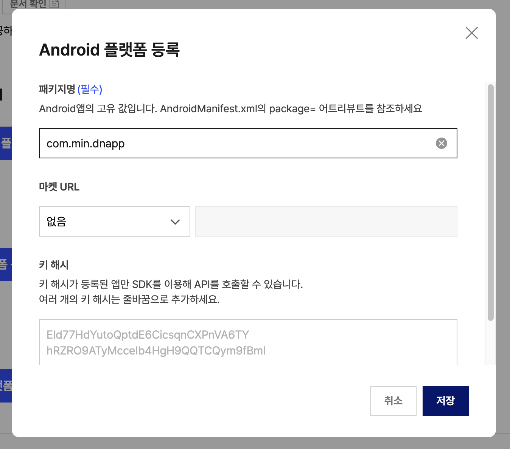
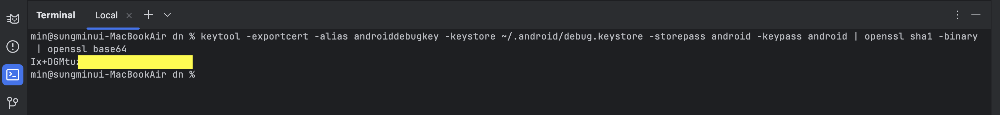
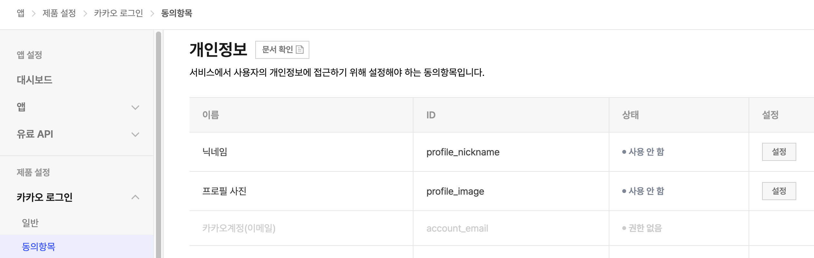

<div align="center">
  <p>
    
  </p>
  <br>
  <h2>OAuth</h2>
  <p>OAuth 관련 내용 정리</p>
  <br>
  <br>
</div>


## 🔥 카카오 로그인

### 1. 앱 생성

https://developers.kakao.com/console/app

카카오 개발자 센터에 진입 후, 우측 상단 [앱 생성] 클릭


👉 앱 이름, 회사명, 카테고리 작성(선택) 후 저장한다

<br>

### 2. 카카오 로그인 설정

생성된 앱에서 [제품 설정] > [카카오 로그인] > [일반] 진입

이후 사용 설정 영역에서 상태를 ON으로 변경한다


<br>

### 3. Android 플랫폼 등록

[앱 설정] > [앱] > [일반] 진입

이후 [플랫폼] 영역에서 [Android 플랫폼 등록] 클릭



👉 패키지명과 키 해시를 입력 후 저장한다

<br>

### *키 해시 생성 방법

안드로이드 스튜디온 내장 터미널을 사용해 디버그(debug) 키 해시를 구할 수 있다

(널리 사용되고 정확한 방법)

#### Mac 기준

터미널에 아래 명령어를 붙여넣고 엔터 키를 누른다

```bash
keytool -exportcert -alias androiddebugkey -keystore ~/.android/debug.keystore -storepass android -keypass android | openssl sha1 -binary | openssl base64
```



👉 출력된 키 해시 값을 카카오 개발자 센터에 등록한다

<br>

### 4. 개인정보 설정

사용자의 개인정보에 접근이 필요하면

[제품 설정] > [카카오 로그인] > [동의항목] 진입 후, 개인정보 영역에서 필요한 항목을 설정한다



<br>

### 5. 프로젝트 설정

#### 5-1) 인터넷 사용 권한

카카오 API로 카카오 서버와 통신하기 위해 앱에 인터넷 사용 권한을 설정해야 한다

`AndroidManifest.xml` 파일에 아래와 같이 설정한다

```xml
<manifest xmlns:android="http://schemas.android.com/apk/res/android"
    xmlns:tools="http://schemas.android.com/tools">

    <!-- 인터넷 사용 권한 설정-->
    <uses-permission android:name="android.permission.INTERNET" />

    <application
        ...
```

#### 5-2) 카카오 SDK 추가

앱 수준의 `build.gradle` 파일에 카카오 SDK 의존성을 추가한다

```kotlin
dependencies {
    implementation("com.kakao.sdk:v2-user:2.21.6")
}
```

*버전 확인 : https://developers.kakao.com/docs/latest/ko/android/download#changelog

#### 5-3) 카카오 SDK 초기화

앱의 `Application` 클래스에 초기화 코드를 작성한다

```kotlin
class GlobalApp : Application() {
    override fun onCreate() {
        super.onCreate()
        // 카카오 SDK 초기화
        KakaoSdk.init(this, "네이티브 앱 키")
    }
}
```

이후 `AndroidManifest.xml` 파일에 `Application` 클래스를 등록한다

```xml
<application
    android:name=".GlobalApp">
    ...
</application>
```

#### 5-4) 로그인 버튼 클릭 이벤트 구현

```kotlin
@Composable
fun HomeScreen() {
    // LocalContext.current를 사용하여 context를 가져온다
    val context = LocalContext.current

    Button(
        onClick = { kakaoLogin(context) }
    ) {
        Text("카카오 로그인")
    }
}

fun kakaoLogin(context: Context) {
    // 카카오톡 설치 여부 확인
    if (UserApiClient.instance.isKakaoTalkLoginAvailable(context)) {
        // 카카오톡으로 로그인
        UserApiClient.instance.loginWithKakaoTalk(context) { token, error ->
            if (error != null) {
                // 로그인 실패 처리
                Log.e("aa", "로그인 실패", error)
            } else if (token != null) {
                // 로그인 성공시 토큰 정보 출력
                Log.i("aa", "로그인 성공, 토큰 : ${token.accessToken}")

                // 사용자 정보 가져오기
                getUserInfo()
            }
        }
    } else {
        // 카카오톡이 설치되지 않은 경우, 웹 브라우저로 로그인
        UserApiClient.instance.loginWithKakaoAccount(context) { token, error ->
            // 로그인 성공/실패 처리
            if (error != null) {
                Log.e("aa", "로그인 실패", error)
            } else if (token != null) {
                Log.i("aa", "로그인 성공, 토큰 : ${token.accessToken}")
                getUserInfo()
            }
        }
    }
}
```

#### 5-5) 사용자 정보 가져오기

```kotlin
fun getUserInfo() {
    UserApiClient.instance.me { user, error ->
        if (error != null) {
            Log.e("aa", "사용자 정보 요청 실패", error)
        } else if (user != null) {
            // 사용자 정보 가져오기 성공
          
            // 카카오 고유 ID
            val userId = user.id
            // 닉네임
            val nickname = user.kakaoAccount?.profile?.nickname 
            Log.d("aa", "사용자 ID : $userId")
            Log.d("aa", "닉네임 : $nickname")
        }
    }
}
```

<br>

### 6. 문제 해결

- 문제 상황 : 카카오 웹뷰에서 로그인 후 앱으로 돌아오지 못하고 에러 발생

- 문제 원인 : 리다이렉션 URI 미등록
- 해결 방법 :
  1. 카카오 개발자센터에 리다이렉션 URI 등록
  2. AndroidManifest에 리다이렉션 URI 설정

