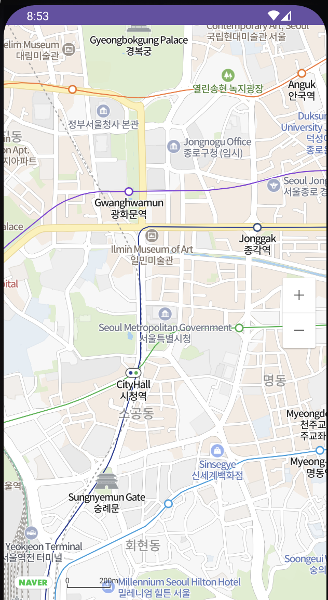

<div align="center">
  <p>
    
  </p>
  <br>
  <h2>API</h2>
  <p>API 관련 내용 정리</p>
  <br>
  <br>
</div>


## 🔥 네이버 지도

### 1. 네이버 클라우드 플랫폼 설정

https://www.ncloud.com/

위 링크로 들어가서 로그인 후 [콘솔]로 이동

➡️ [Services] ➡️ [AI•NAVER API] 탭에서 [AI•NAVER API] 클릭

➡️ 하단 [+ Application 등록] 클릭

<br>

✅ Application 이름 설정

[Application 이름] 작성 후 

✅ Service 선택

[Maps] > [Mobile Dynamic Map] 체크

✅ 서비스 환경 등록

[Android 앱 패키지 이름] 작성 후 [추가] 클릭 후 [등록]

*app 수준의 build.gradle 파일에서 확인 가능

<br>

### 2. 인증 정보 확인

등록된 Application 목록에서 해당 App의

➡️ [인증 정보] 클릭하면 Client ID와 Client Secret 확인 가능

<br>

### 3. 의존성 추가

settings.gradle 파일에 저장소 설정을 추가

```kotlin
dependencyResolutionManagement {
    repositoriesMode.set(RepositoriesMode.FAIL_ON_PROJECT_REPOS)
    repositories {
        google()
        mavenCentral()
      	// 아래 추가
        maven {
            url = uri("https://naver.jfrog.io/artifactory/maven/")
        }
    }
}
```

이후 app 수준의 build.gradle 파일에 네이버 지도 SDK에 대한 의존성을 선언

```kotlin
dependencies {
    // 네이버 지도 SDK
    implementation("com.naver.maps:map-sdk:3.17.0")
}
```

<br>

### 4. 클라이언트 ID 지정

발급받은 클라이언트 ID를 SDK에 지정하면 지도 API를 사용 가능

```kotlin
// AndroidManifest.xml

<manifest>
    <application>
        <meta-data
            android:name="com.naver.maps.map.CLIENT_ID"
            android:value="YOUR_CLIENT_ID_HERE" />
    </application>
</manifest>
```

👉 AndroidManifest.xml의 <meta - data>로 클라이언트 ID를 지정

<br>

### 5. 지도 표시

클라이언트 ID를 지정하고 MapFragment를 앱의 레이아웃에 추가하면 지도가 화면에 나타난다

```xml
<!-- fragment_map.xml -->

<androidx.fragment.app.FragmentContainerView
    android:id="@+id/map_fragment"
    android:layout_width="match_parent"
    android:layout_height="match_parent"
    android:name="com.naver.maps.map.MapFragment" />
```



<br>

### [ 참고 ]

네이버 지도 안드로이드 가이드

https://navermaps.github.io/android-map-sdk/guide-ko/

