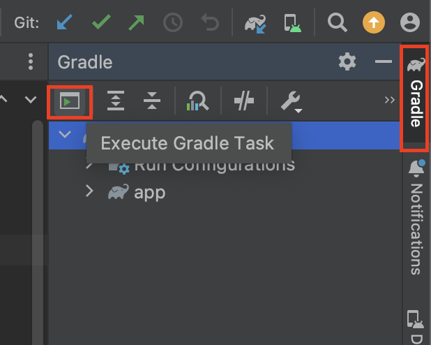
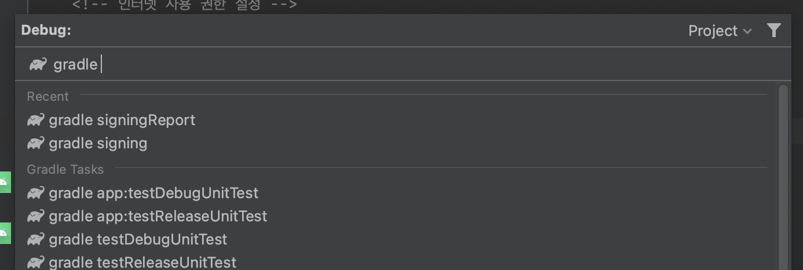
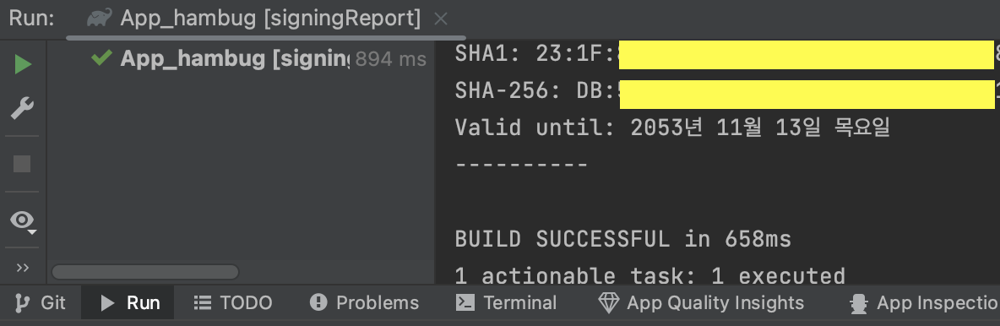

  

    
  

   
  <h2>Etc</h2>
  
기타 참고 내용 정리

   
   

## 🔥 안드로이드 프로젝트의 SHA key를 알아내는 방법

안드로이드 프로젝트에서 SHA1 키를 알아내는 방법

👉 Firebase에서 프로젝트를 생성할 때 필요

### 1. Gradle 들어가기

안드로이드 스튜디오 오른쪽 끝에, Gradle을 포함해 다양한 탭을 열 수 있는 부분이 있다

➡️ Gradle 탭 ➡️ 왼쪽 끝에 있는 아이콘(Execute Gradle Task) 클릭

 

### 2. signingReport 입력

그러면 다음과 같은 화면이 나온다

➡️ 위의 입력하는 곳에 signingReport를 입력하고 엔터

 

### 3. key 확인

SHA1 key / SHA-256 key를 확인할 수 있다

➡️ 필요한 곳에 사용

