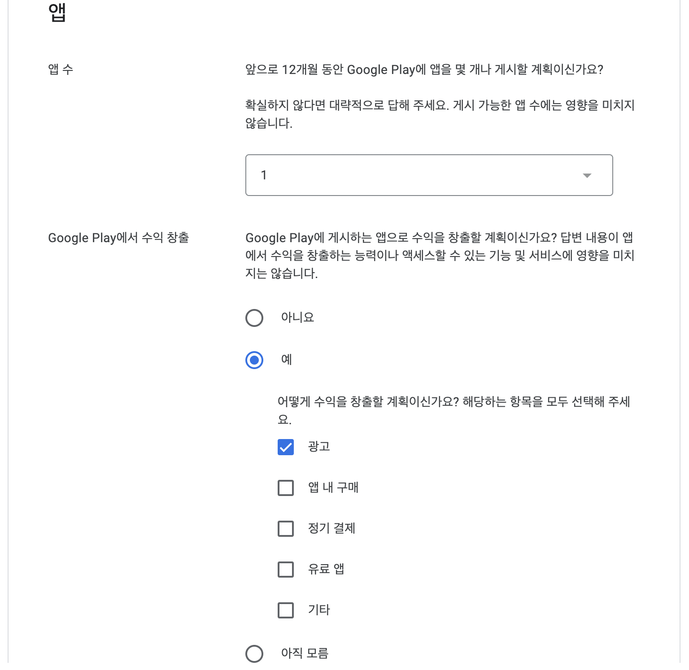
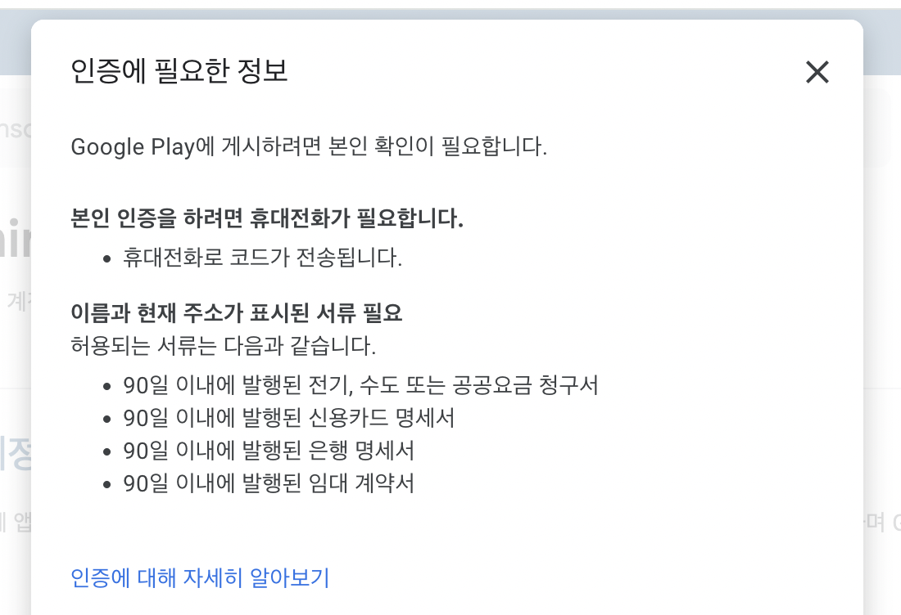

  

    
  

   
  <h2>Etc</h2>
  
기타 참고 내용 정리

   
   

## 🔥 Play Console

### 구글 플레이 콘솔 가입

- 구글 플레이 콘솔 웹사이트에 접속하여 가입

  https://play.google.com/apps/publish/

- 개인 정보와 결제 정보를 입력해야 하며,

  개발자 계정 생성 비용은 $25 (1회)

👉 [ 개인 ] 선택

 

👉 개발자 이름, 본인 인증, 이메일 작성

 

👉 위와 같이 [ 내 정보 ] 작성

 

👉 위와 같이 작성 후 결제

 

👉 구매 완료하면 개발자 계정 생성됨

 

### 서류 제출

이름과 주소 표시된 서류로 인증 필요

👉 구글 플레이 콘솔에서 [ 본인 확인 - 시작하기 ] 클릭

 

👉 등본 발급해서 제출하는 방법 이용

⭐️ 정부24 - 주민등록표 등본(초본) 발급 ⭐️

https://www.gov.kr/mw/AA020InfoCappView.do?CappBizCD=13100000015

‼️ [ 발급하기 ]에서 발급형태는 [ 선택 발급 ] 체크 후 신청하기

[ MyGOV ] -> [ 서비스 신청내역 ] -> [ 문서출력 ] ->  [ 인쇄 ] -> [ pdf 저장 ]으로 파일 다운 받고 업로드 올리기

 

👉 제출하면 [ 본인 확인 ] -> [ 신원 확인 중 ]으로 변경됨

 

👉 제출 후 2시간 정도 후에 인증 완료 메일 받음 (평일 기준)
