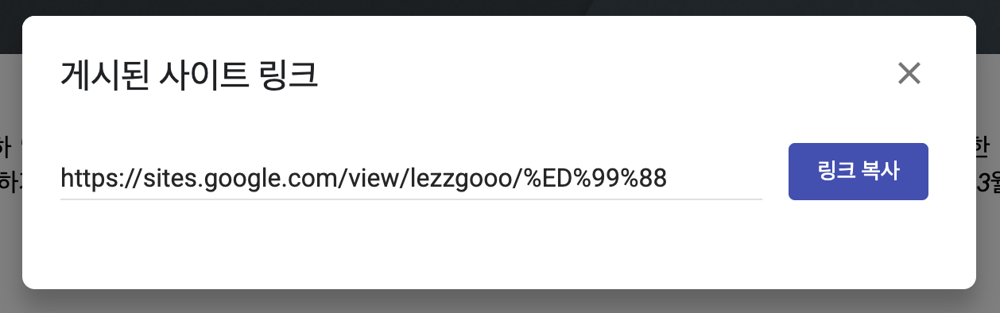

  

    
  

   
  <h2>Etc</h2>
  
기타 참고 내용 정리

   
   

## 🔥 앱 게시 1 - 앱 설정 완료

### 앱 설정 완료

- 먼저 대시보드 - [앱 설정 완료] 영역의 항목들을 완료해야 한다
- 앱 정보, 스토어 등록 정보 등을 작성한다. 이 단계는 앱의 기본적인 정보와 심사 관련 내용을 제출하는 과정이다

✅ 총 11개의 항목에 정보를 입력해서 완료한다

 

## 1. 개인정보처리방침 설정

### 1-1)

URL을 만들기 위해 [Google Sites] 로 이용

https://sites.google.com 

### 1-2)

👉 새 사이트 시작 - [빈 사이트] 클릭 

### 1-3)

👉 [텍스트 상자] 클릭해서 내용 작성 후 [게시] 클릭

### 1-4)

👉 원하는 주소 입력 후 [게시] 클릭

### 1-5)

👉 게시된 링크 복사

### 1-6)

👉 등록 후 저장

 

### 참고한 곳

✔️ https://www.youtube.com/watch?v=jZDpz3b7Zp4

✔️ https://cafe.naver.com/technotealec/150

✔️ https://www.privacy.go.kr/front/per/inf/perInfStep01.do

 

## 2. 앱 액세스 권한

👉 로그인 기능 없는 경우, [액세스 제한 없이 ~] 선택

👉 카카오톡 로그인 같은 로그인 기능이 있는 경우, [앱의 전체 또는 일부 기능이 제한됨] 선택

 

### [앱의 전체 또는 일부 기능이 제한됨] 관련

👉 [안내 추가] 클릭 후 아래와 같이 내용 작성

 

## 3. 광고

 

## 4. 콘텐츠 등급

### 4-1) 카테고리

### 4-2) 설문지

### 4-3) 요약

 

## 5. 타겟층

 

## 6. 데이터 보안

 

## 7. 정부 앱

 

## 8. 금융 기능

## 9. 건강

 

## 10. 앱 카테고리 선택 및 연락처 세부정보 제공

### 10-1) 앱 카테고리

👉 앱에 해당하는 카테고리를 선택

 

### 10-2) 연락처 세부정보

👉 [ 수정 ] 클릭 후 이메일 입력

 

## 11. 스토어 등록정보 설정

### 필수로 입력해야 하는 항목

- 앱 이름
- 간단한 설명
- 자세한 설명
- 앱 아이콘 (최대 1MB, 512x512 px)
- 그래픽 이미지 (최대 15MB, 1024x500 px)
- 휴대전화 스크린샷 (2장 이상, 크기는 1080x1920 px 추천)
- 7인치, 10인치 태블릿 스크린샷 (1장 이상, 크기는 1920x1080 px 추천)

 

## 앱 게시 2 단계

[앱 설정 완료] 단계를 완료하면, [비공개 테스트] 단계 진행 후 검토를 제출한다

자세한 내용은 아래 문서 참고

[앱 게시 2 문서](../앱_게시_2/README.md)
