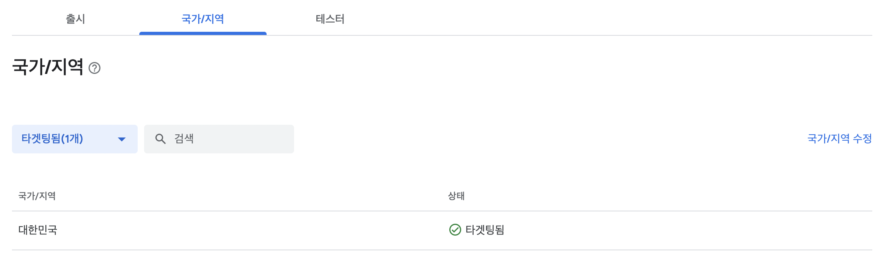
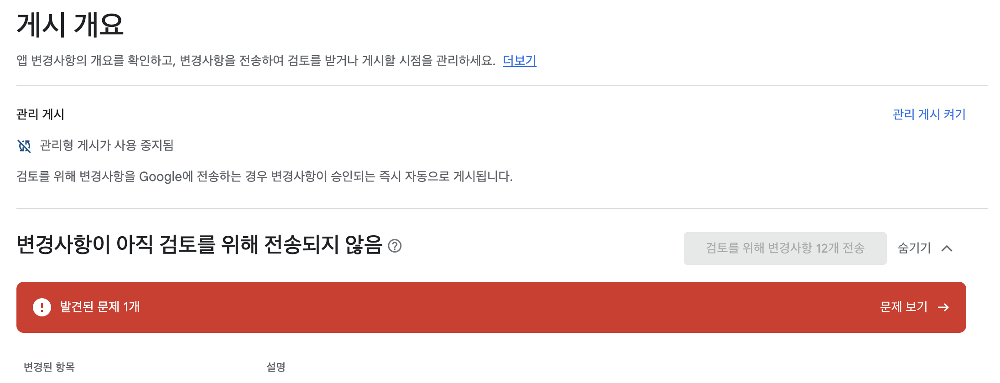
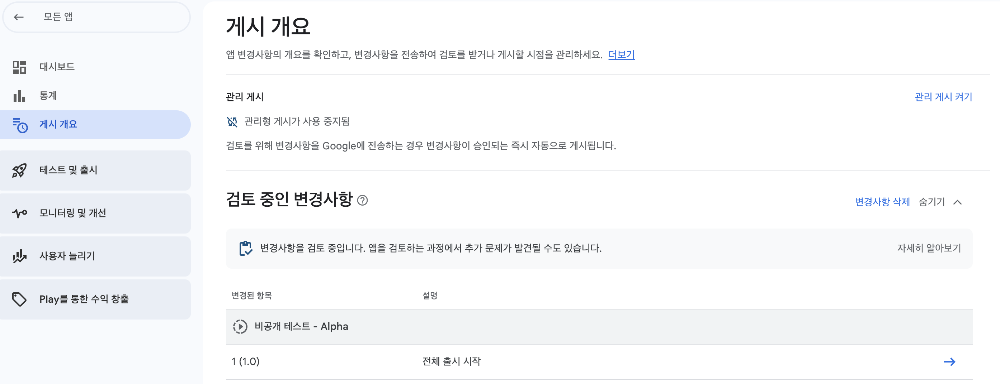
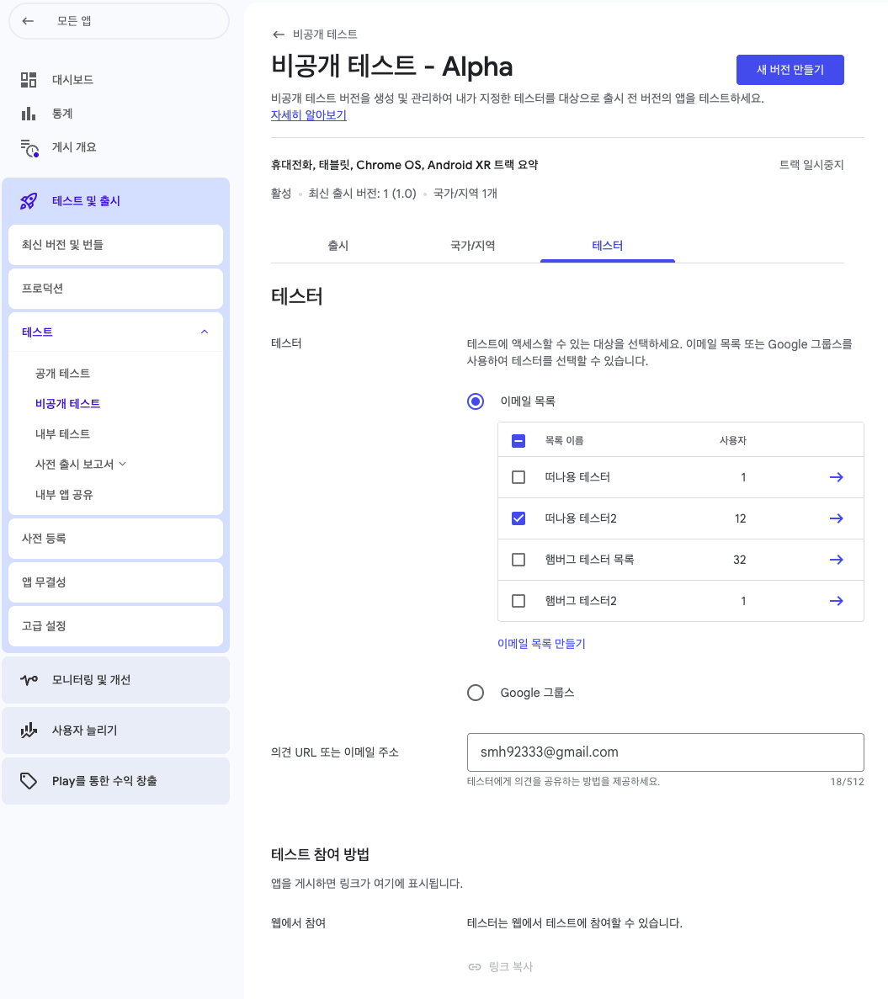

  

    
  

   
  <h2>Etc</h2>
  
기타 참고 내용 정리

   
   

## 🔥 앱 게시 2 - 비공개 테스트

### 비공개 테스트

- [앱 설정 완료] 단계가 끝나면 [비공개 테스트] 단계를 진행한다
- 비공개 테스트를 진행하기 위해 테스터 이메일, 앱의 기능 등에 대한 정보를 입력한다

 

## 1. 국가 및 지역 선택

👉 [국가/지역 추가] 클릭 후 [대한민국] 선택

 

## 2. 테스터 선택

👉 [이메일 목록 만들기] 클릭 후 이메일 입력

*이메일 1개만 입력 가능

 

## 3. 새 버전 만들기

*앱 번들 만드는 방법은 아래 문서 참고

[문서 - 앱 번들 생성 방법](https://github.com/min486/Android/tree/master/Android_Studio/AAB_%EC%83%9D%EC%84%B1)

 

✔️ 안드로이드 스튜디오에서 만든 앱 번들을 [App Bundle] 영역에 업로드한다

 

✔️ 나머지는 아래와 같이 작성

 

## 4. 버전 미리보기 및 확인

두가지 경고가 있지만, 현재(테스트 버전을 생성하는) 단계에서는 무시하고 진행해도된다

- 난독화 (R8/proguard)
  - 이 경고는 앱의 코드를 난독화하는 기능인 R8 또는 Proguard를 사용하지 않았음을 나타낸다
  - 난독화를 사용하면 앱 크기 최적화, 보안 강화의 이점이 있다
- 디버그 기호
  - 이 경고는 네이티브 코드를 사요하는 경우에 나타난다
  - 디버그 기호는 비정상 종료(Crash)나 ANR이 발생할 때, 오류가 발생한 정확한 코드 위치를 알려준다

👉 앱을 정식으로 출시하기 전에는 두 기능을 적용하는 것이 좋다

 

 

## 5. 검토를 위해 Google에 버전 전송

`앱 설정 완료 (앱 게시 1 문서)`, `비공개 테스트 (앱 게시 2 문서)`

두가지 단계를 끝내면 [게시 개요] 로 이동해서 검토 진행 가능

 

### 5-1) 검토 - 문제 해결 방법

✔️ 이후 [게시 개요] 쪽에서 문제가 발생한 경우, 아래 방법으로 해결 가능

 

✔️ [문제 보기] 에서 [선언 작성] 클릭하면 [광고 ID] 쪽으로 이동됨

👉 아니요 체크 후 저장

 

### 5-2) 검토 - 전송

[검토를 위해 변경사항 전송] 버튼이 활성화되면, 클릭해서 검토 진행

 

## 6. 이메일 목록 수정

### 6-1)

검토 완료 후 테스트 참여 링크가 활성화되지 않아서, 이메일 목록에 사용자를 더 추가함

(사용자 1명 → 사용자 12명)

### 6-2)

새로 만든 이메일 목록을 선택하고 [저장] 하면, 다시 검토 필요

### 6-3)

[게시 개요] 쪽에서 [검토를 위해 변경사항 전송] 버튼 클릭해서 검토 진행

✅ 영업일 기준으로 1시간 이내에 검토 완료됨

### 6-4)

검토가 완료되면 아래처럼 프로덕션 트랙이 활성화되고, 테스트 참여 링크도 활성화된다

👉 이 시점부터는 이메일 목록을 수정해도 검토 없이 바로 반영됨

 

### 앱 게시 3

[비공개 테스트] 단계가 완료되면, [프로덕션] 단계 진행 후 [프로덕션 신청]이 가능해진다

자세한 내용은 [앱 게시 3] 문서 참고

[문서 - 앱 게시 3](../앱_게시_3)
