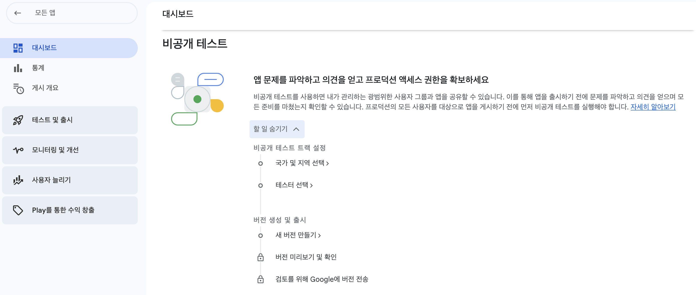
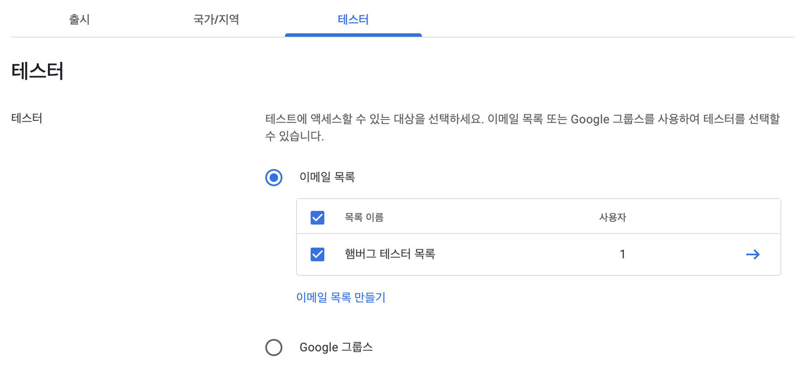
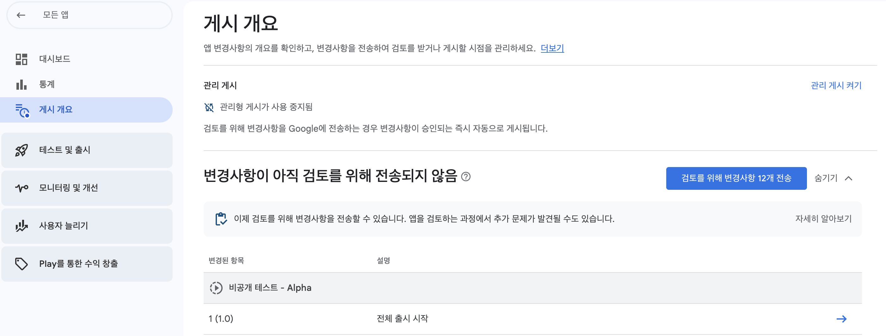

<div align="center">
  <p>
    
  </p>
  <br>
  <h2>Etc</h2>
  <p>기타 참고 내용 정리</p>
  <br>
  <br>
</div>

## 🔥 앱 게시 2

### 개시 개요

"앱 게시 1" 내용들을 완료하면 "게시 개요" 탭으로 이동하여 검토를 위해 [ 전송 버튼 ]을 눌러야 한다

‼️ 그 전에, 검토를 받으려면 "비공개 테스트" 내용을 입력해야 한다




<br>

## [ 참고 ] 대시보드

대시보드에서 4가지 확인 가능

- 앱 설정 완료

  ➡️ "앱 게시 1"에서 완료

- 내부 테스트

  ➡️ 생략 가능

- 비공개 테스트

  ➡️ 아래 참고

- 프로덕션

  ➡️ 아래 참고




<br>

## 비공개 테스트


### 1. 국가 및 지역 선택


👉 [ 국가/지역 추가 ] 클릭 후 [ 대한민국 ] 선택

<br>

### 2. 테스터 선택


👉 [ 이메일 목록 만들기 ] 클릭 후 아래와 같이 이메일 1개만 입력

<br>


<br>

### 3. 새 버전 만들기


👉 진행사항 확인 가능

👉 [ 새 버전 만들기 ] or [ 버전 수정 ] 클릭

<br>


👉 [ 서명 키 선택 ] 클릭

<br>



👉 [ 키 사용 ] 클릭

<br>


<br>

### 4. 앱 번들 만들기

안드로이드 스튜디오에서 해당 프로젝트의 App Bundle을 만든다

*App Bundle : 앱의 실행을 위해 필요한 파일들을 하나의 묶음으로 만드는 것 (앱의 묶음)


👉 안드로이드 스튜디오 상단 [ Build ] ➡️ [ Generate Signed Bundle ] 클릭

<br>


👉 [ Android App Bundle ] 클릭

<br>


👉 [ Create new ] 클릭

<br>


👉 Key store path : 키스토어 저장 위치 선택

👉 Password, Confirm : 원하는 비밀번호 입력

👉 Alias : 키의 별명 입력

👉 Password, Confirm : 동일한 비밀번호 입력

👉 First and Last Name : Certificate에서 이것만 입력하면됨

<br>


👉 체크 해제하고 다음으로

<br>


👉 [ release ] 선택 후 생성

<br>


👉 release 폴더에 aab 파일 확인 가능

*AAB (Android App Bundle) : 안드로이드 앱의 배포 파일 형식

<br>

### 5. 내용 입력

(3. 새 버전 만들기 이어서)


👉 구글 플레이 콘솔에 앱 번들(aab 파일) 업로드

<br>


👉 출시명 : 앱 번들을 업로드하면 출시명은 자동으로 입력됨

👉 출시 노트 : 자유롭게 입력

<br>

### 6. 오류 해결

해당 프로젝트는 타겟이 "API 33" 이여서 오류 발생

‼️ API 33 이상 타겟이면 광고 ID 선언 필요


👉 [ 선언 작성 ] 클릭

<br>


👉 [ 예 ] 클릭

<br>


👉 광고 ID 필요한 이유 선택

<br>

### 7. 경고 해결

‼️ 6. 오류 해결 후에 경고가 떠서 아래처럼 해결


👉 안드로이드 스튜디오 - 매니페스트 파일에서 권한 추가 필요

<br>


```kotlin
// Required only if your app targets Android 13 or higher.
<uses-permission android:name="com.google.android.gms.permission.AD_ID"/>
```

👉 권한 추가

<br>

https://developer.android.com/about/versions/13/behavior-changes-13?hl=ko

👉 공식 문서 참고

<br>

### 8. 앱 버전 오류 해결


‼️ 권한 추가해서 앱 번들을 다시 만들어서 업로드하니 버전 관련 오류 발생

<br>


👉 안드로이드 스튜디오 - app(module) 수준의 build.gradle에서

versionCode와 versionName을 수정하면 된다

👉 versionCode는 한자리수 단위라 1.1 ❌, 2 ⭕️

👉 versionName은 1.1로 바꾸면 paly console에서 1.1로 표기된다

<br>


👉 수정한 앱 번들을 다시 업로드하면 바뀐 버전 확인 가능

<br>


👉 저장 후 [ 개요로 이동 ] 클릭

<br>

## 게시 개요


👉 [ 검토를 위해 변경사항 전송 ] 클릭

<br>


👉 한번 더 [ 검토를 위해 변경사항 전송 ] 클릭

‼️ 검토는 보통 7일 이내 완료됨

<br>

## 대시보드


👉 전송 후 대시보드에서 "검토 중" 상태 확인 가능

<br>


👉 현재 단계에서는 [ 링크 복사 ]가 활성화 안되어있음

검토가 통과해야 활성화 되어서 테스터들에게 링크 공유 가능하다

(검토 통과 후에 테스터들도 등록 가능 - 20명 이상 필요)
