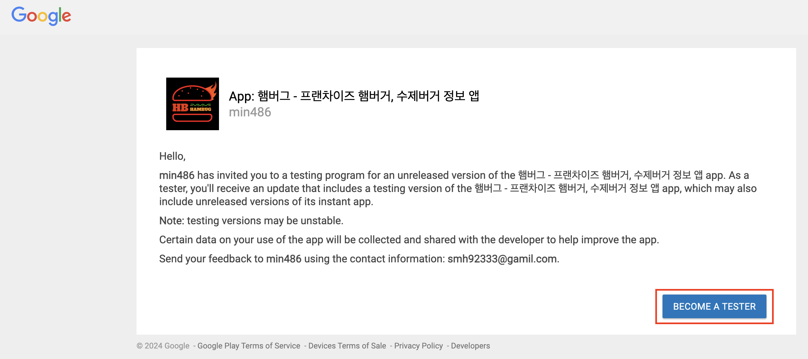
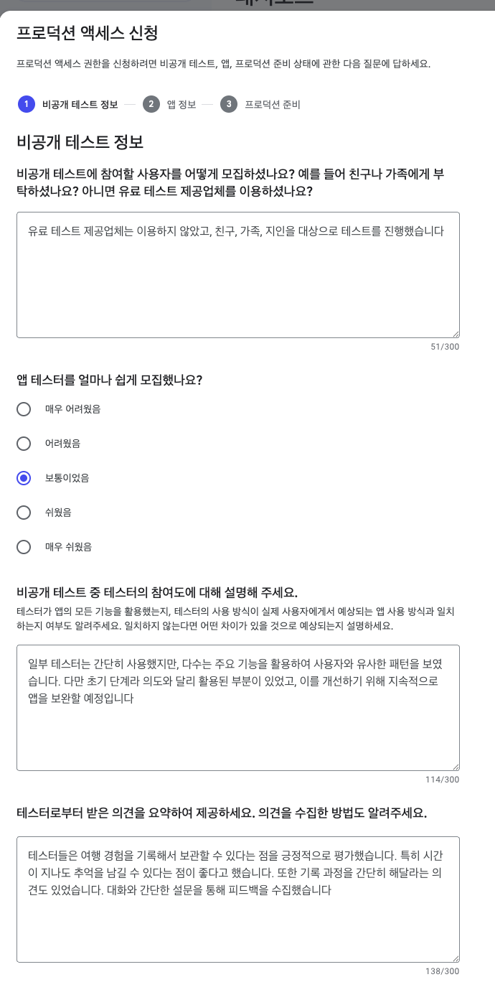
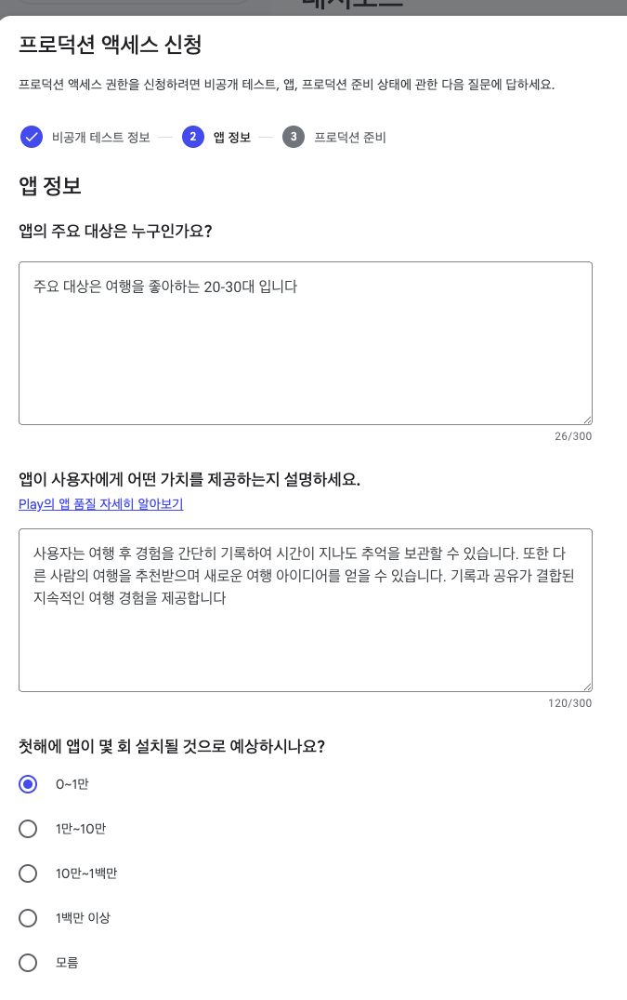
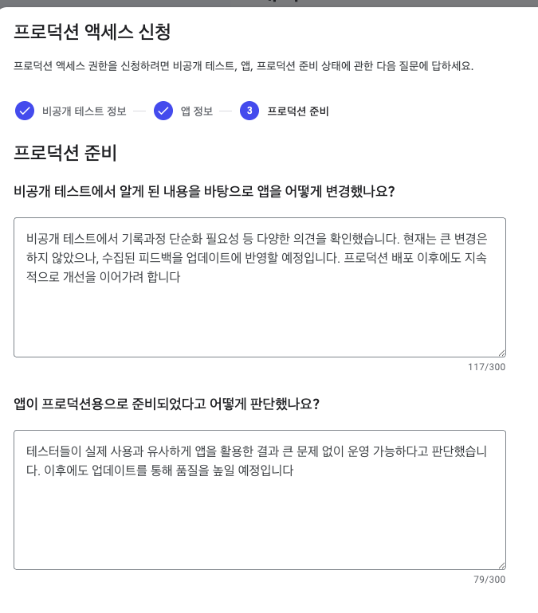

  

    
  

   
  <h2>Etc</h2>
  
기타 참고 내용 정리

   
   

## 🔥 앱 게시 3 - 프로덕션

### 프로덕션 트랙 개요

- [앱 설정 완료], [비공개 테스트] 단계를 완료하면 프로덕션 트랙이 활성화된다
- 이제 프로덕션 신청을 위한 조건(테스트 참여 인원, 테스트 기간)을 확인할 수 있다

 

## 비공개 테스트 참여 안내 방법

### 1) 테스터 등록

- 구글플레이콘솔 → 비공개 테스트 → 테스터 → 이메일 목록
- 등록된 이메일 소유자에게 테스트 참여 링크를 전송할 수 있다

### 2) 테스트 참여 방법 (테스터 입장)

테스터는 제공된 링크를 통해 [테스터 되기] 버튼을 눌러야 한다

참여 방법은 아래 두가지

#### 방법 1. 로그인 불필요

링크 복사 → 크롬(chrome) 앱에서 붙여넣고 열기 → 하단 [테스터 되기] 버튼 클릭

#### 방법 2. 로그인 필요 

카톡방에서 공유된 링크 클릭 → 등록된 구글 계정으로 로그인 → 하단 [테스터 되기] 버튼 클릭

### 3) 테스터 참여 현황 확인

- 테스터가 [테스터 되기] 버튼을 누르면 참여 인원 수가 올라간다
- 예 : "현재 참여를 선택한 테스터 3명"

### 4) 참여 조건 충족

- 12명 이상 테스터 확보 후 1일이 지나면, 대시보드에 "1일" 표시

- 14일 이상 유지하면 프로덕션 신청이 가능해진다 (버튼 활성화)

- 예 : "현재 1일 동안 참여를 선택한 테스터 12명" 

  → "현재 14일 동안 참여를 선택한 테스터 12명" 달성하면, 조건 완료 처리됨

 

## 프로덕션 신청

프로덕션 권한을 신청하려면 아래 순서로 질문에 답해야한다

### 1) 비공개 테스트 정보

### 2) 앱 정보

### 3) 프로덕션 준비

### 4) 프로덕션 액세스 권한 신청

질문 답변이 끝나면 프로덕션 액세스 권한 신청이 자동으로 접수된다

대시보드 - 프로덕션 트랙에서 확인 가능

