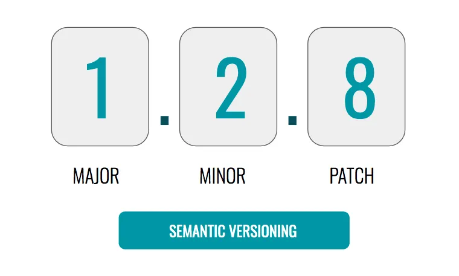

  

    
  

   
  <h2>Etc</h2>
  
기타 참고 내용 정리

   
   

## 🔥 앱 버전 관리

### 시맨틱 버저닝 (Semantic Versioning)

소프트웨어 버전 관리의 한 방법으로, 주로 세 개의 숫자로 구성된다

 

소프트웨어의 변경 사항을 명확하게 전달하기 위해 사용된다

왜냐하면 각 숫자는 특정한 의미를 가지기 때문이다

