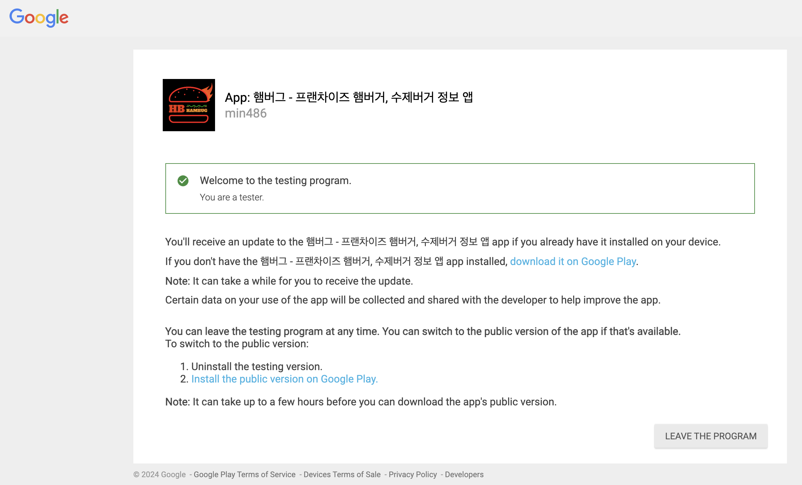
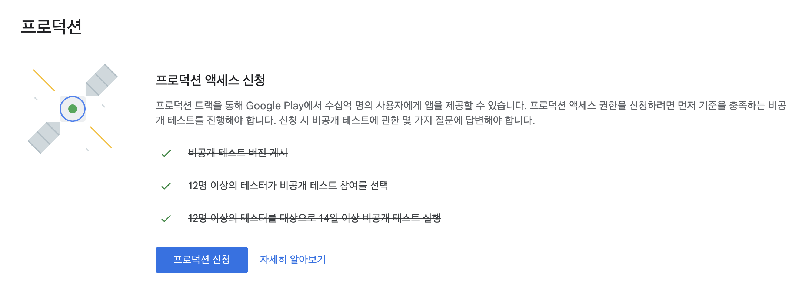

  

    
  

   
  <h2>Etc</h2>
  
기타 참고 내용 정리

   
   

## 🔥 앱 출시

### 참고 순서

앱 게시 1 ➡️ 앱 게시 2 ➡️ 앱 출시

 

## 대시보드

검토가 완료되면 [ 검토 중 ] 안내문구가 사라져있음

👉 5일 정도 소요됨

 

 

## 비공개 테스트

검토가 완료된 상태에서 테스터들을 등록할 수 있다

👉 [ 비공개 테스트 ] ➡️ [ 트랙 관리 ] 클릭

 

👉 [ 테스터 ] 탭에서 이메일 목록에 테스터들 추가하기

(만들었던 목록의 화살표 클릭 or 이메일 목록 만들기 클릭)

 

👉 다음과 같이 이메일들을 추가한다

(친구, 지인 등 다른 사람들의 이메일)

👉 Play Console에 이메일이 등록되어야 해당 소유자가 링크를 들어갈 수 있다

(등록된 이메일로 로그인해서)

 

‼️ 구글 메일(Gmail)만 등록 가능, 네이버 메일 등 불가

 

👉 기기로 앱을 다운받는 테스트는 안해도 된다 

(Android에서 참여 - 링크)

 

👉 웹이나 핸드폰으로 링크를 들어가서 [ 테스터 되기 ] 버튼을 누르면 테스터 숫자가 늘어난다 

(웹에서 참여 - 링크 ⭕️)

*자신(개발자)이 친구, 지인 등에게 링크를 보내면 된다

 

👉 등록된 소유자(친구, 지인 등)가 링크를 들어가면 [ BECOME A TESTER ] 버튼을 누를 수 있다

 

‼️ [ LEAVE THE PROGRAM ] 버튼은 누르지 않게 한다

(늘어난 테스터 숫자가 다시 줄어들기 때문에)

 

## 대시보드 - 프로덕션

👉 프로덕션에서 테스터 숫자를 확인할 수 있다

 

👉 20명 이상을 채우면 체크 표시가 된다

👉 중간에 취소 버튼을 누르는 사람이 생길 수 있으니 인원을 여유있게 채우는거 추천

(ex - 20명 ❌, 22~23명 ⭕️) 

 

👉 하루 정도가 지나면 날짜가 표시된다 (ex - 1일간)

‼️ 14일을 채워야 한다. 20명 이상이 참여한 상태여야 1일씩 올라감

 

👉 14일이 지나면 프로덕션 신청이 가능해진다

 

## 프로덕션 신청

👉 1~3번 각 번호의 질문들에 답해야 한다

👉 위 사진들은 전체 질문의 일부분임

‼️ 다 어렵지 않은 질문들이고 간단하게 답했는데도 잘 승인되었다

(단답이 아닌 1~2줄 정도로 작성함)
