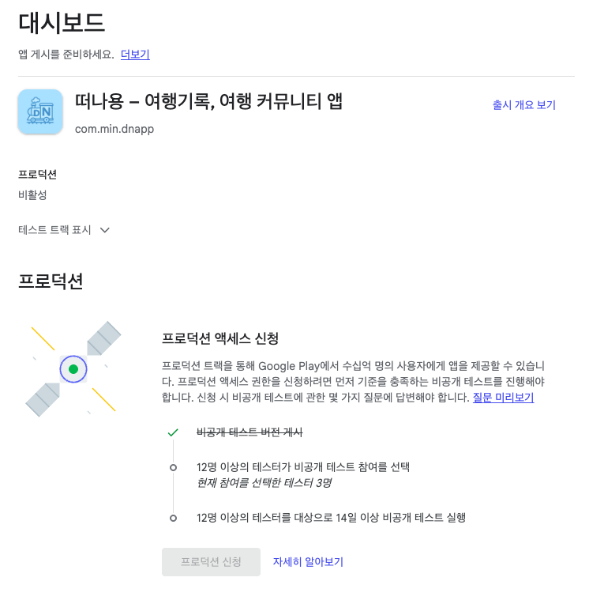

  

    
  

   
  <h2>Etc</h2>
  
기타 참고 내용 정리

   
   

## 🔥 앱 출시

### 참고 순서

앱 게시 1 ➡️ 앱 게시 2 ➡️ 앱 출시

 

## 대시보드

검토가 완료되면 [ 검토 중 ] 안내문구가 사라져있음

👉 5일 정도 소요됨

 

## 비공개 테스트

검토가 완료된 상태에서 테스터들을 등록할 수 있다

👉 [ 비공개 테스트 ] ➡️ [ 트랙 관리 ] 클릭

 

👉 이메일 목록에 테스터들 추가하기

 

