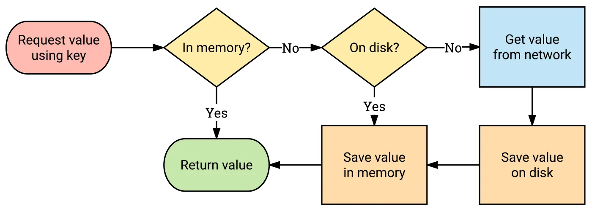

<div align="center">
  <p>
    
  </p>
  <br>
  <h2>Library</h2>
  <p>라이브러리 관련 내용 정리</p>
  <br>
  <br>
</div>


## 🔥 Glide

### Glide

> 앱에서 이미지를 빠르고 효율적으로 불러올 수 있게 도와준다
>
> Android 이미지 로딩 라이브러리 중에서 가장 많이 사용된다

<br>

### Glide 사용

app 레벨의 build.gradle에 의존성 추가

```kotlin
implementation("com.github.bumptech.glide:glide:4.14.2")
```

네트워크 이미지를 사용한다면 인터넷 권한 추가

```kotlin
// AndroidManifest.xml
<uses-permission android:name="android.permission.INTERNET" />
```

기본 사용법

```kotlin
Glide.with(myFragment)
    .load(url)
    .into(myImageView)
```

👉 `with` 에 Context 또는 View를 지정하고

👉 `load` 에 불러올 이미지를 지정하고

👉 `into` 에 불러온 이미지를 넣을 ImageView를 지정

<br>

### 이미지 캐싱

> URL에서 가져온 이미지를 캐시에 저장해서 동일한 URL를 요청했을 때,
>
> 캐시에 저장한 이미지를 꺼내 재요청을 할 필요 없이 속도를 향상시키는 방식

만약 동일한 URL에서 반복적으로 이미지를 불러올 때, 계속해서 이미지를 받아오는 것은 굉장한 낭비다

- 이미지 크기가 작은 상황에서는 큰 문제가 없겠지만,

- 큰 이미지를 받아오는 상황이라면 매번 수 초의 시간과 상당한 양의 메모리를 투자해야 하며, 이는 사용자 경험을 떨어트린다

👉 이런 문제를 해결하기 위한 방법이 이미지 캐싱

Glide는 이런 이미지 캐싱을 직접 구현하지 않고 쉽게 사용할 수 있도록 지원한다



Glide가 요청을 받은 후 이미지를 가져오는 과정

- 메모리 ➡️ 디스크 순으로 캐시를 확인하고, 데이터가 있다면 해당 데이터를 리턴한다

- 만약 메모리, 디스크에 데이터가 없다면 그때 네트워크를 통해 데이터를 가져오고

  디스크, 메모리 캐시에 저장한다

