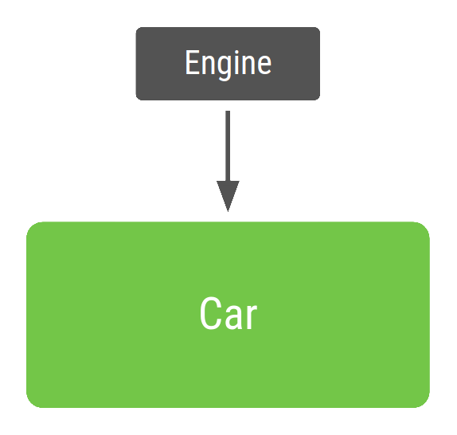
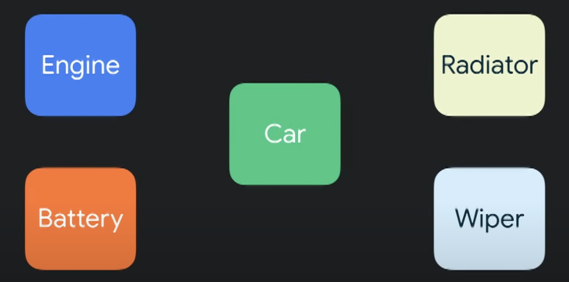

<div align="center">
  <p>
    
  </p>
  <br>
  <h2>Library</h2>
  <p>라이브러리 관련 내용 정리</p>
  <br>
  <br>
</div>


## 🔥 Hilt & HiltViewModel

### 의존성 주입 (Dependency Injection, DI)

> 클래스가 직접 의존 객체를 생성하지 않고, 외부에서 주입받아 사용하는 디자인 패턴

```kotlin
// DI 미적용
class Car {
    private val engine: Engine = Engine()  // Car가 Engine에 강하게 의존
}

// DI 적용
class Car(private val engine: Engine)  // 외부에서 Engine을 주입받음
```

<br>

### DI 필요성 및 장점

DI는 클래스 간의 결합도를 낮춰 코드의 유연성과 유지보수성을 높인다

- 유연성 : 의존 객체를 쉽게 교체할 수 있다
- 테스트 용이성 : 실제 객체 대신 Mock 객체를 주입하여 단위 테스트를 쉽게 할 수 있다
- 재사용성 : 모듈화된 코드를 여러 곳에서 재사용할 수 있다
- 확장성 : 새로운 구현체를 쉽게 추가하고 교체할 수 있다






👉 거대한 클래스를 가지는 대신 여러 부품으로 나눠서 자동차를 작게 만든다

<br>

### Hilt

> Dagger2 기반으로 하는 Android 공식 DI 프레임워크
>
> 안드로이드 컴포넌트에 최적화된 DI 환경을 제공한다

- 주요 특징

  - 생명주기 자동 관리 : Activity, ViewModel 등 안드로이드 컴포넌트의 생명주기에 맞춰 의존 객체의 스코프를 관리한다

  - 간편한 설정


  - 보일러플레이트 코드 감소 : 반복적으로 작성해야 하는 DI 관련 코드를 줄여준다

    *Boilerplate Code : 여러곳에서 재사용되며, 반복적으로 비슷한 형태를 띄는 코드

<br>

### Hilt 주요 어노테이션 및 구성요소

Hilt는 다양한 어노테이션을 통해 의존성 주입을 처리한다

1. `@HiltAndroidApp`

   Application 클래스에 이 어노테이션을 추가하여 DI의 시작점임을 Hilt에 알린다

   ```kotlin
   @HiltAndroidApp
   class GlobalApp : Application()
   ```

   *이후 `AndroidManifest.xml`에 아래 내용 추가

   ```xml
   <application
       android:name=".GlobalApp"
       ...
   </application>
   ```

2. `@AndroidEntryPoint`

   의존성을 주입받을 Android 컴포넌트(Activity 등)에 추가한다

   ```kotlin
   @AndroidEntryPoint
   class MainActivity : ComponentActivity()
   ```

3. `@Inject`

   생성자 or 필드에 붙여 의존성을 주입받을 곳을 표시한다

   ```kotlin
   class UserRepositoryImpl @Inject constructor(
       private val api: UserApi
   )
   ```

4. `@Provides`

   객체를 직접 생성하거나 복잡한 초기화 로직이 필요할 때 사용한다

   retrofit, okHttpClient 등 외부 라이브러리 객체를 제공할 때 유용하다

   ```kotlin
   @Module
   @InstallIn(SingletonComponent::class)
   object NetworkModule {
       @Provides
       @Singleton
       fun provideOkHttpClient(): OkHttpClient {
           return OkHttpClient.Builder().build()
       }
   }
   ```

5. `@Binds`

   인터페이스와 그 구현체를 연결할 때 사용한다

   `@Provides` 보다 더 효율적이고 간결하다

   ```kotlin
   @Module
   @InstallIn(SingletonComponent::class)
   abstract class RepositoryModule {
       @Binds
       @Singleton
       abstract fun bindUserRepository(
           userRepositoryImpl: UserRepositoryImpl
       ): UserRepository
   }
   ```

6. Scope 어노테이션

   의존성 객체의 생명주기 범위를 지정한다

   예 : `@Singleton`, `@ActivityScoped`, `@ViewModelScoped`

<br>

### HiltViewModel

> Hilt와 ViewModel을 연결해주는 어노테이션
>
> ViewModel에 필요한 의존성을 생성자 주입으로 받을 수 있게 한다

- 주요 특징
  - ViewModel의 생명주기를 Hilt가 자동으로 관리한다
  - Composable/Activity 범위에서 동일 ViewModel 인스턴스를 공유할 수 있다
  - `hiltViewModel()` 함수로 간단하게 ViewModel을 가져올 수 있다
- 사용 순서
  - Application 클래스에 `@HiltAndroidApp` 추가
  - ViewModel 클래스에 `@HiltViewModel`, 생성자 `@Inject` 추가
  - 의존성을 주입받을 Activity에 `@AndroidEntryPoint` 추가
  - Compose에서 `hiltViewModel()` 함수로 ViewModel 호출

<br>

### 의존성 추가

1. `libs.versions.toml`

   ```toml
   [versions]
   hilt = "2.56.2"
   ksp = "2.2.0-2.0.2"
   hiltNavigationCompose = "1.2.0"
   
   [libraries]
   hilt-android = { module = "com.google.dagger:hilt-android", version.ref = "hilt" }
   hilt-compiler = { module = "com.google.dagger:hilt-compiler", version.ref = "hilt" }
   hilt-navigation-compose = { module = "androidx.hilt:hilt-navigation-compose", version.ref = "hiltNavigationCompose" }
   
   
   [plugins]
   hilt = { id = "com.google.dagger.hilt.android", version.ref = "hilt" }
   ksp = { id = "com.google.devtools.ksp", version.ref = "ksp" }
   ```

2. `build.gradle.kts` (프로젝트 수준)

   ```kotlin
   plugins {
       alias(libs.plugins.ksp) apply false
       alias(libs.plugins.hilt) apply false
   }
   ```

3. `build.gradle.kts` (앱 수준)

   ```kotlin
   plugins {
       alias(libs.plugins.ksp)
       alias(libs.plugins.hilt)
   }
   
   dependencies {
       // hilt
       implementation(libs.hilt.android)
       ksp(libs.hilt.compiler)
     
       // compose와 함께 사용 (hiltViewModel() 지원)
       implementation(libs.hilt.navigation.compose)
   }
   ```
