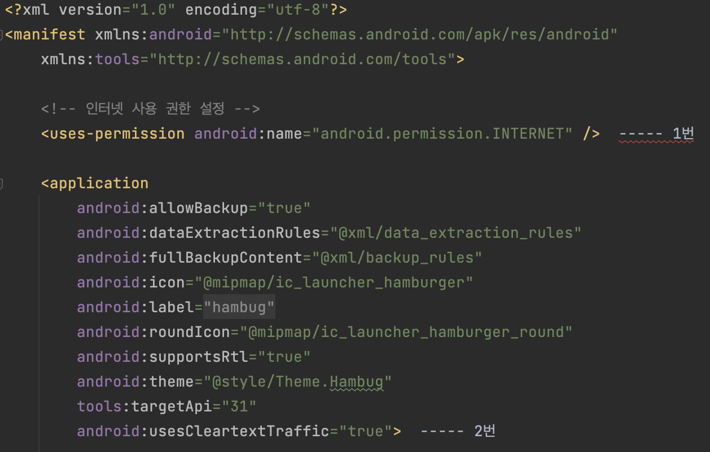

<div align="center">
  <p>
    
  </p>
  <br>
  <h2>Library</h2>
  <p>라이브러리 관련 내용 정리</p>
  <br>
  <br>
</div>


## 🔥 Retrofit

### Retrofit

> 서버와 클라이언트 간 http 통신을 위한 라이브러리
>
> (안드로이드에서 http 통신을 할 수 있도록 도와준다)

<br>

### Retrofit 장점

- JSON 구조의 데이터를 쉽게 가져오고 업로드 할 수 있다
- 안드로이드 앱에서 필요한 데이터를 서버로부터 가져올 때 사용 
- 서버에 데이터를 전송하기 위한 코드를 작성할 때 사용

- 가독성이 좋으며 간편하게 사용할 수 있다

<br>

### 의존성 추가

✅ app 수준의 build.gradle 파일에 의존성 추가

```kotlin
// Retrofit
implementation("com.squareup.retrofit2:retrofit:2.9.0")
```

<br>

✅ Converter 추가

- Gson : com.squareup.retrofit2:converter-gson
- Moshi : com.squareup.retrofit2:converter-moshi

```kotlin
// Moshi Converter
implementation("com.squareup.retrofit2:converter-moshi:2.9.0")
```

👉 converter는 응답 결과가 JSON일 때 객체로 변환해준다

<br>

✅ 인터넷 권한 설정



- 1번은 서버와 통신 하기 위해 인터넷 권한 얻는 것

- 2번은 http로 시작하는 사이트에 접근하기 위한 것

  : 안드로이드는 기본적으로 http 접근을 허용하지 않기 때문이다. https를 지원하는 사이트와 통신하면 안적어도 된다

<br>

### Retrofit 사용

retrofit을 사용하기 위해서 세 가지 필요

- Data class
- Http 작업을 정의하는 Interface
- Retrofit.Builder를 선언한 Object
