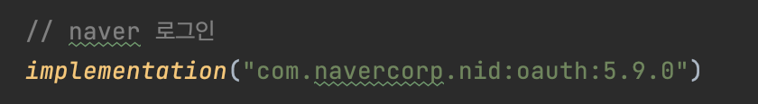
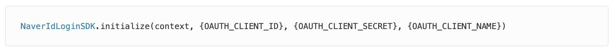
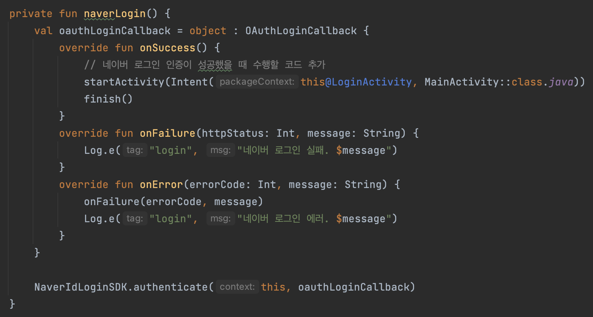

  

    
  

   
  <h2>Android</h2>
  
안드로이드 관련 내용 정리

   
   

## 🔥 네이버 로그인

### 1. 개발 환경 설정

👉 앱 레벨의 build.gradle(Module) 에서 사진과 같이 추가

 

### 2. 초기화

- OAUTH_CLIENT_ID : 애플리케이션 등록 후 발급받은 클라이언트 아이디

- OAUTH_CLIENT_SECRET: 애플리케이션 등록 후 발급받은 클라이언트 시크릿

- OAUTH_CLIENT_NAME: 네이버 앱의 로그인 화면에 표시할 애플리케이션 이름

  모바일 웹의 로그인 화면을 사용할 때는 서버에 저장된 애플리케이션 이름이 표시됩니다

*아래 링크 > [Application] > [내 애플리케이션]에서 정보 확인 가능

https://developers.naver.com/main/

 

### 3. 로그인 구현

`NaverIdLoginSDK.authenticate()` 메서드를 직접 실행하는 방법으로 구현함

👉 `NaverIdLoginSDK.authenticate(context, oauthLoginCallback)`을 실행한 경우 `OAuthLoginCallback`이 호출됩니다. 

로그인 창에서 로그인이 완료되거나 취소될 때에도 `OAuthLoginCallback`이 호출됩니다

 

### [ 참고 ]

네이버 로그인 개발 가이드

https://developers.naver.com/docs/login/android/android.md#android

