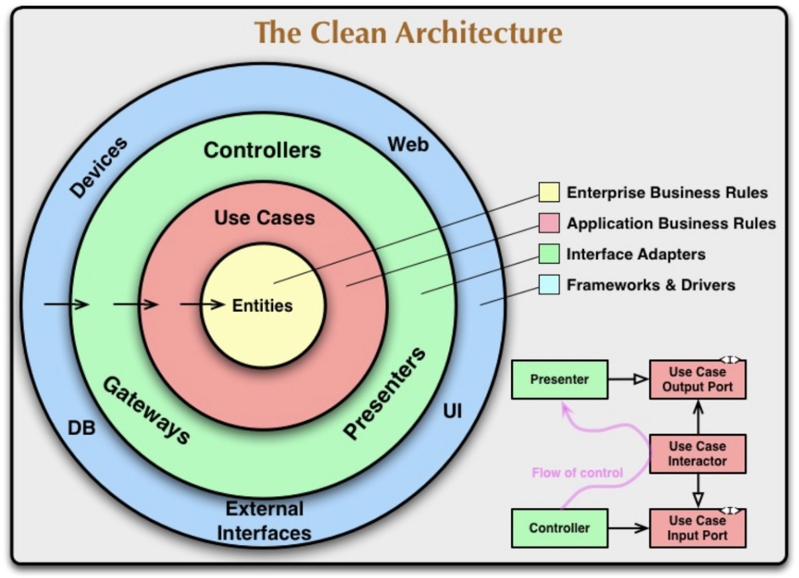
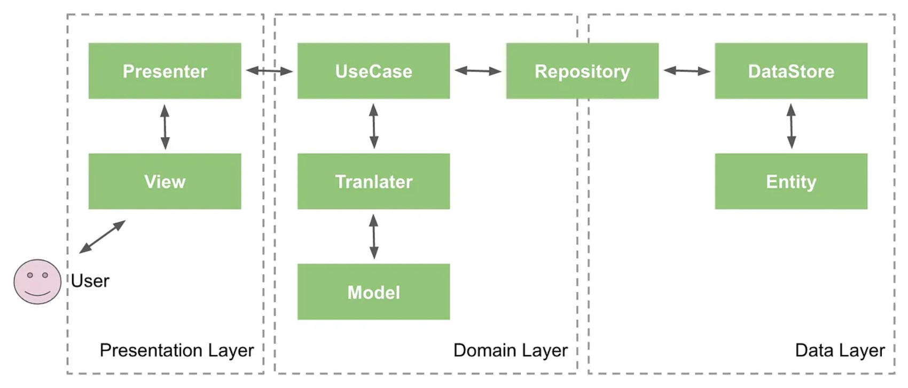

  

    
  

   
  <h2>Architecture</h2>
  
아키텍처 관련 내용 정리

   
   

## 🔥 Clean architecture (클린 아키텍처)

### Clean architecture

> 소프트웨어 시스템의 구조를 설계할 때 지켜야 할 원칙과 방법을 정의한 개념 

👉 안드로이드 앱을 더 구조화된 방식으로 개발할 수 있도록 돕는다

 

### Android에서의 Clean architecture

- Presentation Layer
  - View
    - UI 화면 표시와 사용자 입력 담당
  - Presenter 또는 ViewModel
    - 사용자 인터페이스(UI)와 비즈니스 로직 간의 중간 계층
    - UI에서 발생한 이벤트를 처리하고 필요한 데이터를 비즈니스 로직에 전달
- Domain Layer
  - UseCase
    - 앱의 실제 비즈니스 로직을 포함하는 부분
    - Presenter나 ViewModel로부터 전달된 요청을 처리하고 데이터를 가공하여 반환
  - Model
    - 실질적으로 앱에서 사용하는 데이터들의 집합
- Data Layer
  - Repository
    - 데이터베이스나 외부 데이터 원본과의 상호 작용을 담당하는 부분
    - 데이터를 가져오고 저장하는 작업을 수행
    - UseCase는 Repository를 통해 데이터를 얻어온다
  - Entity
    - 앱의 핵심 데이터 구조를 나타낸다
    - 테이터베이스나 네트워크에서 가져온 데이터를 객체로 변환한 형태

 

### 클린 아키텍처의 장점

- 유지보수 용이성

  : 각 계층이 분리되어 있기 때문에

  한 계층을 변경해도 다른 계층에 영향을 미치지 않아 유지보수가 쉽다

- 테스트 용이성

  : 의존성을 주입하여 유닛 테스트 및 통합 테스트를 수행하기 용이하다

- 모듈 간의 분리

  : 각 계층이 자체 역할을 가지며, 이로 인해 코드의 재사용성이 높아진다

- 데이터베이스나 UI 프레임워크 변경 용이성

  : 중요한 비즈니스 로직은 외부 프레임워크와 분리되어 있어

  해당 프레임워크를 변경하더라고 기존에 작성한 전체 코드를 다시 작성할 필요가 없다
