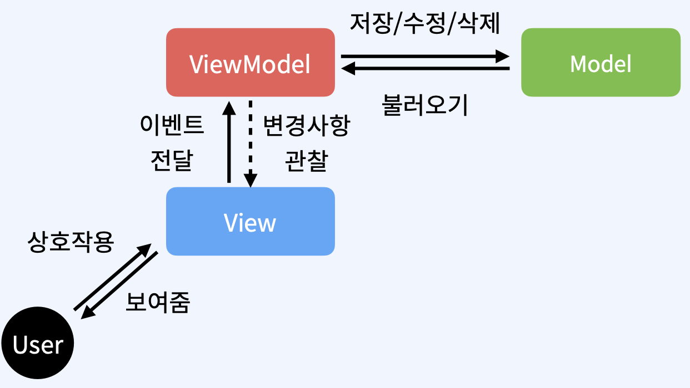

  

    
  

   
  <h2>Architecture</h2>
  
아키텍처 관련 내용 정리

   
   

## 🔥 MVVM 패턴

### 패턴

> 프로그램 구조를 적절히 설계하고 기능에 따라 분리해 코드를 작성하는 것

 

### 패턴의 필요성

프로젝트를 생성하고 하나의 서비스를 개발할 때 어떤 규칙도 없이 코드를 작성할 수 있다

하지만, 새로운 요구사항이 생겨서 기능을 추가할 때 이것저것 코드를 고쳐야 하는 상황이 생긴다

👉 여러 기능들이 분리되지 않고 코드간의 연관성이 너무 밀접해서 유지보수가 힘들어지는 문제 발생

 

### MVVM 패턴

> Model, View, ViewModel로 구성된다
>
> 체계적으로 앱을 만들고 관리하기 위한 아키텍처 패턴

- `ViewModel`에서 UI를 조작하지 않는다

- `View`에서는 `ViewModel`에서 제공하는 데이터를 관찰하여 UI를 업데이트 시킨다

- `View`와 `ViewModel` 사이에서 ` View`가 `ViewModel`에만 의존성을 갖게 하고,

  `ViewModel`은 `View`에 대한 의존성을 제거했다

- `ViewModel`단에서 `View`와 `Model` 사이의 의존 관계를 끊어주었다

  또한, `ViewModel`이 `View`에 대한 의존성을 갖지 않는다

  👉 테스트를 작성하기 용이해졌다

  👉 각 부분이 다른 부분에 독립적이어서 한 부분을 변경하더라도 다른 부분에 영향을 미치는 것이 줄었다

  (유지보수 용이성)

 

### Model, View, ViewModel 역할

- Model
  - 데이터 관리
  - 비지니스 로직 수행
- View
  - 유저에게 보일 화면을 표현
  - ViewModel의 데이터 관찰
- ViewModel
  - Model과 View 연결
  - DataBinding과 LiveData를 통해 View에 데이터 전달
