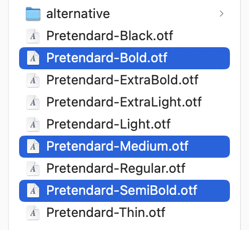
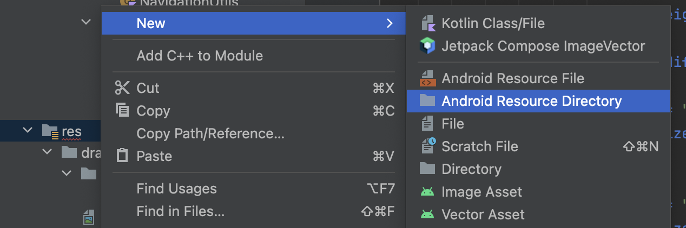
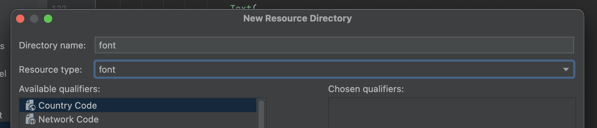
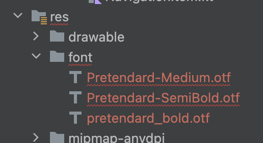

  

    
  

   
  <h2>초기 세팅</h2>
  
앱 초기 세팅 관련 내용 정리

   
   

## 🔥 폰트

### 사용 폰트

폰트는 프리텐다드(pretendard) 적용

https://cactus.tistory.com/306

위의 페이지에서 글꼴 다운로드 받기

➡️ 압축 풀어주고 해당 폴더 진입

➡️ public > static 폴더 이동 후 Medium, Bold, SemiBold 사용

 

### 안드로이드 스튜디오 적용

res폴더에서 우클릭 후 New > Android Resource Directory 클릭

 

➡️ 이후 Resource type : font, Directory name : font 로 설정

 

➡️ 해당 font 폴더에 3가지 폰트를 이동시킨다

‼️폰트 이름이 에러가 생기므로 이름을 변경한다. 아래 예시처럼 전부 변경하기

(예시 : Pretendard-Bold.otf > pretendard_bold.otf)

 

마지막으로 프로젝트 ui > theme > Type.kt 파일에서 폰트 적용 후 사용한다
