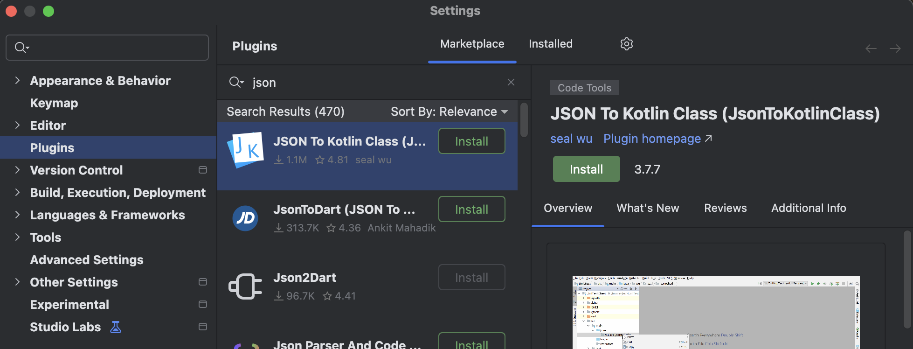
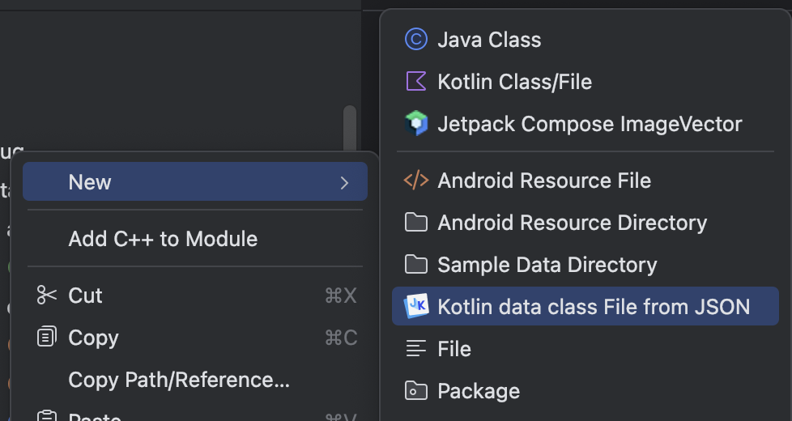
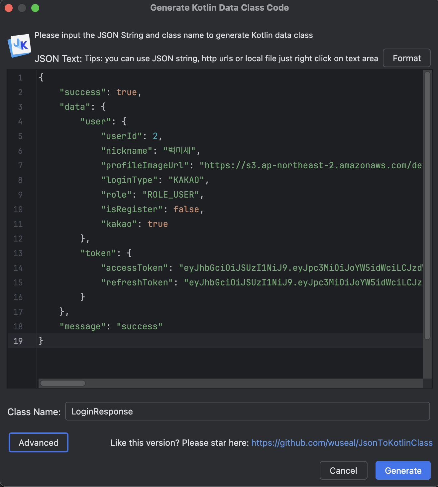
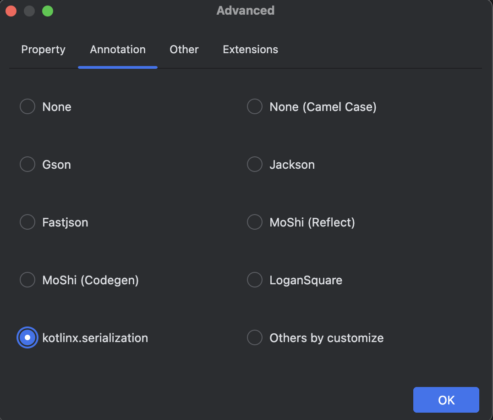

  

    
  

   
  <h2>Plugins</h2>
  
플러그인 관련 내용 정리

   
   

## 🔥 JSON to Kotlin Class 플러그인

### JSON to Kotlin Class

이 플러그인은 Android Studio에 설치하여 사용할 수 있으며,

API 응답(주로 JSON 형식)을 Kotlin의 데이터 클래스(data class)로 변환해준다

 

### 플러그인 설치

1. Android Studio → Settings → Plugins
2. 상단의 Marketplace 탭에서 검색한다
3. Install 버튼 클릭 후 설치 완료되면, 플러그인이 적용된다

 

### 사용 방법

API 응답을 준비한 후, 이 플러그인을 사용하여 데이터 클래스를 생성한다

1. 데이터 클래스를 생성할 패키지 우클릭
2. New → Kotlin data class File from JSON 선택

3. 창이 열리면 아래 항목들을 입력한다
   - `Class Name` : 생성할 최상위 데이터 클래스의 이름을 입력한다
   - `JSON Text` : API 응답으로 받는 JSON 문자열 전체를 붙여넣는다
   - `Annotation` : 사용할 JSON 직렬화/역직렬화 라이브러리를 선택한다

4. Generate 버튼을 클릭하면, 입력한 JSON 구조에 맞게 데이터 클래스들을 포함한 Kotlin 파일이 생성된다
